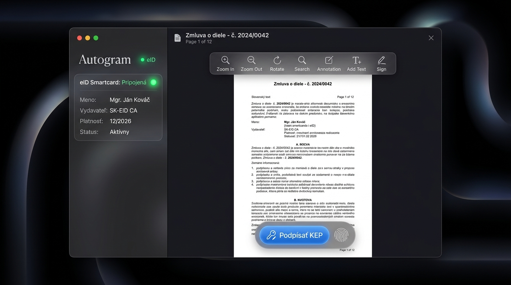
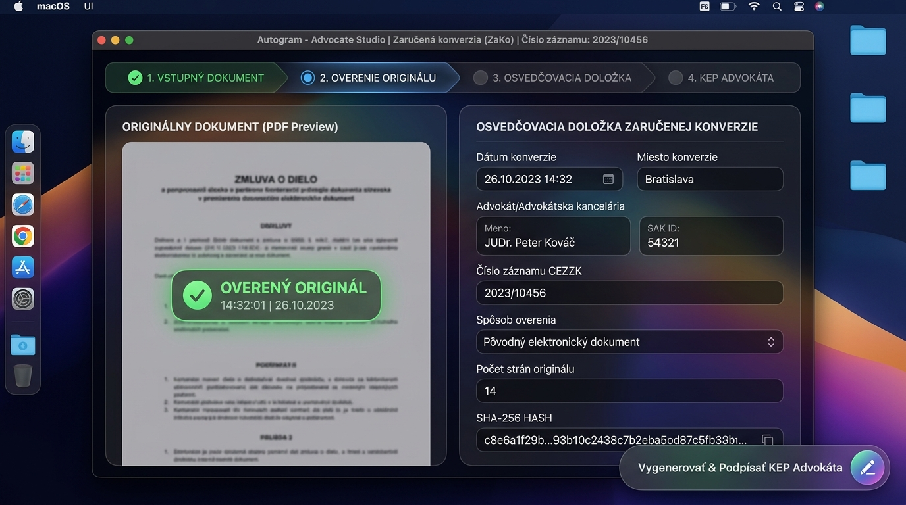
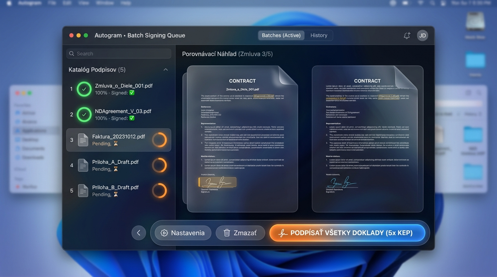
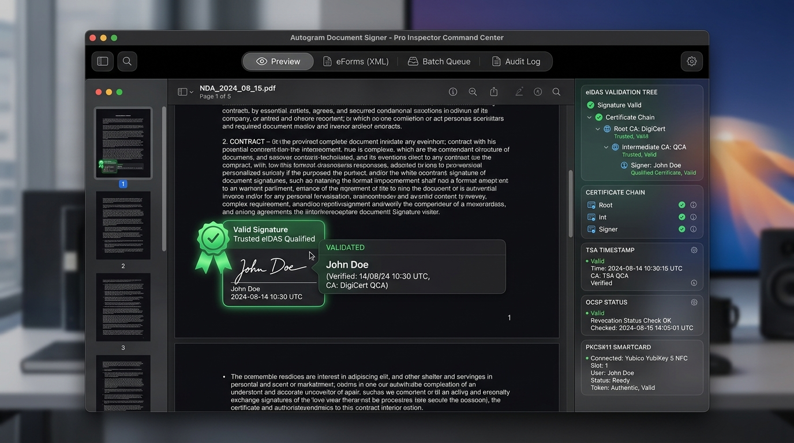
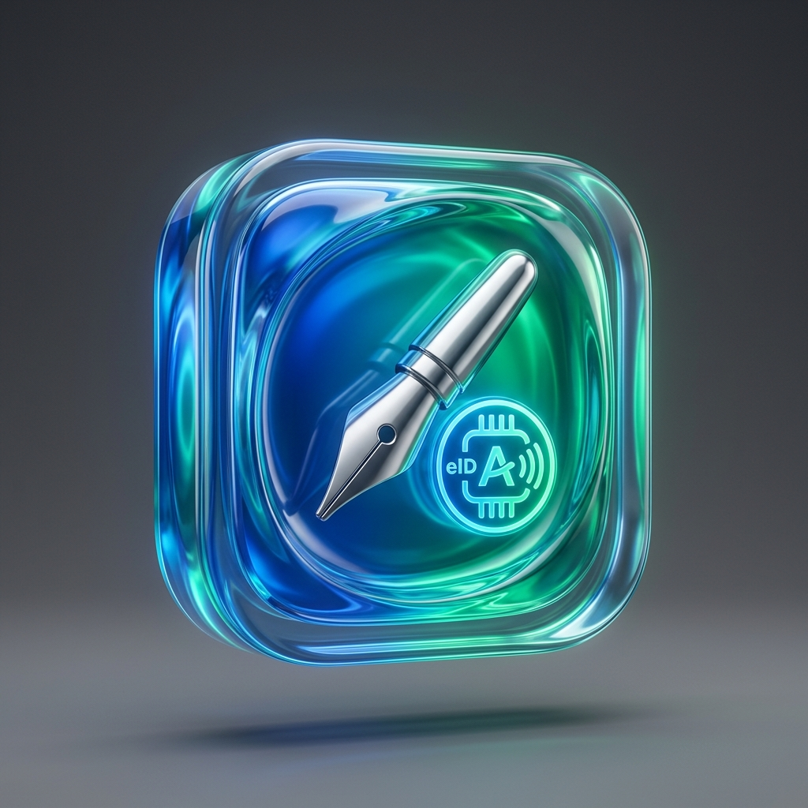

# Master Dizajnová a UX Špecifikácia: Autogram macOS (SwiftUI)

Tento dokument je finálnym zadávacím podkladom pre vývojárskeho agenta a programátora. Obsahuje kompletnú vizuálnu a funkčnú špecifikáciu pre vývoj natívnej macOS aplikácie **Autogram**.

---

## 1. Základné Princípy Natívnej macOS Aplikácie

* **Natívny SwiftUI Vzhľad:** Aplikácia je navrhnutá ako **100% natívna macOS SwiftUI aplikácia** (`@main struct AutogramApp: App`), nie ako webové rozhranie.
* **Automatický Light & Dark Mode:** Aplikácia neobsahuje žiadne manuálne prepínače tém. Vzhľad sa prepína automaticky podľa systémového času a preferencií používateľa v macOS (`@Environment(\.colorScheme)`).
* **Striktne SF Symbols 6+:** V aplikácii sa nepoužívajú žiadne unicode emoji ikony. Všetky prvky používajú štandardné SF Symbols z Apple Icons Composeru.
* **Čisté Liquid Glass Materiály:** Tmavý aj svetlý režim používajú natívny matný sklenený materiál (`.ultraThinMaterial` / `.regularMaterial`) bez neprirodzených neónových či svietiacich efektov.

---

## 2. Vizuálne Podklady a Screenshoty (design_assets/)

Všetky vygenerované vizuálne screenshoty a prvky jednotlivých obrazoviek sú uložené v priečinku:
📁 [design_assets/](design_assets/)

### Prehľad Obrazoviek:
1. 
   * **[Liquid Glass Studio Mode](design_assets/liquid_glass_studio.jpg)** – Hlavná obrazovka podpisovania s PDF plátnom, skleneným panelom eID karty a akčným tlačidlom.

2. 
   * **[ZaKo Advocate Studio](design_assets/zako_advocate_studio.jpg)** – Vizuálne oddelené rozhranie Zaručenej konverzie podľa § 35-39 Zákona 305/2013 Z. z.

3. 
   * **[Batch Signing Queue](design_assets/batch_signing_screen.jpg)** – Obrazovka pre hromadné podpisovanie dávky súborov.

4. 
   * **[Pro Inspector Command Center](design_assets/pro_inspector_command_center.jpg)** – Trojstĺpcové rozloženie pre audit eIDAS certifikačných reťazcov a TSA časových pečiatok.

5. 
   * **[App Icon Liquid Glass Concept](design_assets/autogram_app_icon_concepts.jpg)** – 3D macOS Ikona v zaoblenom štvorci (squircle).

---

## 3. Modul 1: Autogram Podpisovanie (Native Signing Suite)

Podpora jednoduchej príjmovej plochy, zobrazenia a overovania dokumentov:
* **Vstup súboru:** Drag-and-drop alebo systémové okno `NSOpenPanel`. SF Symbol: `doc.badge.plus`.
* **Náhľad PDF (PDFKit):** Vizuálne umiestňovanie pečiatky podpisu s možnosťou nastavenia súradníc (X, Y) a strany. SF Symbol: `signature`.
* **Stav eID karty:** Zobrazenie držiteľa (Meno, SAK ID), vydavateľa (SK-EID CA) a platnosti BOK/PIN. SF Symbol: `creditcard.and.123`.

---

## 4. Modul 2: Zaručená Konverzia (ZaKo Advocate Studio)

Vizuálne aj funkčne oddelené rozhranie pre advokátov, notárov a orgány verejnej moci (§ 35-39 Zákona č. 305/2013 Z. z. o e-Governmente):
* **4-krokový Workflow Stepper:**
  1. *Vstupný dokument* (`doc.badge.plus`)
  2. *Overenie originálu* (`shield.checkerboard`)
  3. *Osvedčovacia doložka* (`building.columns.fill`)
  4. *KEP Advokáta* (`signature.badge.checkmark`)
* **Doložka:** Automatická generácia osvedčovacej doložky s údajmi advokáta, výpočtom **SHA-256** otlačku a polom pre evidenčné číslo CEZZK.

---

## 5. Modul 3: AI Vision Integrácia & 4 Režimy Poskytovateľov

AI Vision Asistent automaticky preskúma naskenovaný papierový dokument, zdeteguje počet strán, vypočíta počet listov a vytvorí **Bounding Boxes** nad okrúhlymi úradnými pečiatkami, vlastnoručnými podpismi a reliéfnymi otlačkami.

### 4 Režimy Nastavenia AI Poskytovateľa (AI Settings):

1. **🌟 Režim 1: Interný Režim (Predvolený bez konfigurácie):**
   - Priamo pre Vás (majiteľa aplikácie). Všetky AI vision funkcie sú automaticky aktívne bez nutnosti konfigurácie.
2. **🔐 Režim 2: Vlastné Predplatné (ChatGPT Plus / Claude Pro Login):**
   - Pripojenie priamo cez Vaše existujúce predplatné ChatGPT Plus/Team/Enterprise alebo Claude Pro. AI beží cez Vaše predplatné (nie cez placené API).
3. **💻 Režim 3: Lokálny Model (Ollama / Local Vision):**
   - 100% súkromné a offline spracovanie priamo na Vašom Macu cez Ollama (`http://localhost:11434` - LLaVA, Llama-3.2-Vision, Qwen2-VL).
4. **🔑 Režim 4: Vlastný API Kľúč (Custom API Key):**
   - Možnosť vložiť vlastný API kľúč (OpenAI / Gemini / Claude) s uložením v macOS Kľúčence (Keychain).

---

## 6. Priradenie SF Symbols Ikoniek pre Vývojára

* Podpisovanie / Pečiatka: `signature`
* Qualifikovaný KEP podpis: `checkmark.seal.fill`
* ZaKo Advokát Studio: `building.columns.fill`
* Overenie bezpečnosti: `shield.checkerboard`
* eID Smartkarta / PIN: `creditcard.and.123`
* AI Vision Asistent: `brain.head.profile`
* Hromadné podpisovanie: `doc.on.doc.fill`
* Nastavenia / API Kľúč: `key.fill`
