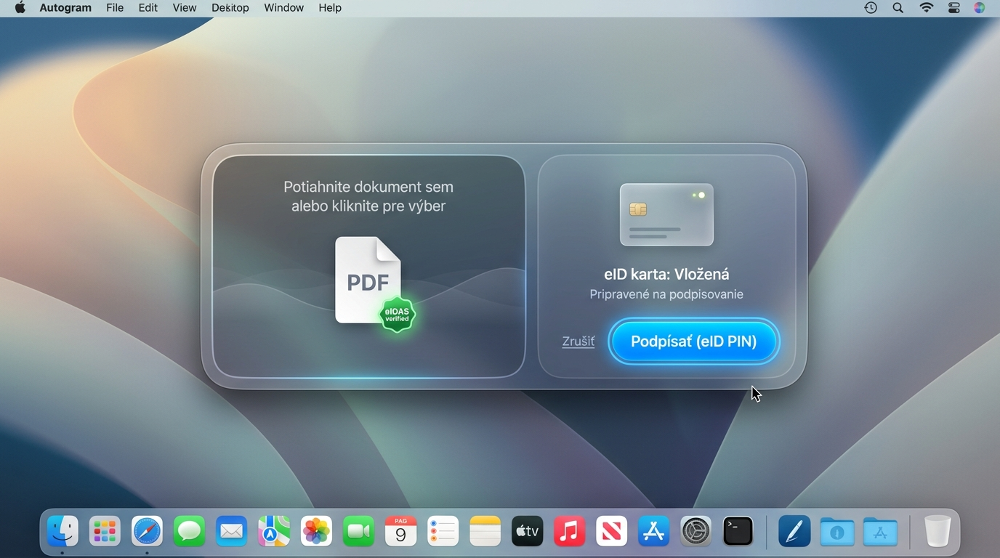

# Návrh UI/UX pre natívnu macOS aplikáciu Autogram (Liquid Glass & Modern macOS Style)

Tento dokument obsahuje komplexnú analýzu funkcionality aplikácie **Autogram** a detailné grafické/UX koncepty s prvkami **Liquid Glass**, modernými macOS materiálmi a pokročilými animáciami.

---

## 1. Porozumenie funkcionalite a doméne Autogram

Autogram je špecializovaný nástroj na **kvalifikované elektronické podpisovanie (KEP)** a **overovanie dokumentov** podľa štandardov EÚ eIDAS a slovenských legislatívnych požiadaviek (eGovernment, slovensko.sk, ORSR, Finančná správa).

### Kľúčové funkčné piliere aplikácie:
1. **Príjem a kontrola dokumentov:** PDF (PAdES), XML formuláre, ASiC-E kontajnery a hromadné podpisovanie.
2. **Hardvérová a certifikačná integrácia:** Detekcia PKCS#11 zariadení (slovenský eID občasný preukaz, smartkarty I.CA, Disig, HSM), správa certifikátov a bezpečné zadávanie BOK/PIN.
3. **Overovanie existujúcich podpisov:** Kontrola platnosti X.509 certifikačných reťazcov, OCSP/CRL odvolaní, kvalifikovaných časových pečiatok (TSA) a vizuálna prezentácia dôveryhodnosti.
4. **Vizuálne umiestnenie podpisu:** Pečiatka podpisu na zvolenú stranu a pozíciu v PDF.
5. **Systémová integrácia macOS:** Finder Quick Actions, CLI rozhranie, REST API pre webové portály a podpora protokolu `autogram://`.

---

## 2. Navrhované Grafické a UX Koncepty

Navrhujeme 3 odlišné vizuálne a UX prístupy, ktoré posúvajú obyčajný natívny štýl macOS do modernej éry s prvkami **Liquid Glass** (sklenené vrstvy s lomom svetla, variabilný frosted blur a dynamic depth).

---

### Koncept 1: Liquid Glass Studio (Modern Native macOS)

#### Vizuálny štýl a materiály:
* **Materiál:** Plávajúce sklenené panely s jemným skreslením hran (chromatic glass refraction) a dynanickým podkladovým rozostrením (`NSVisualEffectView` / SwiftUI `.ultraThinMaterial`).
* **Farebnosť:** Hlboká tmavošedá / grafitová s neónovými akcentmi (smaragdovo zelená pre pripojenú eID kartu, elektrizujúca modrá pre akčné tlačidlá).
* **Typografia:** SF Pro Display pre nadpisy, SF Mono pre certifikačné fingerprinty a dátumy.

#### Layout a UI Prvky:
* **Ľavý sklenený panel (Status Dock):** 
  * Živý ukazovateľ stavu eID smartkarty (zelená pulzujúca dióda).
  * Informácie o držiteľovi certifikátu (Meno, Vydavateľ, Platnosť, BOK stav).
* **Stredné plátno (Document Canvas):**
  * Náhľad PDF / eFormu na sklenenom podklade.
  * **Hore plávajúca kapsula nástrojov:** Priblíženie, otočenie, vyhľadávanie v dokumente a výber pozície podpisu.
* **Dolný akčný pill (Floating HUD):**
  * Plávajúca sklenená pilulka s dominantným tlačidlom **"Podpísať KEP"** a ikonou Touch ID / eID PIN.

#### UX a Animácie:
* **Drag-and-Drop efekt:** Pri pretiahnutí PDF súboru sa celé okno jemne prehĺbi (parallax z-index offset) a dropzone pulzuje svetelným halo efektom.
* **Pripojenie eID karty:** Pri vložení eID do čítačky sa zo status panela šíri jemná svetelná vlna (glow ripple), ktorá odomkne tlačidlo na podpisovanie.
* **Podpisový proces:** Pri overovaní BOK/PIN sa tlačidlo transformuje na kruhový spinner a po úspešnom podpísaní vytvorí hmatový (haptic) a vizuálny "holografický" zelený pečiatkový efekt na dokumente.

---

### Koncept 2: Dynamic Floating HUD Capsule (Rýchly & Distraction-Free Podpisovač)

#### Vizuálny štýl a materiály:
* **Materiál:** Ultra-kompaktná plávajúca kapsula (podobne ako visionOS / macOS Dynamic Island), ktorá pláva priamo nad pracovnou plochou.
* **Zaoblenie a hranice:** Zaoblenie 24pt s jemným svetelným okrajom (specular highlight), ktorý reaguje na pohyb kurzora.

#### Layout a UI Prvky:
* **Ľavá sekcia (Dropzone & Preview):**
  * Miniatúra vloženého dokumentu s eIDAS verified odznakom.
  * Možnosť rýchlej výmeny súboru jedným klikom.
* **Pravá sekcia (eID Card & Action):**
  * Vizuálna ikona chip-card (eID) s informáciou o stave ("Pripojená – Pripravené").
  * Jediné výrazné sklenené tlačidlo **"Podpísať (eID PIN)"**.

#### UX a Animácie:
* **Morphing Window:** Aplikácia začína ako malé plávajúce drop-okienko. Po presunutí súboru sa s plynulou spring animáciou rozvinie na rozšírenú kapsulu.
* **Background Blur:** Pozadie pod kapsulou využíva efekt živého matného skla, vďaka čomu aplikácia dokonale splýva s akoukoľvek tapetou macOS.
* **Instant Workflow:** Vhodné pre používateľov, ktorí nepotrebujú 10-stranový manuálny náhľad, ale chcú súbor podpísať na 2 kliknutia.

---

### Koncept 3: Pro Inspector Command Center (Audit & Overovací Hub)

#### Vizuálny štýl a materiály:
* **Materiál:** Tmavé obsiadiánové sklo s vysokým kontrastom, rozdelené do 3 funkčných stĺpcov s jemnými sklenenými deliacimi líniami.

#### Layout a UI Prvky:
* **Horná navigácia:** Kapsulový prepínač záložiek (`Preview`, `eForms (XML)`, `Batch Queue`, `Audit Log`).
* **Ľavá lišta:** Miniatúry stránok PDF.
* **Stredné okno:** Plný detail dokumentu s interaktívnymi vizuálnymi pečiatkami podpisov.
* **Pravý Inspector Panel (eIDAS Validation Tree):**
  * Štrom overenia podpisu (Root CA, Intermediate CA, Qualified Certificate).
  * Informácie o TSA časovej pečiatke (Time, CA, Status).
  * Stavy OCSP overenia odvolania.
  * Sloty a detaily PKCS#11 čítačky (napr. YubiKey / eID SK).

#### UX a Animácie:
* **Hover Inspection:** Najdenie kurzorom na podpis v dokumente okamžite zvýrazní príslušný certifikačný uzol v pravom Inspector paneli pomocou svietiacej spojovacej vodiacej čiary (bezier curve glow).
* **Batch Drag-and-Drop:** Pri vložení celého priečinka sa automaticky otvorí `Batch Queue` s plynulým indikátorom stavu podpisovania pre každý súbor.

---

## 3. Porovnávacia matica konceptov

| Vlastnosť | Koncept 1: Liquid Glass Studio | Koncept 2: Floating HUD Capsule | Koncept 3: Pro Inspector |
| :--- | :--- | :--- | :--- |
| **Cieľová skupina** | Bežní používatelia, manažéri, právnici | Rýchle každodenné podpisovanie (Power users) | Auditory, IT administrátori, štátna správa |
| **Náročnosť na UI** | Stredná (vyvážený náhľad + status) | Minimálna (kompaktná kapsula) | Vysoká (detailný audit strom) |
| **Pocit z macOS** | 100% macOS Sequoia / visionOS feel | Futuristiký HUD / Dynamic Island | Pro Studio (Xcode / Final Cut štýl) |
| **Vizuálny WOW efekt** | High (plávajúce pilulky, sklo) | Ultra High (morphing & sklo) | High (čistota dát a vizualizácia reťazca) |

---

## 4. Odporúčaný hybridný prístup (Best of Both Worlds)

Pre natívnu macOS aplikáciu Autogram je ideálnou cestou **kombinácia Konceptu 1 a Konceptu 2**:

1. **Výchozí stav (Compact Mode):** Aplikácia sa spustí ako štýlová sklenená kapsula (Koncept 2) pre rýchle pretiahnutie súboru.
2. **Detailný náhľad (Expanded Studio):** Kliknutím na náhľad alebo tlačidlo "Skontrolovať" sa kapsula plynule rozšíri na plnohodnotné **Liquid Glass Studio** (Koncept 1) s možnosťou vizuálneho umiestnenia pečiatky a kontrolou eIDAS certifikátov.
3. **Inspector Drawer:** Pre pokročilých používateľov sa z pravej strany dá vysunúť detailný strom overenia (Koncept 3).

---

## 6. Špecifikácia dizajnového systému pre Hybridný model (Badge, Pečiatky, Ikonky & Animácie)

Na základe tvojej preferencie hybridného modelu uvádzame presnú špecifikáciu UI prvkov a správania:

### 🟢 1. Smaragdový eIDAS Verified Badge System
* **Vizuálny vzhľad:** Zaoblená pill badge (radius 12pt) so skleneným podkladom, neónovo zeleným obvodovým svetlom (`glow radial shadow`) a smaragdovou ikonou čipu/fajky.
* **Stavy odznaku:**
  * **Verified (Emerald Green):** `#00F5A0` + radikálna žiara `rgba(0, 245, 160, 0.35)`. Signál, že podpis je plne eIDAS kvalifikovaný a časová pečiatka bola overená cez TSA.
  * **Warning / Attention (Warm Amber):** `#FFB800` + žiara. Používa sa pri chýbajúcej časovej pečiatke alebo exspirovanom medzilahločom certifikáte.
  * **Invalid / Corrupted (Crimson Red):** `#FF3B30`. Signál narušenej integrity dokumentu od jeho podpísania.
* **UX Animácia:** Pri načítaní dokumentu odznak najprv prebehne jemným skenovacím lúčom (shimmer sweep) zľava doprava a následne sa ustáli v príslušnej farbe.

---

### ✍️ 2. Vizuálne Podpisové Pečiatky (Graphic Signatures & Holographic Stamps)
* **Prezentácia v dokumente:**
  * Pečiatka podpisu kombinuje **vektorový kaligrafický podpis** (alebo typografický kurzíva podpis držiteľa) s eIDAS metadátovým blokom (Meno, Dátum/Čas UTC, CA Vydavateľ).
  * Na dokumente sa zobrazuje v jemnom sklenenom rámčeku s 15% opacitou podkladu, takže neprekrýva nečitateľným spôsobom text zmluvy pod ním.
* **Interaktivita & Connector Line:**
  * Keď používateľ prejde kurzorom myši ponad vizuálnu pečiatku v PDF, pečiatka sa jemne nadvihne (z-index zoom) a zo skleneného okrajom vystrelí tenká svietiaca vodiaca čiara (bezier curve glow) smerujúca k pravému Inspector panelu.
  * Zobrazí sa plávajúci **Hover Tooltip Card** s rýchlym sumárom o držiteľovi certifikátu a platnosti BOK/PIN.

---

### 🎨 3. Liquid Glass Tlačidlá & SF Symbol Ikonografia
* **Akčné tlačidlo "Podpísať KEP":**
  * Plávajúce tlačidlo v spodnej časti využíva gradient od elektrizujúcej modrej (`#007AFF`) po cyan/smaragdový odtieň (`#00C6FF`).
  * Na pravom okraji tlačidla je integrovaný Touch ID / eID PIN indikátor.
* **SF Symbol Ikonografia:**
  * `doc.badge.gearshape` – Pre spracovanie eFormulárov slovensko.sk
  * `signature` / `checkmark.seal.fill` – Pre platný kvalifikovaný podpis
  * `creditcard.and.123` – Pre eID smartkartu a zadávanie BOK/PIN
  * `lock.shield.fill` – Pre zabezpečený PKCS#11 kanál

---

### ✨ 4. Micro-Animations & UX Motion Physics
* **Morphing Kapsuly na Studio:**
  * Keď používateľ pretiahne súbor na kompaktnú kapsulu (Koncept 2), kapsula neprenosne "preskočí", ale s plynulým fyzikálnym pružinovým efektom (`interpolatingSpring`) sa roztiahne do šírky aj výšky a odhalí náhľad dokumentu (Koncept 1).
* **PIN Input Overlay Dialog:**
  * Zadávanie BOK / eID PIN kódu nepoužíva obyčajné macOS popup okno. Namiesto toho sa celé pozadie aplikácie jemne rozostrí (deep Gaussian blur) a zo stredu vystúpi elegantná sklenená karta s PIN políčkami a vizuálnou indikáciou stlačenia klávesov.
* **Success Pulse & Haptics:**
  * Po dokončení podpisovania sa z vizuálnej pečiatky šíri zelený kruhový impulz (success ripple ring) a na Trackpade Macu sa vykoná jemné dvojité potvrdenie cez `NSHapticFeedbackManager`.

---

---

## 8. Modul Zaručenej Konverzie (ZaKo / Advocate Studio) podľa Zákona 305/2013 Z. z.

Zaručená konverzia (ZaKo) je právne záväzný proces podľa **§ 35 až 39 Zákona č. 305/2013 Z. z. o e-Governmente** a vyhlášky MIRRI č. 70/2021 Z. z., pri ktorom sa mení forma dokumentu (z papierovej do elektronickej, medzi elektronickými formátmi alebo z elektronickej do papierovej) pri zachovaní jeho pôvodných právnych účinkov.

Pre **advokátov, notárov a orgány verejnej moci** predstavuje ZaKo kľúčovú funkciu pri komunikácii so súdmi a úradmi.

---

### 🏛️ Vizuálny návrh okna ZaKo (Advocate Studio Mode)

---

### 🔄 3 Podporované režimy zaručenej konverzie v UI:

1. **Elektronický ➔ Elektronický (E-to-E)** *(najčastejší u advokátov)*:
   - Konverzia eFormulára (XML/ASiC-E) z portálu slovensko.sk do autorizovaného PDF s priloženou Osvedčovacou doložkou a KEP-om advokáta.
2. **Papierový ➔ Elektronický (P-to-E)**:
   - Import naskenovaného papierového dokumentu (napr. rozsudku/zmluvy), manuálne alebo automatické overenie fyzických pečiatok a podpisov, vygenerovanie elektronickej osvedčovacej doložky a podpísanie KEP-om advokáta.
3. **Elektronický ➔ Papierový (E-to-P)**:
   - Overenie elektronických podpisov na vstupnom e-dokumente a vygenerovanie Osvedčovacej doložky vo formáte určenom na tlač s overovacím QR kódom / čiarovým kódom.

---

### 📋 UX Workflow Sprievodca (4-krokový Stepper):

Horná sklenená lišta aplikácie sa v režime ZaKo prepne do prehľadného sprievodcu:

1. **Krok 1: Vstupný dokument (Input Intake)**
   - Drag-and-drop originálneho PDF, XML alebo ASiC-E súboru.
   - Výber typu konverzie (E ➔ E, P ➔ E, E ➔ P).
2. **Krok 2: Overenie originálu & Výpočet HASH**
   - Aplikácia automaticky vypočíta kryptografický otlačok **SHA-256**, spočíta presný počet strán originálu a skontroluje platnosť pôvodných podpisov (ak ide o elektronický originál).
   - Zobrazí sa zelený odznak **"OVERENÝ ORIGINÁL"** s presným časovým otlačkom.
3. **Krok 3: Osvedčovacia doložka zaručenej konverzie**
   - Pravý panel automaticky predvyplní údaje advokáta vytiahnuté z pripojenej eID karty / certifikátu (Meno advokáta, SAK ID, IČO, Miesto konverzie).
   - Výzva na zadanie **Evidenčného čísla záznamu v evidencii konverzií (CEZZK / evidencia advokáta)**.
   - Spracovanie údajov o bezpečnostných prvkoch (pečiatky, vodoznaky, vlastnoručné podpisy).
4. **Krok 4: Spojenie & KEP Advokáta**
   - Sklenené tlačidlo **"Vygenerovať & Podpísať KEP Advokáta"**.
   - Aplikácia zlúči originálny dokument s vygenerovanou Osvedčovacou doložkou podľa oficiálnej vyhlášky a vyžiada si eID BOK/PIN kód advokáta pre finálne podpísanie KEP-om a opatrenie kvalifikovanou časovou pečiatkou (TSA).

---

### ✨ Špecifické UI Prvky pre ZaKo v Autograme:

* **Advocate Profile Presets:** Pamätanie si údajov advokátskej kancelárie (SAK reg. číslo, IČO, sídlo), aby advokát nemusel pri každej konverzii opakovane zadávať tie isté údaje.
* **Auto-Generated Verifikačný QR Kód:** Na Osvedčovaciu doložku sa automaticky vygeneruje štandardizovaný QR kód umožňujúci rýchle overenie autentičnosti doložky pomocou mobilu alebo úradného skenera.
---

---

## 9. Návrh Ikony Aplikácie Autogram pre macOS (Liquid Glass 3D Aesthetic)

Ikona aplikácie pre macOS musí okamžite komunikovať **dôveryhodnosť, bezpečnosť a modernosť**. Podľa požiadaviek na **Liquid Glass** dizajn bol vytvorený 3D návrh sklenenej ikony v štandardnom zaoblenom štvorci (squircle):

### 💎 Vlastnosti 3D Ikony:
* **Materiál:** Refrakčné 3D tekuté sklo (refractive liquid glass) s vnútorným elektrizujúcim modro-smaragdovým gradientom.
* **Symbolika:** 
  * V strednej sklenej vrstve je zapustený kovový **3D pero (Nib)** reprezentujúci podpisovanie.
  * Vedľa neho svieti smaragdovo neónová **eID chip ikona**, ktorá odkazuje na kvalifikovaný elektronický podpis a eID kartu.
* **Svetlo a tieň:** Horný odlesk (specular highlight) vytvára pocit skutočnej sklenenej plôšky plávajúcej na macOS Docku.

---

## 10. Obrazovka Hromadného Podpisovania (Batch Signing Queue)

Pre používateľov (advokátov, účtovníkov a manažérov), ktorí potrebujú podpísať desiatky dokumentov naraz (napr. 5 faktúr alebo zmlúv naraz):

### 🚀 UI/UX prvky Batch okna:
* **Ľavý sklenený zoznam (Queue Sidebar):**
  * Zoznam dávky súborov s kruhovým indikátorom stavu (100% Signed v zelenom krúžku vs. Pending v oranžovom prstenci).
* **Stredný porovnávací náhľad (Comparative Canvas):**
  * Možnosť rýchleho prezerania viacerých PDF dokumentov vedľa seba v sklenených rámoch.
---

---

## 11. AI Vision Asistent pre Zaručenú Konverziu (Automatická Detekcia)

Tradičné aplikácie pre Zaručenú konverziu sú dosť ťažkopádne, pretože vyžadujú manuálne počítanie listov vs. strán a prácne ručné vypisovanie a identifikovanie každej pečiatky, podpisu či reliéfneho odtlačku na každej strane.

### 🤖 Ako funguje AI Vision v Autograme:

1. **Automatické zdetegovanie počtu strán & výpočet listov:**
   - Aplikácia okamžite po naskenovaní/načítaní zistí celkový počet strán (napr. 6 strán PDF) a vypočíta odhad listov pre obojstrannú tlač (3 listy).
   - V rozhraní sa spýta len jednoduchú verifikačnú otázku: *"Koľko listov má obojstranný originál?"* s predvyplnenou hodnotou.

2. **Automatická detekcia grafických prvkov (Computer Vision OCR):**
   - AI Vision model preskúma jednotlivé strany a automaticky vytvorí farebné ohraničenia (Bounding Boxes) priamo nad dokumentom:
     - 🟦 **Úradná pečiatka (Okrúhla so štátnym znakom)** – presnosť 99.2%
     - 🟢 **Vlastnoručný podpis** – presnosť 98.7%
     - 🟡 **Reliéfna pečiatka (Slepotlač / Embossing)**
     - 🟧 **Nečitateľný / poškodený text alebo vodoznak**
   - Advokát nemusia manuálne popisovať každú stranu – stačí **1-klikom schváliť automatickú detekciu**.

---

## 12. Dizajnové pravidlá (Pure Native macOS Liquid Glass)

Na základe tvojich spresnení boli z dizajn systému **odstránené všetky neónové a svietiace gamer efekty**:

* **Light & Dark Mode:** Aplikácia plne podporuje natívny svetlý (Light Mode) aj tmavý (Dark Mode) režim macOS.
* **Čisté sklo (Pure Liquid Glass):** Používa sa elegantné matné sklo s jemným rozostrením (`.ultraThinMaterial` / `.regularMaterial`), prirodzeným odrazom svetla na hranách a čistou typografiou SF Pro.
* **Čitateľnosť & Ikonografia:** Dôraz je kladený na prehľadnosť, čisté SF Symbols ikonky a intuitívne ovládanie pre advokátske kancelárie a notárov.

