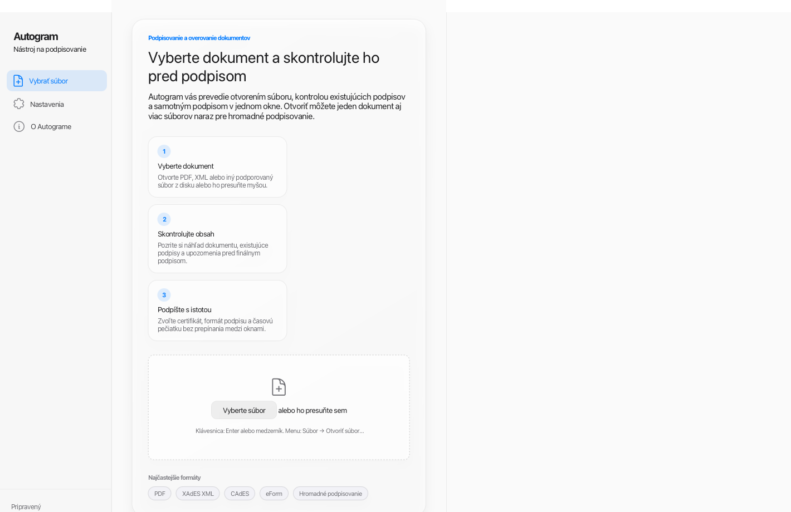
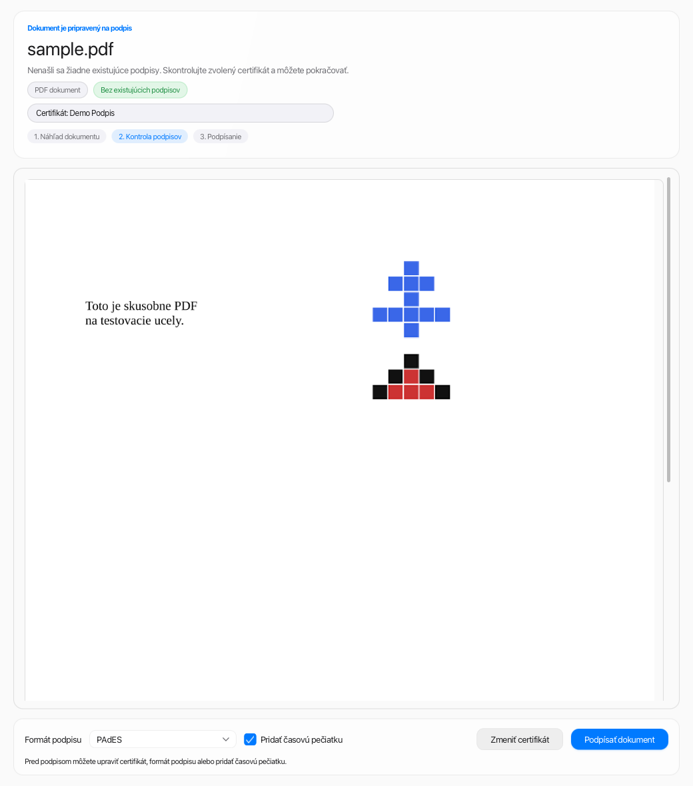

# Autogram macOS
[🇸🇰 Slovenská verzia](README-SK.md)

Autogram is a desktop application for signing and verifying electronic documents in accordance with the eIDAS regulation. This repository is a macOS-specialized fork of the upstream [Slovensko.Digital Autogram](https://github.com/slovensko-digital/autogram) project: it keeps the signing core, HTTP API, CLI workflows, and eForm support, while redesigning the desktop experience for a more native, readable, and trustworthy macOS workflow.

## Project Scope
- Sign and verify electronic documents from a desktop app with one primary workflow.
- Support legal and public-sector use cases where the user needs to inspect a document before signing it.
- Preserve automation paths through CLI, HTTP API, and the `autogram://` protocol.
- Keep compatibility with Slovak eGovernment forms and PKCS#11-based signing devices.

## Why This Redesign Exists
The original application already had strong signing capabilities, but the macOS UX needed a more deliberate surface for high-trust work.

- Document signing is a consequential action, so the UI has to be calm, legible, and explicit.
- The old screens were functionally correct, but visually dense and uneven in hierarchy.
- Dark mode readability, dialog sizing, and signing-state communication needed refinement.
- New users needed clearer onboarding before they reached certificate selection and final signing.

The redesign therefore focuses on the places where users make legal or operational decisions: file intake, document review, signature verification, update prompts, and inline warnings. The core signing behavior remains unchanged.

More detailed rollout notes live in [PLAN.md](PLAN.md) and upstream sync guidance in [PORTING.md](PORTING.md).

## Redesign Scope
- Welcome screen and file intake, including clearer drag-and-drop guidance.
- Signing and verification screen, with stronger state hierarchy and denser summary blocks.
- Sidebar metadata and existing-signature summaries.
- Update dialog and overlay ergonomics.
- macOS-native theme tokens, dark-mode readability, and dialog sizing rules.

## Screenshots
### Welcome Screen


The home screen now explains the workflow before the user starts:
- open one file or multiple files for batch signing,
- understand the supported document types at a glance,
- use drag and drop or explicit file selection,
- see update messaging inside a clearer, larger overlay.

### Document Review and Signing


The signing workflow keeps the document preview dominant while surfacing the right decisions:
- review the PDF preview before signing,
- see the current signing state and selected certificate immediately above the preview,
- understand whether the document is ready for signing before the final action,
- choose signature format, timestamp, and certificate in one place.

## Main Capabilities
- Desktop GUI for signing and verifying documents in a single-window flow.
- Signature profiles and document workflows including PAdES, XAdES, CAdES, and Slovak eForms.
- Existing signature validation before countersigning.
- Batch signing from the command line.
- HTTP API integration for web systems and internal tools.
- Custom protocol launch via `autogram://`.
- Support for commonly used PKCS#11 cards, native eID integrations, and PKCS#12 workflows where available.

## Slovak eGovernment Forms
Autogram can work with the most common Slovak public-sector document flows:

- `slovensko.sk` forms, including automatic schema and metadata loading.
- ORSR forms, including embedded-schema handling for signature generation.
- Finančná správa forms in `.asice` containers and XML workflows when the form identifier is known.

See the Slovak README for the full practical examples and naming rules used in these workflows.

## Run on macOS
Official cross-platform releases are available in the upstream [Releases](https://github.com/slovensko-digital/autogram/releases) section. This fork focuses on the macOS application surface and development workflow.

### Option A: Run from Source
```sh
./mvnw -q -Psystem-jdk -DskipTests package
open target/app-image/Autogram.app
```

### Option B: Run from a Downloaded DMG Without Notarization
```sh
# 1) Remove quarantine from the downloaded DMG
xattr -dr com.apple.quarantine "$HOME/Downloads/Autogram-<version>.dmg"

# 2) Mount DMG and copy the app to Applications
hdiutil attach "$HOME/Downloads/Autogram-<version>.dmg"
ditto "/Volumes/Autogram/Autogram.app" "/Applications/Autogram.app"
hdiutil detach "/Volumes/Autogram"

# 3) Remove quarantine from the installed app
xattr -dr com.apple.quarantine "/Applications/Autogram.app"

# 4) Self-sign locally with an ad-hoc signature
codesign --remove-signature "/Applications/Autogram.app" || true
codesign --force --deep --sign - --timestamp=none "/Applications/Autogram.app"
codesign --verify --deep --strict --verbose=2 "/Applications/Autogram.app"

# 5) Launch
open -a "/Applications/Autogram.app"
```

Notes:
- This is a local ad-hoc signature, not Apple notarization.
- For public distribution without warnings, use Apple Developer signing and notarization.

## Integration
Swagger documentation for the HTTP API is available on [GitHub](https://generator3.swagger.io/index.html?url=https://raw.githubusercontent.com/slovensko-digital/autogram/main/src/main/resources/digital/slovensko/autogram/server/server.yml) or after launching the app at [http://localhost:37200/docs](http://localhost:37200/docs).

You can also trigger the application directly from a browser or another app by opening a URL with the special protocol `autogram://`, for example `autogram://go`.

## Console Mode
Autogram can run from the command line for scripted and batch workflows. Use:

```sh
autogram --help
```

On Windows, use:

```sh
autogram-cli --help
```

## Supported Cards and Drivers
- Any PKCS#11-compatible card when the driver path is known.
- Native support for the Slovak eID card.
- Native support for I.CA SecureStore, MONET+ ProID+Q, and Gemalto IDPrime 940.

Adding more cards is typically straightforward as long as they expose PKCS#11.

## Development
### Prerequisites
- JDK 24 with JavaFX
- Maven
- Optional: Visual Studio Code or IntelliJ IDEA Community Edition

Liberica JDK with JavaFX is the recommended setup on macOS.

### Build and Test
```sh
./mvnw -q -Psystem-jdk test
./mvnw -q -Psystem-jdk -DskipTests package
```

The package build prepares the application image in `target/app-image/Autogram.app`.

### Packaging on Linux
`docker-compose.yml` contains services for packaging on Ubuntu, Debian, and Fedora:

```sh
docker compose up --build
```

Resulting packages appear in `packaging/output/`.

### Additional Engineering Docs
- [DEVELOPER.md](DEVELOPER.md)
- [PORTING.md](PORTING.md)
- [PLAN.md](PLAN.md)
- [UPSTREAM_SYNC_PR_CHECKLIST.md](UPSTREAM_SYNC_PR_CHECKLIST.md)

## Authors and Sponsors
Jakub Duras, Slovensko.Digital, CRYSTAL CONSULTING, s.r.o., Solver IT s.r.o., and other contributors.

## License
This software is licensed under EUPL v1.2. It was originally derived from the Octosign White Label project by Jakub Duras, which is licensed under MIT, and is distributed here under EUPL v1.2 with the author’s permission.

In short, the software can be used commercially and non-commercially, and you can create your own versions as long as you publish changes and extensions under the same license and preserve the original copyright.
