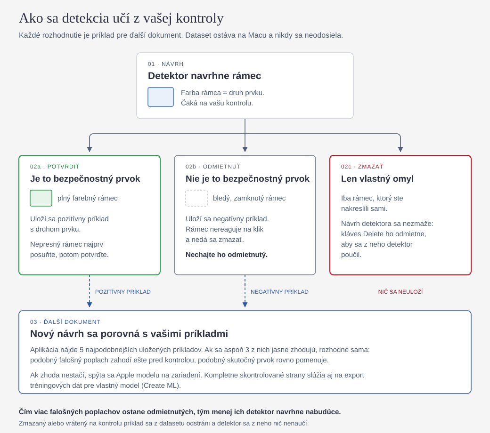

<p align="center">
  
</p>

<h1 align="center">Chevron7</h1>

<p align="center">
  <a href="https://github.com/originalmagneto/chevron7/releases/latest"></a>
  
  
  
  
  <a href="https://chevron7.slovensko.app"></a>
  <a href="https://buymeacoffee.com/chevron7"></a>
</p>

<p align="center">
  <strong>Natívny pracovný stôl pre dôveryhodné právne dokumenty.</strong><br>
  Podpis. Konverzia. Evidencia. V jednom lokálnom workflow.<br>
  <a href="https://chevron7.slovensko.app"><strong>chevron7.slovensko.app</strong></a> · <a href="https://chevron7.slovensko.app/en/">English</a>
</p>

<p align="center">
  <a href="#prehľad">Prehľad</a> ·
  <a href="#ai-vision-vrstvená-detekcia-bezpečnostných-prvkov">AI Vision</a> ·
  <a href="#zaručená-konverzia">Zaručená konverzia</a> ·
  <a href="#podpisovanie">Podpisovanie</a> ·
  <a href="#rýchly-štart">Rýchly štart</a> ·
  <a href="#architektúra">Architektúra</a>
</p>

Natívna macOS aplikácia v SwiftUI pre kvalifikované elektronické podpisovanie, zaručenú konverziu podľa zákona č. 305/2013 Z. z. a lokálnu evidenciu právnych dokumentov. Žiadny obsah dokumentu neopúšťa Mac, pokiaľ to výslovne nezvolíte.

## Web

Produktový web beží na **[chevron7.slovensko.app](https://chevron7.slovensko.app)** (anglicky na [/en/](https://chevron7.slovensko.app/en/)). Je to statický web v Astro nasadený na Cloudflare a má vlastný súkromný repozitár `originalmagneto/chevron7-website`; po každom push na jeho `main` sa nasadí sám. Vizuálny systém webu popisuje [DESIGN.md](DESIGN.md), fakty o produkte, ktoré web smie tvrdiť, [PRODUCT.md](PRODUCT.md). Všetky zábery appky na webe sú skutočné nahrávky Chevron7 s ukážkovými dokumentmi.

## Pôvod a poďakovanie

Chevron7 je natívna macOS aplikácia na kvalifikovaný elektronický podpis a zaručenú konverziu. Podpisový engine v priečinku `engine/` je fork projektu [slovensko-digital/autogram](https://github.com/slovensko-digital/autogram) pod licenciou EUPL 1.2. Podpisovanie mobilom cez NFC používa aplikáciu Autogram v mobile a server autogram.slovensko.digital, ktoré prevádzkuje Slovensko.Digital. Rozšírenie pre Safari preberá časti [slovensko-digital/autogram-extension](https://github.com/slovensko-digital/autogram-extension).

Chevron7 nie je spojený so Slovensko.Digital ani ním podporovaný a nemá nič spoločné so spoločnosťou Chevron Corporation. Licencia: EUPL 1.2, pozri `LICENSE` a `NOTICE`.

## Prehľad

<table>
<tr>
<th align="left" width="22%">Modul</th>
<th align="left">Čo rieši</th>
<th align="left" width="26%">Výstup</th>
</tr>
<tr>
<td><strong>Podpisovanie</strong></td>
<td>KEP, PAdES, ASiC-E, kvalifikovaná časová pečiatka, vizuálny podpis a dávkové spracovanie s jednou plnou DSS validáciou.</td>
<td><code>PDF</code> · <code>ASiC-E</code></td>
</tr>
<tr>
<td><strong>Zaručená konverzia</strong></td>
<td>Import, analýza strán, vrstvená AI Vision detekcia bezpečnostných prvkov, osvedčovacia doložka a autorizácia mandátnym certifikátom.</td>
<td><code>ASiC-E</code> (PDF/A-2b a XML doložka) · evidencia</td>
</tr>
<tr>
<td><strong>Štátne weby</strong></td>
<td>Rozšírenie do Safari, ktoré podpisovanie na portáloch obslúži cez túto aplikáciu: natívna správa namiesto otvoreného portu, potvrdenie v plávajúcom okne, kartou alebo mobilom.</td>
<td><code>PDF</code> · <code>ASiC-E</code> · <code>XDCF</code></td>
</tr>
<tr>
<td><strong>Register</strong></td>
<td>Lokálne záznamy o konverziách, stavy, vyhľadávanie, uloženie podpísaného záznamu o konverzii a CSV export.</td>
<td><code>register.json</code> · <code>CSV</code></td>
</tr>
<tr>
<td><strong>Integrácie</strong></td>
<td>eID, advokátske preukazy, PKCS#11, Keychain, Finder Quick Action, podpis mobilom cez Autogram v mobile (NFC eID na iPhone), EZZK cez SOAP s vlastným prihlásením advokáta (produkcia zatiaľ len na čítanie).</td>
<td>natívny pracovný tok</td>
</tr>
</table>

<details>
<summary><strong>Čo získate v každom module</strong></summary>

<table>
<tr>
<td width="50%" valign="top">
<h3>Podpisovanie</h3>
<ul>
<li>Výber eID, I.CA SecureStore, PKCS#11 a Keychain tokenov, vrátane čítačiek s viacerými slotmi.</li>
<li>PAdES a ASiC-E výstupy s kvalifikovanou časovou pečiatkou.</li>
<li>Vizuálny podpis, dávkové spracovanie a bezpečné zrušenie operácie.</li>
<li>Podpis bez čítačky: QR kód, iPhone s aplikáciou Autogram v mobile a občiansky preukaz s NFC.</li>
<li>Neplatný vstupný podpis blokuje konkrétny dokument; nedostupná trust služba zostáva iba informatívna.</li>
</ul>
</td>
<td width="50%" valign="top">
<h3>Zaručená konverzia</h3>
<ul>
<li>Kontrolovaný import a potvrdenie pôvodu dokumentu.</li>
<li>Katalóg 16 druhov bezpečnostných prvkov, AI návrhy a povinná manuálna kontrola vrátane šnúrok, pások a pečatí.</li>
<li>PDF/A-2b, osvedčovacia doložka, XML a lokálna evidencia.</li>
<li>Mandátny certifikát, evidenčné číslo priamo z EZZK a kontrola, či číslo nie je z iného dňa alebo z iného režimu.</li>
<li>Záznam o zaručenej konverzii (record 1.0) sa podpíše rovnakým PIN hneď po doložke, s kvalifikovanou časovou pečiatkou, a sám sa odošle do EZZK. Register ukazuje, či ho EZZK prijalo, spracovalo alebo odmietlo. Na Produkcii je odoslanie zatiaľ zamknuté.</li>
</ul>
</td>
</tr>
</table>
</details>

### Nové natívne rozhranie

- Podpisovanie aj ZaKo zobrazujú aktuálny krok v podnadpise okna. Navigácia a voľba dokumentu sú v hornej lište. Stav karty (eID, I.CA alebo DEMO) je v stavovej lište.
- Inšpektor podpisu sa dá skryť a meniť jeho šírku. Karty v inšpektore sú svetlé, bez vrstveného frosted glass. Vizuálny podpis má priehľadné pozadie.
- Overenie originálu: lupa 100–250 %, Delete zmaže vybraný prvok, Escape zruší nástroj alebo výber. Klávesové posuny ostávajú ⌥ a ⇧⌥.
- Doložka má štruktúrovaný živý náhľad (osem polí podľa zákona) a prepínač v toolbare.
- Register má filter stavu, detail, odoslanie do EZZK a overenie stavu v EZZK v toolbare; záznam, ktorý EZZK odmietlo pri odoslaní, sa dá po potvrdení odoslať znova. Pri autorizácii sa pole PIN zameria samo.
- Počas podpisovania a autorizácie sú zablokované akcie, ktoré by vynulovali rozpracovanú operáciu. Bočný panel má zbaliteľné sekcie podpísaných a nedávnych dokumentov; podpísané kópie sa dajú odstrániť aj so súborom do Koša.
- Sekcia **Zaručené konverzie** v bočnom paneli ukazuje posledných päť konverzií s evidenčným číslom a stavom v EZZK; klik otvorí detail v Registri, **Zobraziť všetky** celý Register. Dole v paneli je nenápadný odkaz **Podporiť vývoj** (Buy Me a Coffee).

## AI Vision: vrstvená detekcia bezpečnostných prvkov

Vstavaná detekcia beží na zariadení a skladá sa z troch vrstiev. Voliteľné externé modely sa zapínajú v nastaveniach. Rozšírenie katalógu a tréningových tried samo osebe nepotvrdzuje presnosť detekcie nových prvkov.

<p align="center">
  
</p>

<table>
<tr>
<th align="left" width="18%">Vrstva</th>
<th align="left">Ako funguje</th>
<th align="left" width="30%">Technológia</th>
</tr>
<tr>
<td><strong>1 · Kandidáti</strong></td>
<td>Strana sa vykreslí raz a prejde rýchlym aj presným OCR. Tri nezávislé zdroje navrhnú oblasti, ktoré sa zlúčia podľa prekrytia. Filtre pred klasifikáciou obmedzujú návrhy na tlačenom texte, linkovaných bunkách a čiarových kódoch.</td>
<td>vstavané HSV heuristiky · <code>RecognizeTextRequest</code> (fast + accurate) · <code>DetectContoursRequest</code> · objectness saliency</td>
</tr>
<tr>
<td><strong>2 · Klasifikácia</strong></td>
<td>Každý výrez porovná <em>feature print</em> s lokálne uloženými potvrdenými a zamietnutými príkladmi. Ak je výsledok neistý, rozhodne on-device Apple model: dostane iba výrez a podiel OCR textu, nie tip heuristiky, a jeho "nie" platí aj pri nulovej istote. Najviac 12 výrezov na stranu, 8 s limit na výrez, každý výrez v čerstvej relácii modelu.</td>
<td><code>GenerateImageFeaturePrintRequest</code> · Foundation Models (macOS 27, obrazový vstup)</td>
</tr>
<tr>
<td><strong>3 · Kontrola</strong></td>
<td>Plátno drží iba dokument; vpravo sú tri karty: Kontrola strany, Nálezy a Pridať prvok. Advokát nález potvrdí alebo odmietne (aj všetky naraz cez <strong>Odmietnuť návrhy</strong>), upraví rámec ťahaním, alebo zvolí typ a klikne na prvok, aby sa rámec prichytil k obrysu. Každý druh prvku má vlastnú farbu; odmietnuté nálezy sú bledé, zamknuté a nereagujú na klik. Po označení strany aplikácia preskočí na ďalšiu neskontrolovanú; bez kontroly každej neprázdnej strany nepokračuje.</td>
<td><code>GenerateIterativeSegmentationRequest</code> · SwiftUI canvas</td>
</tr>
</table>

### Ako sa detekcia učí z vašej kontroly

<p align="center">
  
</p>

Detekcia sa neučí raz a navždy vo výrobe, ale priamo z vašej práce na tomto Macu. Každý nález, ktorý potvrdíte alebo odmietnete, sa uloží ako **príklad**: výrez zo skenu, jeho *feature print* (číselný odtlačok vzhľadu) a vaše rozhodnutie. Pri ďalšom dokumente sa každý nový návrh porovná s piatimi najpodobnejšími uloženými príkladmi. Ak sa aspoň tri z nich jasne zhodujú, aplikácia rozhodne sama, bez volania jazykového modelu:

- podobá sa na to, čo ste **potvrdili**, tak ho rovno pomenuje správnym druhom prvku,
- podobá sa na to, čo ste **odmietli**, tak ho ako falošný poplach zahodí ešte predtým, než ho uvidíte.

Ak zhoda nestačí, rozhodne on-device Apple model a výsledok opäť skontrolujete vy. S každým dokumentom je teda falošných poplachov menej a pomenovania presnejšie, ale iba vtedy, keď sú rozhodnutia v datasete správne a úplné.

#### Prečo nechať odmietnuté návrhy odmietnuté

Odmietnutý návrh nie je odpad, ale najcennejší typ príkladu: učí detektor, čo bezpečnostný prvok **nie je** (tlačený text, logo v hlavičke, tabuľka, čiarový kód, šum skenu). Keby ste ho zmazali, detektor by rovnakú chybu navrhol znova. Preto aplikácia:

- odmietnuté nálezy na plátne zobrazí len bledým prerušovaným rámcom pod ostatnými, bez popisu, aby vás nemýlili (prepínač **Zobraziť odmietnuté** ich skryje úplne),
- ich zamkne: nereagujú na klik ani ťahanie, nedajú sa posunúť, zmeniť, duplikovať ani zmazať a nový rámec môžete nakresliť priamo cez ne,
- v zozname Nálezy ich presunie do zbalenej skupiny **Odmietnuté (N)**, kde jediná akcia je **Vrátiť na kontrolu**,
- pri návrhu detektora nahradí mazanie odmietnutím: kláves Delete návrh odmietne, nie zmaže.

Rozlišujte dve situácie:

<table>
<tr>
<th align="left" width="34%">Situácia</th>
<th align="left">Správny postup</th>
</tr>
<tr>
<td>Na mieste nie je žiadny bezpečnostný prvok</td>
<td><strong>Odmietnuť</strong> (jednotlivo alebo cez <strong>Odmietnuť návrhy</strong> na strane či v celom dokumente). Vznikne negatívny príklad.</td>
</tr>
<tr>
<td>Prvok tam je, ale rámec sedí nepresne alebo má zlý druh</td>
<td>Rámec <strong>posuňte alebo zmeňte druh a potvrďte</strong>. Vznikne pozitívny príklad so správnou polohou. Odmietnutím by sa skutočná pečiatka naučila ako „nie prvok“.</td>
</tr>
<tr>
<td>Sami ste nakreslili rámec omylom</td>
<td><strong>Zmazať</strong>. Vlastný omyl nemá hodnotu príkladu, nič sa neuloží.</td>
</tr>
</table>

<details open>
<summary><strong>Čo presne sa uloží pri každej akcii</strong></summary>

<table>
<tr>
<th align="left" width="28%">Akcia</th>
<th align="left">Čo sa stane v datasete</th>
</tr>
<tr>
<td>Potvrdíte nález</td>
<td>Podporovaný prvok s rámcom v skene sa uloží ako pozitívny výrez s feature printom a druhom prvku. Právne posúdenie podpisu či pečiatky sa mapuje na všeobecnú obrazovú triedu; fyzická kontrola bez rámca nevytvorí výrez.</td>
</tr>
<tr>
<td>Odmietnete nález</td>
<td>Výrez sa uloží ako negatívny príklad a nález sa zamkne, aby sa príklad omylom nestratil.</td>
</tr>
<tr>
<td>Stlačíte Delete na návrhu detektora</td>
<td>Návrh sa odmietne (negatívny príklad), nezmaže.</td>
</tr>
<tr>
<td>Zmažete vlastný rámec alebo už potvrdený nález</td>
<td>Nález aj jeho príklad zmiznú; zmazanie sa dá vrátiť tlačidlom <strong>Vrátiť</strong>.</td>
</tr>
<tr>
<td>Upravíte potvrdený nález (poloha v inšpektore, prichytenie alebo spresnenie rámca)</td>
<td>Nález ostane potvrdený a príklad sa uloží znova s novou polohou. Ťahanie po plátne, zmena druhu alebo popisu vráti nález na kontrolu; potom ho znova potvrďte.</td>
</tr>
<tr>
<td>Vrátite nález na kontrolu</td>
<td>Príklad sa z datasetu odstráni, kým nerozhodnete znova.</td>
</tr>
<tr>
<td>Dokončíte kontrolu strany</td>
<td>Úplná anotácia strany sa uloží osobitne do <code>reviewed-pages.json</code>. Samotné potvrdenie jedného výrezu nestačí na export celej strany. Úpravy nálezov zneplatnia jej kontrolu.</td>
</tr>
<tr>
<td>Export pre Create ML</td>
<td>Exportuje sa nový priečinok s <code>annotations.json</code>, obrazmi kompletne skontrolovaných strán a <code>splits.json</code> na rozdelenie podľa dokumentov. Odmietnuté nálezy sú v ňom pozadím, nie objektom. Strany s prvkom bez lokalizácie alebo bez podporovanej obrazovej triedy sa vynechajú; fyzický záznam vylúči pôvodnú aj odkazovanú výstupnú stranu. Rozdelenie z <code>splits.json</code> treba pri tréningu použiť explicitne. Export model nenatrénuje.</td>
</tr>
</table>

<p>Dataset žije v <code>~/Library/Application Support/Chevron7/VisionBank</code>, obsahuje náhľady strán dokumentov, ktorých prvky ste posúdili, a nikdy sa neodosiela. V Nastaveniach sa dá učenie vypnúť (<strong>Učiť sa z potvrdených a odmietnutých prvkov</strong>) a dataset vymazať. Prínos nových príkladov treba overiť na samostatných skenoch príkazom <code>vision-eval</code> (nižšie).</p>
</details>

<details>
<summary><strong>Nastavenia AI a voliteľné externé modely</strong></summary>

<table>
<tr>
<th align="left" width="40%">Voľba</th>
<th align="left">Správanie</th>
</tr>
<tr>
<td>Klasifikovať neisté nálezy on-device modelom</td>
<td>Predvolene zapnuté, ak je dostupná Apple Intelligence. Bez modelu rozhoduje iba porovnanie s príkladmi a odhad heuristík.</td>
</tr>
<tr>
<td>Učiť sa z potvrdených a odmietnutých prvkov</td>
<td>Predvolene zapnuté. Vypnutím sa dataset prestane dopĺňať.</td>
</tr>
<tr>
<td>oMLX · Ollama · OpenAI-compatible API</td>
<td>Voliteľná druhá vrstva nálezov z externého vision LLM. Iba pri výslovnom zapnutí; vstavaná detekcia beží vždy.</td>
</tr>
</table>
</details>

<details>
<summary><strong>Meranie presnosti</strong></summary>

<p>Každá zmena detektora sa dokladá číslami na vašich vlastných skenoch, nie na syntetických fixtúrach. Exportovaný dataset (mimo repozitára) sa vyhodnotí príkazom:</p>

```bash
cd Chevron7
DEVELOPER_DIR=/Applications/Xcode.app/Contents/Developer \
swift run vision-eval ~/Chevron7Eval [--builtin-only] [--no-fm] [--bank <dir>] [--iou 0.4] [--json]
```

<p>Výstup obsahuje presnosť, úplnosť a F1 pre každý druh prvku, priemerný čas na stranu a počet volaní on-device modelu. Bez <code>--bank</code> sa použije prázdny dočasný dataset, nie ten používateľský, aby boli čísla porovnateľné medzi commitmi.</p>
</details>

## Zaručená konverzia

### Bezpečnostné prvky

- Katalóg má 16 druhov. Rýchly výber obsahuje pečiatku, podpis, slepotlač, parafu, šnúrku a pásku/štítok; ďalšie možnosti sú zoskupené v menu.
- Prvok možno označiť rámcom v skene alebo zaznamenať cez **Skontrolované na origináli**. Fyzická kontrola vyžaduje opis umiestnenia a pred autorizáciou aj konkrétnu stranu zachytenia v novom PDF.
- Dokument bez bezpečnostných prvkov vyžaduje výslovné potvrdenie po kontrole neprázdnych strán. Zmena nálezu zruší príslušné potvrdenia a platnosť tréningovej anotácie.
- Potvrdený nález opraví automatické vyhodnotenie jeho strany ako prázdnej. Úradné osvedčenie podpisu a ďalšie právne posúdenia potvrdzuje človek.

Sekcia bezpečnostných prvkov XML záznamu používa overenú štruktúru record 1.0 s textovým opisom, umiestnením a číslami strán/listu. Overenie tejto sekcie nepotvrdzuje súlad celého formulára; formulárový balík zostáva pilotný.

Podrobnosti: [pravidlá tréningového datasetu](Chevron7/docs/security-element-training.md) a [oficiálne formulárové podklady](Chevron7/docs/reference/security-elements/FINDINGS.md).


<table>
<tr>
<td align="center" width="20%"><strong>1 · Vstup</strong><br><sub>PDF alebo obrazový sken, potvrdenie pôvodu</sub></td>
<td align="center" width="20%"><strong>2 · Overenie</strong><br><sub>analýza, AI nálezy, fyzická kontrola, kontrola každej strany</sub></td>
<td align="center" width="20%"><strong>3 · Doložka</strong><br><sub>osoba, počítadlá, poloha prvkov, XML, preflight</sub></td>
<td align="center" width="20%"><strong>4 · Autorizácia</strong><br><sub>evidenčné číslo, PDF/A, mandátny podpis</sub></td>
<td align="center" width="20%"><strong>5 · Hotovo</strong><br><sub>ASiC-E pre klienta a lokálna evidencia</sub></td>
</tr>
</table>

<details open>
<summary><strong>Stav EZZK a produkčného odoslania</strong></summary>

<p><strong>Chevron7 komunikuje s EZZK cez SOAP rozhranie Ditec, s prihlasovacím menom a heslom, ktoré advokát dostal pri registrácii.</strong> Portálové REST rozhranie cez OAuth2/PKCE by vyžadovalo, aby MIRRI SR zaregistrovalo natívny callback pre Chevron7; podľa integrátorov sa to nestane, lebo EZZK sa už nerozvíja. Pôvodný OAuth kód v projekte ostáva, ale nie je zapojený, a čaká na budúce prihlasovanie cez slovensko.sk.</p>

<p>Prihlasovacie údaje sa zadávajú v <strong>Nastaveniach, karta EZZK</strong>, pre zvolené prostredie: Demo (lokálne), Test alebo Produkcia. Heslo sa uloží do Keychainu až vtedy, keď ho EZZK prijme; prihlasovací token existuje len v pamäti aplikácie. Testovacie prostredie má vlastný certifikát, ktorému aplikácia dôveruje len podľa pripnutého odtlačku.</p>

<p><strong>Čo funguje kde:</strong> na Teste prihlásenie, čas servera, pridelenie evidenčných čísel, odoslanie podpísaného záznamu cez <code>ReceiveConversionRecord</code> aj overenie jeho stavu. Na Produkcii zatiaľ len prihlásenie, čas servera a verejné overenie záznamu. Celý postup kartou SAK na Teste prešiel; pridelenie čísla a odoslanie záznamu na Produkcii sa zapnú pre všetkých po prvej overenej ostrej konverzii. Bez evidenčného čísla aplikácia nepovolí autorizáciu, a číslo z iného dňa alebo z iného režimu odmietne ešte pred podpisom, lebo EZZK nepoužité čísla o polnoci spotrebuje.</p>

<p><strong>Ochrany pred chybou:</strong> mimo režimu Demo aplikácia nepridelí evidenčné číslo ani neautorizuje, ak podpisuje iba ukážkovo (bez podpisového enginu alebo bez karty), lebo nepoužité číslo by o polnoci prepadlo bez záznamu. Riadok Registra, ktorého záznam sa práve podpisuje alebo odosiela, sa nedá vymazať. Ak EZZK pri overení odpovie, že pod číslom eviduje viac záznamov (kód 106), aplikácia sa spýta znova s časom konverzie, aby sa stav ustálil.</p>

<p><strong>Záznam o konverzii:</strong> po podpise doložky sa rovnakým PIN podpíše aj záznam record 1.0 v kontajneri XDC a ASiC-E, mimo režimu Demo vždy s kvalifikovanou časovou pečiatkou. Klient dostane jediný súbor: ASiC-E, v ktorom sú PDF/A a doložka podpísané spolu. Ako v kontajneroch z podpisuj.sk sa PDF/A v ňom volá podľa poľa „Názov výstupu (PDF/A)“ (s príponou <code>.pdf</code>), doložka <code>&lt;číslo&gt;.xml.xdcf</code> a doložka aj záznam uvádzajú ako názov nového dokumentu presne názov tohto PDF; súbor pri zdroji sa volá <code>&lt;názov výstupu&gt;.asice</code> a nikdy neprepíše existujúci súbor. Podpísaný záznam ostáva len v Registri konverzií; v kontextovej ponuke riadka alebo v jeho detaile ho uložíte cez <strong>Uložiť záznam…</strong> ako <code>&lt;číslo&gt;.record.asice</code>. Aplikácia záznam odošle hneď a potom každých päť minút skúša čakajúce odoslania a overuje stav v EZZK (Prijatý na spracovanie, Spracovaný, Odmietnutý). Pri prerušenom spojení záznam znova neposiela naslepo: najprv overí, či ho EZZK už má, lebo EZZK duplicity ukladá. Záznam odoslaný po polnoci dňa pridelenia sa označí ako oneskorený, EZZK ho však prijme. Ak sa záznam nepodarí podpísať, výstupy pre klienta ostanú a riadok v registri má stav Záznam nepodpísaný.</p>

<p>Podrobne: <a href="Chevron7/docs/EZZK-INTEGRATION.md">Chevron7/docs/EZZK-INTEGRATION.md</a>.</p>
</details>

<p align="center">
  
</p>

## Podpisovanie

1. Otvorte PDF cez `⌘O`, drag and drop alebo Finder Quick Action. Podpísaný súbor sa ukladá vedľa pôvodného pod jeho menom s príponou `_podpisane`, nech ste ho otvorili ktorýmkoľvek z týchto spôsobov; do vlastného priečinka aplikácie spadne len vtedy, keď pôvodný priečinok nie je zapisovateľný alebo keď dokument prišiel bez súboru (napríklad obrázok pretiahnutý z inej aplikácie).
2. Pri viacerých dokumentoch vyberte **Pripraviť dávku podpisov**.
3. Prejdite preflight kontrolou vstupov a nastavení.
4. Vyberte formát, certifikát a voliteľný vizuálny podpis alebo QTS.
5. Spustite podpisovanie cez **Podpísať KEP** (karta v čítačke) alebo **Podpísať mobilom** (občiansky preukaz s NFC cez iPhone).
6. Skontrolujte výsledný PDF, XML alebo ASiC-E artefakt.

### Podpis mobilom

Bez čítačky kariet podpíšete dokument občianskym preukazom s NFC a iPhonom s aplikáciou [Autogram v mobile](https://sluzby.slovensko.digital/autogram-v-mobile/). Mac dokument zašifruje náhodným kľúčom, ktorý pozná len on, nahrá ho na server Slovensko.Digital, zobrazí QR kód a čaká. Po naskenovaní kódu telefón dokument podpíše a Mac si podpísaný súbor stiahne, overí a uloží rovnako ako pri karte.

<p align="center">
  
</p>

<table>
<tr>
<th align="left" width="30%">Čo platí</th>
<th align="left">Detail</th>
</tr>
<tr><td>Formát a pečiatka</td><td>Rovnaké voľby ako pri karte: PAdES v PDF alebo ASiC-E (XAdES), kvalifikovanú časovú pečiatku pridá server pri úrovni <code>_T</code>.</td></tr>
<tr><td>Vizuálny podpis</td><td>Vypáli sa do PDF lokálne ešte pred odoslaním; karta uvádza "Občiansky preukaz (eID) cez Autogram v mobile", lebo certifikát je známy až po podpise.</td></tr>
<tr><td>Zaručená konverzia</td><td>Vyžaduje mandátny certifikát. Podpis z mobilu bez neho aplikácia odmietne, nič neuloží a evidenciu nezmení. ZaKo cez mobil je zatiaľ dostupná len v režime Demo, lebo mobil podpisuje iba PDF; kartou SAK sa PDF/A a osvedčovacia doložka (XDC) podpíšu ako dva dátové objekty jedného ASiC-E a do PDF/A sa nič nevkladá.</td></tr>
<tr><td>Súkromie</td><td>Server dokument dešifruje len v pamäti pri podpise a zmaže ho do 24 hodín. Kľúč sa neposiela nikam inam než v hlavičke k danému dokumentu.</td></tr>
<tr><td>Hranice</td><td>Aplikácia Autogram v mobile číta len občiansky preukaz a otvára len odkazy z <code>autogram.slovensko.digital</code>; SAK karta a vlastný server cez mobil nejdú. Finder Quick Action ostáva len pre kartu.</td></tr>
</table>

<details>
<summary><strong>Stavy podpisu a dôveryhodnosti</strong></summary>

<table>
<tr>
<th align="left" width="22%">Krok</th>
<th align="left">Význam</th>
</tr>
<tr><td><code>INSPECT</code></td><td>Rýchle čítanie existujúcich podpisov vrátane podpisov v ASiC-E, bez blokovania na nedostupnom trust liste.</td></tr>
<tr><td><code>VALIDATE</code></td><td>Úplná dôveryhodnostná kontrola s trust listami; jedna validácia pre celú dávku.</td></tr>
<tr><td><code>INVALID</code></td><td>Konkrétny dokument je zablokovaný, ostatné v dávke pokračujú.</td></tr>
<tr><td><code>indeterminate</code></td><td>Trust služba nie je dostupná; nie je to platný ani neplatný podpis a dávku neblokuje.</td></tr>
<tr><td><code>DEMO</code></td><td>Jasne označený podpisovač bez reálneho tokenu. DEMO podpis nie je právne záväzný.</td></tr>
</table>
</details>

## Podpisovanie na štátnych weboch

Rozšírenie do Safari podpisuje priamo na slovensko.sk, financnasprava.sk, sluzby.orsr.sk, socpoist a obcan.justice.sk. Portál volá svoje obvyklé rozhranie D.Signer a Chevron7 ho obslúži namiesto pôvodného podpisovača. Dokumenty necestujú cez žiadny otvorený port: rozšírenie hovorí s aplikáciou natívnou správou.

<table>
<tr>
<th align="left" width="30%">Čo platí</th>
<th align="left">Detail</th>
</tr>
<tr><td>Transport</td><td>Natívny messaging, žiadny HTTP server a žiaden počúvajúci port. Meno Mach služby vlastní malý launchd agent, ktorý slúži len ako miesto stretnutia; aplikácia uňho zaregistruje anonymný endpoint a rozšírenie sa naň pripojí priamo. Cez agenta neprejde ani jeden dokument.</td></tr>
<tr><td>Spustenie</td><td>Chevron7 netreba mať otvorený. Pri požiadavke ho launchd agent spustí na pozadí, bez ikony v Docku a bez hlavného okna, a zobrazí sa iba okno podpisu vycentrované nad oknom Safari. Po otvorení Chevron7 z Docku alebo Findera sa z neho stane bežná aplikácia s hlavným oknom.</td></tr>
<tr><td>Potvrdenie</td><td>Stránka nepodpíše nič ticho. Každá požiadavka otvorí plávajúce okno nad prehliadačom: vľavo všetky strany PDF a tlačidlo <strong>Otvoriť náhľad</strong> (Quick Look), vpravo mobil a karta. Naraz sa spracúva jedna požiadavka.</td></tr>
<tr><td>Karty</td><td>Karta I.CA: po vložení dostane zameranie pole PIN, Enter načíta certifikáty a oba sa zobrazia pod sebou s označením mandátny, QCP alebo komerčný. Občiansky preukaz: certifikáty sa vopred nečítajú, engine použije jediný podpisový kľúč na karte a BOK sa zadáva dvakrát v okne eID klienta (prihlásenie a potvrdenie podpisu); okno podpisu ostane viditeľné pod ním.</td></tr>
<tr><td>Mobil</td><td>Podpísať sa dá aj občianskym preukazom cez NFC. Relay prijíma tie isté eForm atribúty ako lokálny engine, takže mobilom sa dá podpísať aj elektronický formulár, nielen PDF.</td></tr>
<tr><td>Formát</td><td>Určuje ho portál, nie nastavenia. PDF, ktoré portál pýta v obálke ASiC-E (nove.slovensko.sk), sa podpíše ako XAdES v ASiC-E s pôvodným PDF vnútri, kartou aj mobilom. Elektronický formulár ide ako XAdES v ASiC-E s XML Data Containerom.</td></tr>
<tr><td>Dlhé podpisy</td><td>Safari ukončuje pozadie rozšírenia asi po 30 sekundách, preto stránka podpis len spustí a výsledok si vyzdvihuje krátkymi správami. Podpis s PIN alebo mobilom tak môže trvať ľubovoľne dlho.</td></tr>
<tr><td>Časová pečiatka</td><td>Portály pýtajú úroveň Baseline B, teda bez pečiatky, a aplikácia im pošle presne to. Na slovensko.sk sa prepínač pečiatky neponúka vôbec, lebo nove.slovensko.sk podpis s nevyžiadanou pečiatkou odmietne (overené porovnaním s oficiálnym Autogramom). Na ostatných weboch prepínač úroveň povýši na Baseline T a pri každej požiadavke začína vypnutý. Autogram v mobile ponúkne pri Baseline B vlastnoručný podpis, pri Baseline T osvedčený.</td></tr>
<tr><td>Ukladanie</td><td>Podpis z prehliadača sa vracia stránke. Kópiu si aplikácia predvolene odkladá do vlastného priečinka, ktorý sa dá zmeniť alebo ukladanie vypnúť; v nastaveniach sa dá zapnúť presun kópií do Koša po 7, 30 alebo 90 dňoch.</td></tr>
<tr><td>Návrat k pôvodnému</td><td>Prepínač v rozšírení vráti konkrétnu stránku jej pôvodnému podpisovaču, napríklad D.Bridge 2, bez vypínania celého rozšírenia. Rozšírenie potom stránku obnoví, lebo voľba musí padnúť skôr, než sa načíta podpisovač stránky.</td></tr>
<tr><td>Hranice</td><td>Rozšírenie nie je podpísané Developer ID, takže Safari ho načíta len pri zapnutom <strong>Develop &gt; Allow Unsigned Extensions</strong>, a to po každom štarte. Po reinštalácii aplikácie treba Safari ukončiť (⌘Q) a otvoriť znova. Podporované sú zatiaľ formuláre XAdES s XML Data Containerom a PDF; ostatné typy objektov hlásia nepodporovaný typ.</td></tr>
</table>

<details>
<summary><strong>Inštalácia rozšírenia</strong></summary>

```bash
DEVELOPER_DIR="/Applications/Xcode.app/Contents/Developer" ./build_app.sh --release install
./scripts/install-webbridge-agent.sh
./scripts/safari-spike.sh
```

`build_app.sh install` rozšírenie v systéme zaregistruje; ak Safari počas inštalácie beží, pripomenie jeho reštart. V zozname rozšírení sa volá **Chevron7** a nesie ikonu aplikácie, takže sa nedá zameniť s oficiálnym rozšírením „Autogram na štátnych weboch“ ani s D.Bridge 2. Safari ho vypíše až potom, ako aplikácia aspoň raz bežala: appex enumeruje cez svoju nosnú aplikáciu. Pri bežnej prevádzke to nevadí, lebo launchd agent spustí Chevron7 sám pri prvej požiadavke z portálu. `safari-spike.sh` overí všetko, čo sa overiť dá bez Safari: prítomnosť appexu, jeho entitlement, registráciu agenta a spojenie s aplikáciou. Potom vypíše tri kroky, ktoré treba spraviť v Safari ručne.

Podpis bez Safari sa dá vyskúšať priamo:

```bash
"$(swift build --show-bin-path)/webbridge-probe" --sign dokument.pdf
```

</details>

## Vizuálny guide

<table>
<tr>
<td width="50%" valign="top">
<ul>
<li><a href="docs/diagrams/visual-guide.html">AI Vision, architektúra a batch preflight</a> (HTML)</li>
<li><a href="docs/diagrams/architecture.html">Architektúra aplikácie</a> (HTML) · <a href="docs/diagrams/architecture.svg">SVG</a></li>
<li><a href="docs/gallery.html">Diagramová galéria</a></li>
<li><a href="docs/diagrams/process-zako.svg">Proces zaručenej konverzie</a></li>
<li><a href="docs/diagrams/mobile-signing.svg">Podpis mobilom (AVM)</a></li>
</ul>
</td>
<td width="50%" valign="top">
<ul>
<li><a href="docs/diagrams/ai-vision.svg">AI Vision pipeline</a></li>
<li><a href="docs/diagrams/ai-learning.svg">Ako sa detekcia učí z vašej kontroly</a></li>
<li><a href="docs/diagrams/pdfa-pipeline.svg">PDF/A pipeline</a></li>
<li><a href="docs/diagrams/finder-quick-action.svg">Finder Quick Action</a></li>
<li><a href="docs/diagrams/state-machine.svg">Stavový automat evidencie</a></li>
</ul>
</td>
</tr>
</table>

<details>
<summary><strong>Ďalšie diagramy</strong></summary>

<h3>Architektúra aplikácie</h3>
<p>Tri zóny: povrchy (SwiftUI, Safari WebBridge, Autogram v mobile), jadro (session stores, Chevron7Kit, Java engine) a dôvera (evidencia, EZZK, PKCS#11 karty). Dokument neopúšťa Mac, kým to výslovne nezvolíte.</p>
<p align="center"></p>

<h3>PDF/A pipeline</h3>
<p>Vloženie metadát a príloh, XMP profil, výpočet fingerprintu a kontrola, že exportovaný artefakt spĺňa požadovaný formát.</p>
<p align="center"></p>

<h3>Finder Quick Action</h3>
<p>Samostatný runner zobrazí výber ovládača, certifikátu a PIN/BOK, podpíše PDF na pozadí a uloží výsledok bez otvorenia hlavného okna.</p>
<p align="center"></p>

<h3>Podpis mobilom</h3>
<p>Mac nahrá zašifrovaný dokument na AVM server, iPhone ho po naskenovaní QR kódu podpíše občianskym preukazom cez NFC a Mac si podpísaný súbor stiahne pollingom. Rovnaký diagram je v sekcii Podpisovanie.</p>

<h3>Stavový automat evidencie</h3>
<p>Kedy je dokument iba pripravený, kedy prešiel kontrolou a kedy už vznikol podpísaný alebo konvertovaný artefakt.</p>
<p align="center"></p>
</details>

## Rýchly štart

<table>
<tr>
<th align="left" width="30%">Požiadavka</th>
<th align="left">Poznámka</th>
</tr>
<tr><td>macOS 27 alebo novší</td><td>Foundation Models a Vision segmentácia vyžadujú macOS 27; AI funkcie sa bez nich len zúžia.</td></tr>
<tr><td>Xcode 27.0 a Swift 6</td><td>Iba pre build zo zdrojov. Samotné Command Line Tools nestačia (chýba SwiftUI macro plugin).</td></tr>
<tr><td>Apple Intelligence</td><td>Voliteľné. Zapína on-device klasifikáciu neistých nálezov.</td></tr>
<tr><td>eID, advokátsky preukaz, PKCS#11, CryptoTokenKit alebo Keychain token</td><td>Pre reálny kvalifikovaný podpis.</td></tr>
<tr><td>Vlastný EZZK účet (meno a heslo z registrácie)</td><td>Pre prihlásenie, evidenčné čísla a odoslanie záznamov na Teste a overovanie záznamov. Zadáva sa v Nastaveniach, karta EZZK. Bez účtu funguje režim Demo.</td></tr>
</table>

### Stiahnutie

Aktuálny macOS build je v [GitHub Releases](https://github.com/originalmagneto/chevron7/releases/latest) ako DMG. Vydania vznikajú automaticky: každý push do `main` s commitom `feat`, `fix` alebo `perf` zostaví a zverejní novú verziu (podrobnosti v sekcii Vydania).

<details open>
<summary><strong>Prvé spustenie (aplikácia nie je notarizovaná)</strong></summary>

<p>Build je podpísaný lokálne, nie Apple Developer ID, takže Gatekeeper ho pri prvom spustení zastaví. Toto je štandardný postup, žiadne nastavenia sa nemenia natrvalo:</p>

<ol>
<li>Otvorte DMG a presuňte <code>Chevron7.app</code> do priečinka <strong>Applications</strong>.</li>
<li>Spustite aplikáciu. macOS ohlási, že ju nemôže overiť, a ponúkne len "Presunúť do koša" alebo "Hotovo". Zvoľte <strong>Hotovo</strong>.</li>
<li>Otvorte <strong>Systémové nastavenia ▸ Súkromie a bezpečnosť</strong>, zrolujte nadol k hláseniu o aplikácii Chevron7 a kliknite na <strong>Aj tak otvoriť</strong>. Potvrďte heslom alebo Touch ID.</li>
<li>Od tejto chvíle sa aplikácia spúšťa normálne.</li>
</ol>

<p>Alternatíva z Terminálu, ktorá zruší karanténny príznak stiahnutého súboru:</p>

```bash
xattr -d com.apple.quarantine "/Applications/Chevron7.app"
```

<p>Overenie stiahnutého DMG: v poznámkach k vydaniu je SHA-256 odtlačok; porovnajte ho s výstupom <code>shasum -a 256 &lt;stiahnutý súbor&gt;.dmg</code>. Vydania do v0.4.0 vrátane vyšli ešte pod názvom Autogram macOS.</p>
</details>

<details>
<summary><strong>v0.2.3 · predchádzajúce vydanie</strong></summary>
<ul>
<li>I.CA SecureStore správne vyberá slot s kartou aj pri prázdnej čítačke na prvej pozícii.</li>
<li>Existujúce XAdES podpisy v ASiC-E sa načítajú cez ľahkú inšpekciu bez blokovania na nedostupnom trust liste.</li>
<li>Batch preflight, PDF/A výstupy, ZaKo workflow a lokálna evidencia zostávajú súčasťou jedného natívneho buildu.</li>
</ul>
</details>

<details open>
<summary><strong>v0.10.0 · aktuálne vydanie: posledné konverzie v bočnom paneli a príprava ostrého EZZK</strong></summary>
<ul>
<li>Sekcia <strong>Zaručené konverzie</strong> v bočnom paneli s posledných päť konverziami, ich evidenčným číslom a stavom v EZZK; klik otvorí detail v Registri.</li>
<li>Nenápadný odkaz <strong>Podporiť vývoj</strong> (Buy Me a Coffee) dole v bočnom paneli.</li>
<li>Jedna produkčná politika pre pridelenie čísla a odoslanie záznamu na ostrom EZZK; pre všetkých ostáva zatiaľ vypnutá, kým neprejde prvá overená ostrá konverzia.</li>
<li>Mimo Demo sa s ukážkovým podpisom nepridelí číslo ani neodošle záznam, riadok v spracovaní sa nedá vymazať a kód 106 sa ustáli opätovným overením s časom konverzie.</li>
</ul>
</details>

<details>
<summary><strong>v0.9.0 · predchádzajúce vydanie: prehľadná kontrola bezpečnostných prvkov, ktorá chráni učenie detekcie</strong></summary>
<ul>
<li>Každý z 16 druhov prvkov má vlastnú farbu čitateľnú na papieri aj v tmavom režime; sivá patrí iba odmietnutým nálezom.</li>
<li>Odmietnuté nálezy sú bledé, zamknuté, nereagujú na klik a sú v zbalenej skupine <strong>Odmietnuté (N)</strong>; jediná akcia je <strong>Vrátiť na kontrolu</strong>.</li>
<li>Návrh detektora sa namiesto zmazania odmietne (aj klávesom Delete), aby sa detektor z chyby poučil; zmazať sa dá len vlastný rámec alebo potvrdený nález.</li>
<li>Úprava potvrdeného nálezu v inšpektore už nestratí jeho tréningový príklad.</li>
</ul>
</details>

<details>
<summary><strong>v0.8.0 · predchádzajúce vydanie: jeden súbor pre klienta ako v podpisuj.sk</strong></summary>
<ul>
<li>Klient dostane jediný <code>&lt;Názov výstupu&gt;.asice</code> s PDF/A a doložkou <code>&lt;evidenčné číslo&gt;.xml.xdcf</code>, podpísanými spolu s kvalifikovanou časovou pečiatkou; doložka uvádza presne názov PDF v kontajneri.</li>
<li>Podpísaný záznam o konverzii ostáva v Registri a uloží sa cez <strong>Uložiť záznam…</strong>; <strong>Uložiť ako…</strong> uloží kontajner pre klienta.</li>
<li>Celý postup prešiel na testovacom EZZK s kartou SAK; produkčné EZZK je zatiaľ len na čítanie.</li>
</ul>
</details>

<details>
<summary><strong>v0.7.0 · predchádzajúce vydanie: podpísaný záznam o konverzii a jeho odoslanie do EZZK</strong></summary>
<ul>
<li>ZaKo podpíše rovnakým PIN aj záznam o zaručenej konverzii (record 1.0) s kvalifikovanou časovou pečiatkou a odošle ho do EZZK; na Produkcii je odoslanie zatiaľ zamknuté.</li>
<li>Register má nové stavy (Prijatý na spracovanie, Spracovaný, Odmietnutý, Výsledok odoslania neznámy, Záznam nepodpísaný, Oneskorený), priebežnú kontrolu stavu a ručné opätovné odoslanie odmietnutého záznamu.</li>
<li>Evidenčné čísla pridelené a nepoužité v ten deň sa použijú znova namiesto žiadosti o nové; číslo raz použité v podpísanom dokumente sa už nikdy neponúkne.</li>
<li>Register sa po chybe načítania nikdy neprepíše a pred prvým spustením tejto verzie sa zálohuje.</li>
</ul>
</details>

<details>
<summary><strong>v0.5.0 · predchádzajúce vydanie: Chevron7, EZZK a podpisovanie zo Safari</strong></summary>
<ul>
<li>Nové meno Chevron7 pre aplikáciu, Safari rozšírenie, Finder Quick Action a ikonu. Nastavenia a údaje z Autogram macOS sa nepreberajú.</li>
<li>Prihlásenie do EZZK vlastným menom a heslom advokáta cez SOAP, režimy Demo, Test a Produkcia (produkcia zatiaľ iba na čítanie).</li>
<li>Podpisovací panel nad Safari s náhľadom strán, spustenie aplikácie na pozadí a podpis PDF do obálky ASiC-E pre nove.slovensko.sk.</li>
<li>Zbaliteľná história v bočnom paneli a upratovanie kópií do Koša.</li>
</ul>
</details>

<details>
<summary><strong>v0.4.0 · predchádzajúce vydanie: mobil, Safari, ZaKo a nové UI</strong></summary>
<ul>
<li>Podpis mobilom cez QR kód a NFC eID, aj z podporovaných štátnych portálov cez Safari rozšírenie.</li>
<li>Natívne rozhranie s postupom v podnadpise okna, nastaviteľným inšpektorom a priehľadným vizuálnym podpisom.</li>
<li>16 druhov bezpečnostných prvkov, fyzická kontrola originálu a výslovné potvrdenie dokumentu bez prvkov.</li>
<li>Oddelené učenie z výrezov a export kompletne skontrolovaných strán s rozdelením podľa dokumentov.</li>
<li>Opravená normalizácia PDF/A v pribalenom engine a aktualizované diagramy.</li>
<li>Pretiahnutý dokument si drží svoj priečinok aj meno, takže podpis už nekončí v dočasnom priečinku pod vygenerovaným menom.</li>
<li>Safari rozšírenie sa v zozname volá <strong>Chevron7</strong> a nesie ikonu aplikácie.</li>
</ul>
<p>Po nainštalovaní aplikácie možno Safari bridge zaregistrovať spustením <code>Install Safari Bridge.command</code> z DMG. Rozšírenie vyžaduje zapnuté <strong>Develop &gt; Allow Unsigned Extensions</strong> v Safari.</p>
</details>

<details>
<summary><strong>v0.3.1 · predchádzajúce vydanie: podpisový engine a Finder Quick Action v DMG</strong></summary>
<ul>
<li>DMG obsahuje Java podpisový engine (DSS, PKCS#11, machine protokol v1/v2) s vlastným jlink runtime; kvalifikovaný podpis eID a advokátskym preukazom funguje bez inštalácie Javy a sidebar už nepadá do režimu DEMO.</li>
<li>Finder Quick Action podpisuje cez zabalené helpery <code>AutogramCLI-arm64</code> a <code>AutogramQuickActionRunner-arm64</code>.</li>
<li>Zdroje enginu sú v repozitári (<code>engine/</code>, EUPL 1.2) a zostavujú sa skriptom <code>Chevron7/scripts/build-engine.sh</code>.</li>
</ul>
</details>

<details>
<summary><strong>v0.3.0 · vrstvená AI Vision a nová kontrola originálu</strong></summary>
<ul>
<li>Kandidáti z troch zdrojov (heuristiky, Vision kontúry, saliency) plus presné OCR, ktoré odfiltruje tlačený text a linkované bunky formulárov; na reálnom skene plnomocenstva klesol počet volaní modelu z 24 na 3 a strana bez podpisu ostala čistá.</li>
<li>Klasifikácia porovnaním s vašimi potvrdenými príkladmi a on-device Apple modelom, bez externých služieb.</li>
<li>Obrazovka Overenie originálu: dokument na plátne, tri karty vpravo (Kontrola strany, Nálezy, Pridať prvok), jednoriadkové nálezy, "Potvrdiť všetky" a automatický prechod na ďalšiu neskontrolovanú stranu.</li>
<li>Klik-na-prvok cez Vision segmentáciu a spresnenie rámca jedným tlačidlom.</li>
<li>Lokálny dataset s exportom pre Create ML a <code>vision-eval</code> na meranie presnosti.</li>
<li>Nastavenia v zväčšovateľnom okne, poskytovateľ detekcie v spodnej lište pri "Znova analyzovať AI", File ▸ Otvoriť nedávne.</li>
</ul>
</details>

### Build a inštalácia

Podpisový engine (Java fork Autogramu s DSS, machine protokol v1/v2, Finder Quick Action) je v priečinku `engine/` a zostavuje sa raz, pred buildom aplikácie. Potrebuje arm64 JDK 25 s JavaFX jmods ([Azul Zulu FX 25](https://www.azul.com/downloads/?version=java-25-lts&os=macos&architecture=arm-64-bit&package=jdk-fx)) rozbalený pod `~/Library/Java`, prípadne cestu v `AUTOGRAM_JAVA_HOME`. Funguje aj Liberica 25 FX zo sdkman, napríklad `AUTOGRAM_JAVA_HOME="$HOME/.sdkman/candidates/java/25.0.4.fx-librca"`.

Aplikácia sa zostavuje finálnym Xcode 27 v `/Applications/Xcode.app`. Build z beta SDK padal hneď pri štarte na chýbajúcom symbole FoundationModels, preto beta Xcode nepoužívajte.

```bash
cd Chevron7
scripts/build-engine.sh
DEVELOPER_DIR=/Applications/Xcode.app/Contents/Developer ./build_app.sh --release install
```

`build-engine.sh` zostaví `autogram.jar` a závislosti cez Maven, vytvorí jlink runtime, skompiluje launcher `AutogramCLI-arm64` a runner `AutogramQuickActionRunner-arm64` a overí engine cez `CAPABILITIES`. `build_app.sh` potom všetko zabalí do `Contents/{Helpers,app,runtime}`; bez enginu aplikácia beží, ale podpis padá na Keychain alebo DEMO a Finder Quick Action nepodpisuje.

Aplikácia sa nainštaluje do `/Applications/Chevron7.app`.

### Vydania

Workflow [`.github/workflows/release.yml`](.github/workflows/release.yml) beží pri každom pushi do `main` na GitHub runneri `xcode-27` (macOS 27, arm64). Verziu odvodí z [Conventional Commits](https://www.conventionalcommits.org/) od posledného tagu `native-v*`: `feat` zvýši minor, `fix` a `perf` patch, `!` alebo `BREAKING CHANGE` major (pri 0.x minor). Samé `docs`, `test`, `chore` či `refactor` vydanie nevytvoria a commit s `[skip release]` sa nepočíta. Workflow zostaví engine aj aplikáciu, zabalí DMG so `Install Safari Bridge.command`, pripojí `SHA256SUMS.txt` a vytvorí tag aj GitHub Release. Do repozitára nič nezapisuje: verziu aplikácia dostane cez `CHEVRON7_VERSION`, lokálny build ju berie z posledného tagu.

Poznámky k vydaniu sa zostavia z commitov; ručne napísaný `docs/releases/vX.Y.Z.md` má prednosť. Vydanie s konkrétnou verziou sa dá spustiť aj ručne cez **Actions ▸ Release ▸ Run workflow**. Rovnaký postup lokálne:

```bash
cd Chevron7
scripts/next-version.sh
CHEVRON7_VERSION=0.5.0 ./build_app.sh --release package
scripts/package-release.sh 0.5.0
```

### Testy

```bash
cd Chevron7
DEVELOPER_DIR=/Applications/Xcode.app/Contents/Developer swift test
```

Na niektorých strojoch `SecurityElementsDetectorTests` prekročí 60-sekundový limit a zhodí zvyšok behu; vtedy pomôže `--skip SecurityElementsDetectorTests`. Testy strojového režimu enginu spúšťajte z cesty bez medzier, inak časť z nich nenájde svoje zdroje (`%20` v ceste).

<details>
<summary><strong>Voliteľné live testy</strong></summary>

<p>Java DSS engine (vyžaduje nainštalovaný engine):</p>

```bash
CHEVRON7_ENGINE_LIVE_TEST=1 \
DEVELOPER_DIR=/Applications/Xcode.app/Contents/Developer \
swift test --filter JavaEngineLiveProcessTests
```

<p>On-device Foundation Model (beží automaticky, ak je model dostupný, inak sa preskočí):</p>

```bash
DEVELOPER_DIR=/Applications/Xcode.app/Contents/Developer \
swift test --filter FoundationModelClassifierTests
```

<p>Pripnutý certifikát testovacieho EZZK (pošle len neautentizované <code>GetOptions</code> na <code>ezzk-test.iomo.sk</code>):</p>

```bash
EZZK_LIVE=1 \
DEVELOPER_DIR=/Applications/Xcode.app/Contents/Developer \
swift test --filter EZZKSOAPTransportTests
```
</details>

### EZZK z príkazového riadka

```bash
swift run ezzk-probe <login|time|numbers|consume|lookup|record|receive> [číslo] [--env test|production] [--name N] [--ico I] [--at ISO] [--purpose original|xml] [--out SÚBOR] [--file ASICE]
```

Údaje berie z `EZZK_LOGIN` a `EZZK_PASSWORD`, inak z Keychainu uloženého cez Nastavenia. `numbers`, `consume` a `receive` odmietnu `--env production`. `record` prečíta jeden vlastný záznam cez `GetConversionRecord` a nič nemení; `receive <číslo> --file <asice>` pošle podpísaný záznam na Test. Heslo ani token sa nikdy nevypisujú.

## Výstupy a hranice

<table>
<tr>
<th align="left" width="30%">Čo</th>
<th align="left">Kde a ako</th>
</tr>
<tr><td>Podpísané a konvertované súbory</td><td>Prednostne vedľa zdrojového dokumentu, inak <code>~/Library/Application Support/Chevron7/Output</code>. Existujúce súbory sa neprepíšu (<code>dokument (2).pdf</code>).</td></tr>
<tr><td>Register konverzií</td><td><code>~/Library/Application Support/Chevron7/Evidence/register.json</code>, bez obsahu dokumentov. Vedľa neho <code>records/</code> s podpísanými záznamami na odoslanie do EZZK, <code>allocated-numbers.json</code> s pridelenými a ešte nepoužitými evidenčnými číslami a jednorazová záloha <code>register.backup-before-b2.json</code>. Register, ktorý sa nedá načítať, sa nikdy neprepíše; odloží sa jeho kópia <code>register.unreadable-*.json</code>.</td></tr>
<tr><td>Dataset AI Vision</td><td><code>~/Library/Application Support/Chevron7/VisionBank</code>: náhľady strán, výrezy a feature printy posúdených prvkov. Lokálne, vymazateľné.</td></tr>
<tr><td>Tajomstvá</td><td>Keychain: API kľúče a heslo do EZZK (položka <code>app.slovensko.chevron7.ezzk.soap</code>, zvlášť pre Test a Produkciu). Prihlasovací token do EZZK len v pamäti. Security-scoped bookmarks pre prístup k súborom.</td></tr>
<tr><td>Podpis mobilom</td><td>Dokument dočasne na <code>autogram.slovensko.digital</code>, zašifrovaný kľúčom z tohto Macu, zmazaný po podpise alebo do 24 hodín. Bez registrácie a bez API kľúča.</td></tr>
</table>

Aktuálny ZaKo profil je implementačný P2E pilot s PDF/A-2b. Lokálny `PDFAValidator` nie je náhradou za veraPDF alebo Acrobat Preflight. Produkcia EZZK je zatiaľ len na čítanie: podpísaný záznam a jeho odoslanie fungujú na Teste, pridelenie evidenčného čísla a odoslanie na Produkcii sa zapnú po prvej overenej ostrej konverzii. Aktívne formuláre a externé požiadavky treba overiť samostatne.

## Architektúra

<table>
<tr>
<th align="left" width="24%">Vrstva</th>
<th align="left">Zodpovednosť</th>
</tr>
<tr><td><strong>Chevron7App</strong></td><td>SwiftUI views, menu commands, Settings, drag and drop, Finder routing a lifecycle.</td></tr>
<tr><td><strong>Session stores</strong></td><td><code>SigningSessionStore</code>, <code>ZakoSessionStore</code>, <code>RecentDocumentStore</code> a <code>SignedDocumentStore</code> riadia workflow, stav a históriu podpisov.</td></tr>
<tr><td><strong>Chevron7Kit</strong></td><td>PDF analýza, <code>LayeredDetectionProvider</code> (kandidáti, klasifikácia, učenie, segmentácia), XML doložka, PDF/A, podpisovanie, ASiC-E a evidencia.</td></tr>
<tr><td><strong>EngineBridge</strong></td><td>Persistentný machine session helper pre Java/DSS, PDFBox a PKCS#11 integrácie.</td></tr>
<tr><td><strong>Signing/AVM</strong></td><td><code>AVMClient</code>, <code>AVMSigningSession</code> a <code>MobileSigningCoordinator</code>: podpis mobilom cez relay Autogram v mobile (upload, QR kód, polling, mapovanie výsledku, kontrola mandátu). <code>avm-probe</code> overuje protokol proti reálnemu serveru.</td></tr>
<tr><td><strong>WebBridge</strong></td><td><code>Chevron7WebBridge</code> nesie kontrakt medzi rozšírením a aplikáciou, <code>chevron7-webbridge-agent</code> je launchd rendezvous vlastniaci meno Mach služby, <code>Chevron7WebExtensionHandler</code> je appex v <code>Contents/PlugIns</code> a <code>WebExtension/</code> samotné rozšírenie. <code>webbridge-probe</code> otestuje celú appkovú polovicu bez Safari.</td></tr>
<tr><td><strong>EZZK</strong></td><td><code>EZZK/SOAP/</code> nesie celú komunikáciu s registrom: stavbu SOAP požiadaviek overenú voči uloženej WSDL a XSD snímke, parser odpovedí, prenos s pripnutým testovacím certifikátom, heslo v Keychaine, aktéra klienta s jedným bezpečným opakovaním prihlásenia a adaptér pre ZaKo. <code>EZZKSubmissionCoordinator</code> rozhoduje o každom prechode stavu záznamu (odoslanie, overenie, neznámy výsledok, odmietnutie), <code>EvidenceNumberPool</code> pamätá pridelené nepoužité čísla a <code>EZZKStatusChecker</code> v aplikácii každých päť minút posiela a overuje riadky registra, vždy len jeden riadok naraz. <code>EZZKAccountController</code> drží stav účtu pre Nastavenia a ZaKo, <code>ezzk-probe</code> overí službu z príkazového riadka.</td></tr>
<tr><td><strong>vision-eval</strong></td><td>Samostatný CLI target na meranie presnosti detekcie; nie je súčasťou aplikácie.</td></tr>
</table>

Kompletná implementačná dokumentácia je v [`docs/PHASES.md`](docs/PHASES.md); návrh podpisu mobilom v [`docs/superpowers/specs/2026-09-11-avm-mobile-signing-design.md`](docs/superpowers/specs/2026-09-11-avm-mobile-signing-design.md); návrh podpisovania na štátnych weboch v [`Chevron7/docs/superpowers/specs/2026-09-11-safari-extension-design.md`](Chevron7/docs/superpowers/specs/2026-09-11-safari-extension-design.md) a jeho spúšťania na pozadí v [`Chevron7/docs/superpowers/specs/2026-09-16-web-signing-background-design.md`](Chevron7/docs/superpowers/specs/2026-09-16-web-signing-background-design.md); zistenia z ladenia podpisovania na nove.slovensko.sk kartou I.CA, eID a mobilom v [`Chevron7/docs/WEB-SIGNING-FINDINGS-2026-09-16.md`](Chevron7/docs/WEB-SIGNING-FINDINGS-2026-09-16.md); integrácia EZZK cez SOAP, jej nastavenie, overený kontrakt a údržba v [`Chevron7/docs/EZZK-INTEGRATION.md`](Chevron7/docs/EZZK-INTEGRATION.md) a technický register zistení v [`Chevron7/docs/P2E-EZZK-FINDINGS.md`](Chevron7/docs/P2E-EZZK-FINDINGS.md); návrh vrstvenej detekcie v [`Chevron7/docs/superpowers/specs/2026-09-05-layered-security-element-detection-design.md`](Chevron7/docs/superpowers/specs/2026-09-05-layered-security-element-detection-design.md).

## Podporiť vývoj

Aplikácia je open source a zostane zadarmo. Dobrovoľný príspevok cez
[Buy Me a Coffee](https://buymeacoffee.com/chevron7) ide na konkrétnu vec: na
členstvo v Apple Developer Program. V aplikácii ho nájdete dole v bočnom paneli
(**Podporiť vývoj**) aj v ponuke **Pomoc**.

Bez neho sa buildy podpisujú ad-hoc, a Safari načíta rozšírenie len pri zapnutom
**Develop > Allow Unsigned Extensions**, ktoré si navyše nepamätá po reštarte.
S ním je aplikácia podpísaná Developer ID a notarizovaná, takže rozšírenie sa
načíta bez tohto kroku a inštalácia nevyžaduje obchádzanie Gatekeepera.

## Právne a bezpečnostné upozornenie

Chevron7 je technický nástroj. Nenahrádza právne posúdenie konkrétneho dokumentu ani povinnosť advokáta skontrolovať originál, bezpečnostné prvky, certifikát a výsledný artefakt. AI nálezy sú návrhy; bez potvrdenia advokátom sa do osvedčovacej doložky nedostanú.
