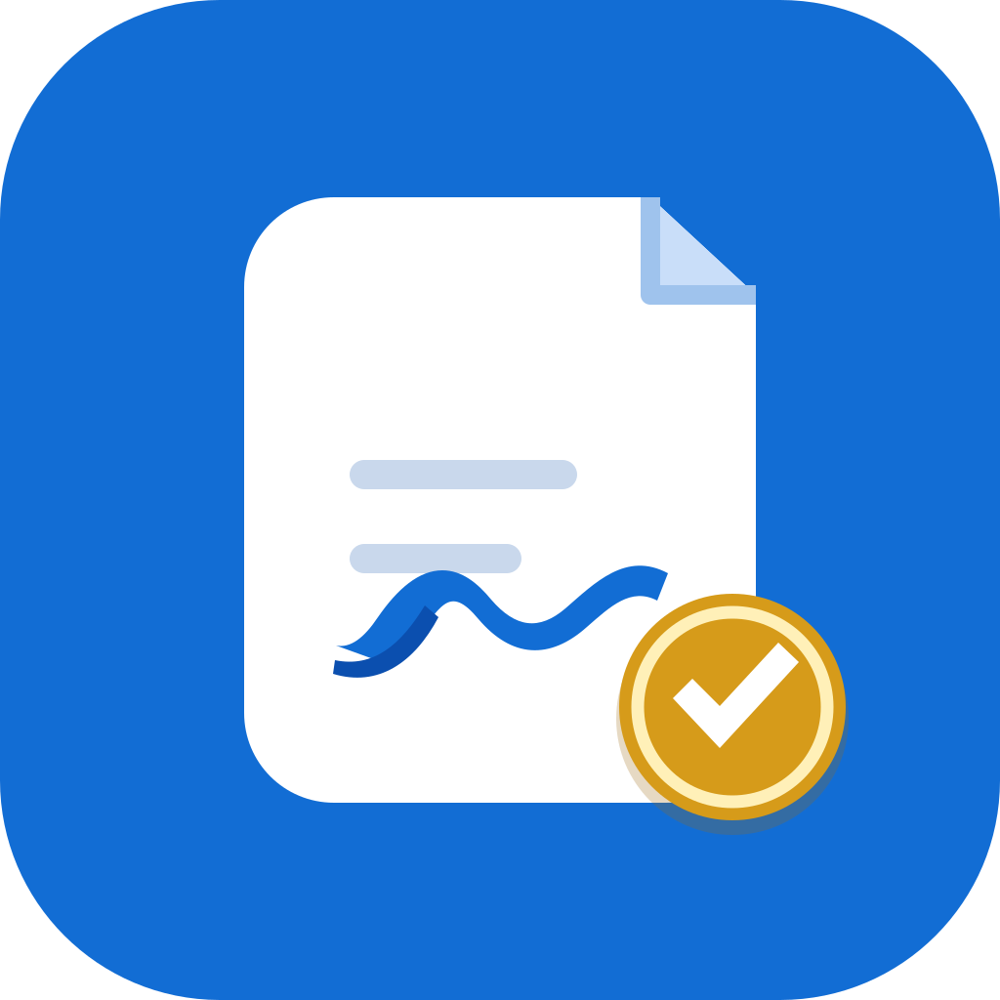
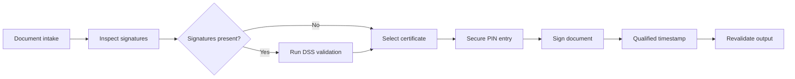

<p align="center">
  
</p>

<h1 align="center">Autogram macOS</h1>

<p align="center">
  Native electronic signing for Apple silicon Macs.
</p>

<p align="center">
  
  
  
  
</p>

<p align="center">
  <a href="README-SK.md">Slovenská dokumentácia</a>
  · <a href="#installation">Installation</a>
  · <a href="docs/native-macos-user-guide.md">User guide</a>
  · <a href="docs/native-macos-architecture.md">Architecture</a>
  · <a href="#upstream">Upstream</a>
</p>

> **Preview status**
>
> Autogram macOS is an active preview for macOS 27 or later on Apple silicon. Public releases still require Developer ID signing and notarization.

Unsigned preview DMGs are available from [GitHub Releases](https://github.com/originalmagneto/autogram-macOS/releases). After copying the app to Applications, Control-click it and choose **Open** for the first launch. Preview DMGs are not Developer ID signed or notarized.

Autogram macOS is a SwiftUI and AppKit workspace that supervises the established [Autogram](https://github.com/slovensko-digital/autogram) and European Commission DSS signing engine. It helps legal, business, and public-sector users inspect, sign, timestamp, and validate electronic documents without obscuring the certificate, signature, or validation state.

## At a glance

| Capability | Native workflow |
| --- | --- |
| Document workspace | Open, drag in, inspect, and process individual or multiple documents in a native SwiftUI, AppKit, and PDFKit workspace. |
| PAdES | Sign PDFs with PAdES Baseline T and qualified timestamps where required. |
| ASiC-E and XAdES | Inspect ASiC-E containers and create ASiC-E output with XAdES when selected. |
| DSS validation | Detect existing signatures, request authoritative validation, and revalidate signed output. |
| Graphic signatures | Place reusable PNG or PDF artwork directly on a PDF signature appearance. |
| Cards and certificates | Discover compatible PKCS#11 middleware and certificates on connected tokens. |
| Timestamps and batch work | Choose qualified timestamp settings and process multiple selected documents in one workspace. |
| Finder signing | Sign selected PDFs directly from a managed Finder Quick Action. |

## Signing workflow


```mermaid
flowchart LR
    A[Document intake] --> B[Inspect signatures]
    B --> C{Signatures present?}
    C -->|Yes| D[Run DSS validation]
    C -->|No| E[Select certificate]
    D --> E
    E --> F[Secure PIN entry]
    F --> G[Sign document]
    G --> H[Qualified timestamp]
    H --> I[Revalidate output]
```

The original document is never overwritten. Autogram creates a collision-safe output beside the source file, then makes the signed result active for inspection and validation.

## Document formats

| Document | What Autogram macOS does |
| --- | --- |
| PDF | Preview, inspect, validate, and sign with PAdES Baseline T. |
| Existing signed PDF | Display signatures, countersign when appropriate, and revalidate all signatures. |
| ASiC-E `.asice` | Inspect contents, preview embedded PDFs, and preserve the existing XAdES or CAdES signature family. |
| New ASiC-E output | Create a container with XAdES when selected. |

## Signature validation

Fast inspection makes signature and document metadata available promptly. Complete validation is delegated to the bundled Autogram and DSS engine, the cryptographic authority for this application. Unsigned documents do not trigger unnecessary complete validation.

Signed output is automatically inspected and validated again. `Valid` and `Invalid` reflect the available DSS evidence. `Validation indeterminate` means a signature was found but the available trust, revocation, timestamp, or certificate-chain evidence is insufficient for a definitive result. Validation can be requested again when the necessary online evidence becomes available.

## Graphic signatures

A graphic signature is an optional visible appearance attached to a cryptographic PDF signature. It is not a substitute for the electronic signature.

- Import transparent PNG artwork or a selected page from a PDF into a private reusable application library.
- Place artwork on the PDF, then drag, resize, rotate, or select its target page.
- Artwork keeps its aspect ratio. A new placement starts centered on the last page, or the first page of a one-page document.
- Placement and rotation are not reused for another document. The editable overlay is cleared after signing.
- Preview timing text is a placeholder. Signed output contains the real signing time and timestamp status.

## Cards and middleware

Autogram macOS discovers supported PKCS#11 middleware and asks the signing engine for certificates on the connected token. The application is arm64-only. Intel-only PKCS#11 libraries and Rosetta paths are unsupported.

- I.CA cards require SecureStore 8.3.1 or later.
- Slovak eID cards require current arm64-capable middleware, including an arm64 `libPkcs11.dylib`.
- Other PKCS#11 tokens can work when their library and token behavior are compatible with Autogram.

## Finder Quick Action

The managed Finder Quick Action directly signs selected PDFs with PAdES Baseline T. It prompts for the signing card, certificate, and PIN, then writes output beside each source PDF. It does not open the workspace or require Terminal interaction.

Install and maintain it from **Autogram macOS Settings**. Settings reports whether the bundled action is current and provides Install, Update, Reinstall, and Remove controls. A managed action is updated after an app update unless it was removed. If macOS requests it, enable the action in **System Settings > General > Login Items & Extensions > Finder Extensions**.

For setup and troubleshooting, see the [native macOS installation guide](docs/native-macos-installation.md). The older standalone CLI Quick Action remains documented separately in [macOS CLI automation](docs/macos-cli-automation.md).

## Requirements

### End users

- Apple silicon Mac running macOS 27 or later.
- Compatible signing card or token with arm64 or universal PKCS#11 middleware.
- I.CA SecureStore 8.3.1 or later for I.CA cards.
- Current arm64-capable middleware for Slovak eID cards.
- Network access for qualified timestamping and online signature validation.
- Write access to the source document folder.

### Developers

- Apple silicon build machine with Xcode and the macOS 27 SDK.
- JDK 25 with JavaFX for the Autogram helper build.
- Maven through the included wrapper. Liberica JDK with JavaFX is recommended for local development.

## Installation

Release installation and Finder integration are covered in the [native macOS installation guide](docs/native-macos-installation.md). The guide includes the supported setup path and troubleshooting information.

For a local development build, see the collapsed [developer build and test details](#developer-build-and-test).

## Security and privacy

- PIN values exist only for the active operation and are cleared after use.
- PINs are sent to the bundled helper through standard input.
- PIN values are not persisted or placed in preferences, arguments, environment variables, or logs.
- Timestamp credentials are not stored in plaintext preferences.
- Diagnostics exclude secrets and private document content.
- Source documents are not overwritten, and graphic artwork is copied to application support rather than linked to its original private path.
- PKCS#11 libraries are checked for arm64 compatibility before use.

Read the [native macOS architecture](docs/native-macos-architecture.md) for trust boundaries and the process model.

## Documentation

- [Native macOS installation](docs/native-macos-installation.md)
- [Native macOS user guide](docs/native-macos-user-guide.md)
- [Native macOS architecture](docs/native-macos-architecture.md)
- [Native release checklist](docs/native-macos-release-checklist.md)
- [Machine CLI protocol](docs/machine-cli-protocol-v1.md)
- [macOS CLI and standalone Finder Quick Action](docs/macos-cli-automation.md)
- [Batch signing API](docs/batch-sign-api.md)
- [Batch signing GUI](docs/batch-sign-gui.md)
- [Upstream porting notes](PORTING.md)
- [Development plan](PLAN.md)

## Upstream

This fork keeps upstream Autogram and the DSS signing engine as the cryptographic authority. Native macOS work is separated into the Swift application, machine protocol, Finder integration, and platform packaging so useful changes can be proposed upstream without coupling cryptographic behavior to Apple frameworks.

Upstream project: [slovensko-digital/autogram](https://github.com/slovensko-digital/autogram)

## License

Autogram is distributed under the [EUPL v1.2](LICENSE). The project was originally derived from the Octosign White Label project by Jakub Ďuraš, licensed under MIT and distributed here with the author's permission.

Commercial and non-commercial use is permitted subject to the EUPL conditions, including publication of covered modifications and preservation of applicable copyright notices.

<a id="developer-build-and-test"></a>
<details>
<summary><strong>Developer build and test</strong></summary>

Build a local native application:

```sh
export AUTOGRAM_JAVA_HOME="/path/to/arm64-jdk-with-javafx"
export DEVELOPER_DIR="/Applications/Xcode-beta.app/Contents/Developer"
scripts/native-macos/build-native-app.sh
scripts/native-macos/sign-native-app.sh
open "build/native/Autogram macOS.app"
```

The build creates `build/native/Autogram macOS.app` with the native Swift application, the arm64 Autogram machine helper, the Java dependencies used by Autogram and DSS, and a reduced arm64 Java runtime. Local signing is ad hoc and does not provide Apple notarization.

Run the focused native unit suite:

```sh
DEVELOPER_DIR=/Applications/Xcode-beta.app/Contents/Developer \
  xcodebuild \
  -project native-macos/Autogram.xcodeproj \
  -scheme Autogram \
  -destination 'platform=macOS' \
  -only-testing:AutogramTests \
  test
```

Build and test the upstream Java application and helper:

```sh
./mvnw -Psystem-jdk test
./mvnw -Psystem-jdk -DskipTests package
```

</details>
