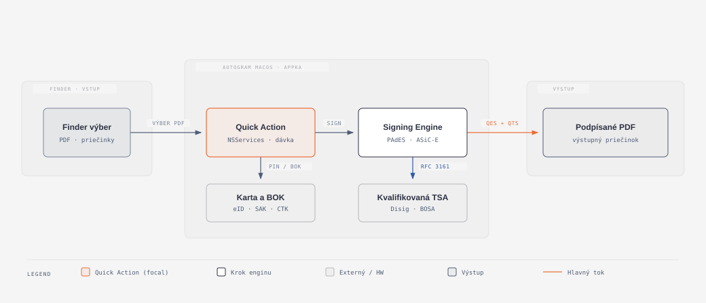
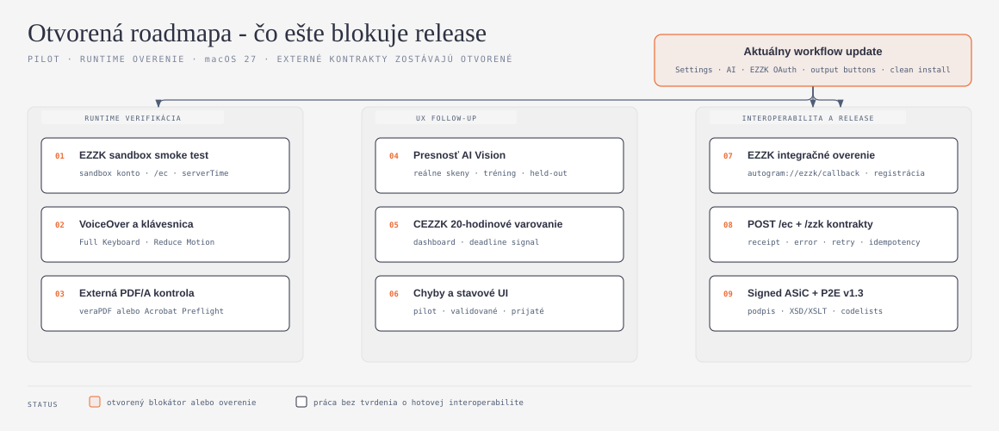

<p align="center">
  
</p>

# Autogram macOS

Autogram je natívna macOS aplikácia v SwiftUI pre elektronické podpisovanie dokumentov a zaručenú konverziu listinných dokumentov do elektronickej podoby.

`macOS 27 only` · `Swift 6` · `SwiftUI + @Observable` · `0 Swift package dependencies` · `236 tests` · `3 skipped` · `0 failures`

<div align="center">
  <table>
    <tr>
      <td><strong>STATUS</strong><br><code>236 tests</code> · <code>3 skipped</code> · <code>0 failures</code></td>
      <td><strong>PLATFORM</strong><br><code>macOS 27</code> · <code>Swift 6</code> · <code>SwiftUI</code></td>
      <td><strong>FOCUS</strong><br><code>QES</code> · <code>ZaKo</code> · <code>PDF/A-2b</code></td>
    </tr>
  </table>
  <sub><a href="#features">Funkcie</a> · <a href="#signing">Podpisovanie</a> · <a href="#zako">ZaKo</a> · <a href="#vision">AI Vision</a> · <a href="#settings">Nastavenia</a> · <a href="#pdfa">PDF/A</a> · <a href="#architecture">Architektúra</a> · <a href="#build">Build a testy</a></sub>
</div>

<a id="features"></a>
## Čo aplikácia rieši

- **Podpisovanie:** KEP, PAdES, kvalifikovaná časová pečiatka, ASiC-E, vizuálny podpis a dávkové podpisovanie.
- **Zaručená konverzia (ZaKo):** import, analýza, AI Vision, manuálne označenie bezpečnostných prvkov, osvedčovacia doložka, PDF/A-2b, autorizácia mandátnym certifikátom a lokálna evidencia.
- **Register:** lokálne záznamy konverzií, stav odoslania do CEZZK, vyhľadávanie, filtrovanie a CSV export.
- **Nastavenia:** AI Vision providery, PDF/A režim, TSA servery, EZZK prostredia a profily advokáta.
- **Integrácie macOS:** drag and drop, file picker, Finder Quick Action, security-scoped bookmarks a natívne Settings okno.

<details>
  <summary><strong>Compliance a produkčné hranice</strong></summary>

  Aktuálny build je implementačný P2E pilot. Generuje PDF/A-2b, kým externé požiadavky na PDF/A-1a alebo PNG, aktívne verzie formulárov a produkčný EZZK kontrakt nebudú autoritatívne potvrdené a nezávisle overené. P2E cieľová doložka je oficiálna verzia v1.3, zatiaľ čo aktuálny konverzný záznam je verzia 1.0. Porovnanie a plán sú v <a href="Autogram/docs/P2E-EZZK-FINDINGS.md"><code>P2E-EZZK-FINDINGS.md</code></a> a <a href="Autogram/docs/superpowers/plans/2026-08-29-ezzk-oauth-rest-ui.md"><code>ezzk-oauth-rest-ui.md</code></a>.
</details>

## Rýchly prehľad

| Oblasť | Stav v aktuálnom builde |
|---|---|
| Natívne UI | SwiftUI, `NavigationSplitView`, `@Observable`, macOS 27 |
| Podpisovanie | Jednotlivé dokumenty, Finder dávka, manuálna kontrola preflightu |
| Formáty | KEP, PAdES, ASiC-E, QTS, vizuálny podpis |
| ZaKo | Päť krokov od importu po dokončenie |
| AI Vision | On-device baseline, oMLX, Ollama, vlastné OpenAI-compatible API |
| PDF/A | Vektorový a rasterizovaný režim, PDF/A-2b pilotný profil |
| Register | `register.json` v Application Support, CSV export |
| EZZK | Demo mock, OAuth2/PKCE klient, native callback a guarded transport |
| Verifikácia | 236 testov, 3 voliteľné live engine testy skipped, 0 failures |

<table>
  <thead>
    <tr><th>Oblasť</th><th>Aktuálne</th><th>Hranica</th></tr>
  </thead>
  <tbody>
    <tr><td><code>Podpisovanie</code></td><td>KEP, PAdES, QTS, ASiC-E, dávka</td><td>Vyžaduje dostupnú podpisovú identitu</td></tr>
    <tr><td><code>ZaKo</code></td><td>Analýza, AI Vision, doložka, PDF/A-2b</td><td>P2E pilot, externá validácia zostáva potrebná</td></tr>
    <tr><td><code>EZZK</code></td><td>Mock, OAuth2/PKCE, Keychain session a native callback</td><td>Sandbox receipt a produkčný POST kontrakt otvorené</td></tr>
    <tr><td><code>Výstupy</code></td><td>Collision-safe PDF, XML a ASiC-E</td><td>Existujúci súbor sa nesmie prepísať</td></tr>
  </tbody>
</table>

Implementačná dokumentácia: [`docs/PHASES.md`](docs/PHASES.md)

Aktuálny UX a workflow plán: [`Autogram/docs/superpowers/plans/2026-08-30-sidebar-vision-batch-plan.md`](Autogram/docs/superpowers/plans/2026-08-30-sidebar-vision-batch-plan.md)

Diagramová galéria: [`docs/gallery.html`](docs/gallery.html)

## Požiadavky

- macOS 27 alebo novší
- Apple Silicon alebo Intel Mac podporovaný použitým Xcode toolchainom
- Xcode 26.5 a Swift 6 pre zostavenie zo zdrojov
- pre reálny podpis: kompatibilná eID karta, advokátsky preukaz alebo iný PKCS#11, CryptoTokenKit alebo Keychain token
- pre produkčné CEZZK odoslanie: EZZK účet, registrácia callbacku `autogram://ezzk/callback` u prevádzkovateľa, sandboxové overenie a sieťové pripojenie k príslušnej službe
- pre PDFBox normalizáciu: nainštalovaný Autogram macOS 2 engine s Java runtime; bez neho sa použije lokálny fallback iba vtedy, ak výsledok prejde lokálnou kontrolou

Aplikácia je cielene zostavená pre macOS 27. `Package.swift` preto deklaruje platformu `.macOS("27.0")` a build script zapisuje `LSMinimumSystemVersion=27.0`.

## Pracovné režimy

<a id="signing"></a>
### Podpisovanie

1. Otvorte PDF cez <kbd>⌘O</kbd>, vložte ho drag and drop alebo použite Finder Quick Action.
2. Pri viacerých súboroch vyberte **Pripraviť dávku podpisov** a prejdite preflight kontrolou.
3. Zvoľte formát podpisu: KEP, PAdES alebo ASiC-E, podľa dostupných možností aj QTS.
4. Voliteľne zapnite vizuálny podpis a upravte jeho vzhľad a umiestnenie.
5. Vyberte podpisovú identitu a spustite **Podpísať KEP** (<kbd>⌘⏎</kbd>) alebo dávku potvrďte v sticky action bare.
6. Aplikácia použije CryptoTokenKit, Keychain identitu alebo EngineBridge s PKCS#11 fallbackom.
7. Výsledok zobrazí podpísaný dokument, stav podpisu a dostupné PDF, XML a ASiC-E artefakty.

Dávkové podpisovanie má oddelené fázy preflight, ready, signing a summary. Počas spracovania je možné dávku zastaviť alebo zrušiť. Chyba jedného dokumentu ponúkne opakovanie alebo pokračovanie. Výstupy používajú collision-safe názvy a nikdy ticho neprepíšu existujúci súbor.

Ak nie je dostupný reálny token, aplikácia použije jasne označený DEMO podpisovač. DEMO podpis nie je právne záväzný.

<a id="zako"></a>
### Zaručená konverzia

ZaKo používa päť krokov:

1. **Import:** vstupný PDF alebo obrazový sken a potvrdenie originálu alebo úradne osvedčenej kópie.
2. **Analýza:** formát strán, neprázdne strany, listy a návrh názvu dokumentu.
3. **Označenie:** AI Vision a manuálne označenie podpisov, pečiatok, reliéfnych pečatí, paraf a iných prvkov.
4. **Osvedčovacia doložka:** údaje osoby, počítadlá, lokalizácia prvkov, XML náhľad a právny preflight.
5. **Autorizácia a dokončenie:** evidenčné číslo cez explicitnú EZZK akciu, dôveryhodný serverový čas, PDF/A, podpis, lokálna evidencia a odoslanie do CEZZK až po validácii podpísaných ASiC artefaktov a potvrdeného receipt.

Odoslanie do CEZZK je oddelené od vytvorenia súborov. OAuth integrácia má OIDC discovery, PKCE, natívny callback `autogram://ezzk/callback`, bezpečné uloženie tokenov v Keychain, obnovu session, typed transport a guarded UI. Produkčné odoslanie zostáva fail-closed, kým workflow nevytvorí a nevaliduje samostatný podpísaný record ASiC a kým nebude potvrdený sandboxový receipt kontrakt.

### Procesný diagram


| Krok | Činnosť | Vykonáva |
|---|---|---|
| 01 | Import skenu alebo dokumentu a potvrdenie pôvodu | advokát |
| 02 | Analýza strán, listov a formátu | Autogram |
| 03 | AI Vision a manuálne označenie bezpečnostných prvkov | Autogram + advokát |
| 04 | Osvedčovacia doložka a právny preflight | Autogram + advokát |
| 05 | Evidenčné číslo a dôveryhodný serverový čas | IS EZZK |
| 06 | PDF/A-2b, XML príloha a finálna validácia | Autogram |
| 07 | KEP s mandátnym certifikátom a QTS | advokát |
| 08 | Lokálna evidencia a odoslanie do 24 hodín | CEZZK |

<a id="vision"></a>
## AI Vision


Vstavaný detector pracuje lokálne na zariadení. Používa Apple Vision na vylúčenie textových riadkov a čiarových kódov, farebné a tmavé masky, connected components a konzervatívne geometrické filtre. Detekcia sa analyzuje na šírke 760 px, farebná maska používa saturáciu `s > 0.18` a rasterizačný režim PDF/A používa 200 dpi.

Výsledkom sú `SecurityElement` záznamy s:

- typom prvku a stranou,
- normalizovaným bounding boxom,
- mierou istoty,
- slovným opisom v slovenčine,
- pôvodom nálezu a možnosťou manuálnej úpravy.

Vstavané pravidlá bežia vždy. Voliteľné LLM režimy sú **oMLX**, **Ollama** a vlastné OpenAI-compatible API. Pri vlastnom cloudovom API môže obraz dokumentu opustiť Mac, preto treba endpoint a režim zvoliť podľa požiadaviek na ochranu údajov. K dispozícii sú predvoľby pre právne dokumenty, konzervatívnu kontrolu, podpisy a parafy, pečiatky a reliéfne prvky aj vlastný prompt.

<a id="pdfa"></a>
## PDF/A a osvedčovacia doložka


ZaKo vytvorí najprv intermediárny PDF/A-2b. Vektorový režim zachováva textovú vrstvu. Rasterizovaný režim vyrenderuje každú stranu pri 200 dpi a vytvorí stabilný obrazový PDF.

Aktívna pipeline je:

```text
PDF/A konverzia
  -> SHA-256 intermediárneho PDF/A
  -> XML ConversionRecord 1.0
  -> EmbeddedFile osvedcovacia-dolozka.xml
  -> finálna normalizácia PDF/A (PDFBox, ak je dostupný)
  -> lokálna kontrola finálneho artefaktu
  -> KEP/QTS, ASiC-E a lokálna evidencia
```

Hash sa počíta z konvertovaných PDF/A bajtov pred vložením XML. Finálny dokument však validujeme až po vložení XML, pretože príloha je súčasťou artefaktu, ktorý používateľ podpisuje a odovzdáva.

PDF obsahuje asociovaný súbor cez `/AF` a `/AFRelationship /Data`. Samostatná doložka sa zapisuje ako `.xml.xdcf`. Ak podpisový provider vráti ASiC-E, vytvorí sa aj `.asice` kontajner s PDF/A a doložkou.

`PDFAValidator` kontroluje štruktúru a stabilné PDF/A kontrakty: hlavičku, EOF, `startxref`, XMP `pdfaid`, OutputIntent, ICC profil, šifrovanie, JavaScript a asociáciu EmbeddedFile. Nie je to úplná náhrada za veraPDF alebo Acrobat Preflight, preto sa pri release validácii odporúča aj externý nástroj.

## Výstupy a bezpečné umiestnenie

ZaKo sa pokúsi uložiť výstupy do zapisovateľného priečinka zdrojového dokumentu. Ak zdrojový priečinok nie je zapisovateľný alebo import nemá použiteľný security scope, použije sa:

```text
~/Library/Application Support/Autogram/Output
```

Typické názvy:

```text
diplom.pdf                  -> diplom-konvertovane.pdf
diplom.pdf + nový názov     -> diplom-novy-nazov.pdf
pôvod.pdf                   -> pôvod_podpisane.pdf
```

Generované artefakty:

- `{dokument}.pdf`: finálny podpísaný PDF/A-2b alebo podpisový formát podľa voľby,
- `{dokument}-{evidenčné-číslo}.xml.xdcf`: samostatná osvedčovacia doložka,
- `{dokument}.asice`: voliteľný ASiC-E výstup podľa podpisového providera.

Pri existujúcom súbore sa použije collision-safe suffix, napríklad `(2)`, aby sa pôvodný artefakt neprepísal. Výber cez file picker, drag and drop a Finder Quick Action zachováva zdrojový priečinok počas dokumentovej session pomocou security-scoped access.

Nedávno otvorené dokumenty sa ukladajú iba ako bezpečné security-scoped bookmarky. Zoznam je voliteľný, obsahuje najviac osem položiek a neukladá obsah dokumentov.

## Finder Quick Action



Vo Finderi označte PDF súbory, prípadne priečinok s PDF súbormi, a zvoľte **Rýchle akcie -> Podpísať s QES + QTS (Autogram)**.

- Služba je registrovaná cez natívne `NSServices` v hlavnom bundle.
- `NSRequiredContext` obmedzuje službu na Finder.
- `FinderSigningRouter` odovzdá výber do `SigningSessionStore.signFromFinder(_:)`.
- Dávka prejde preflight kontrolou, použije dostupnú kvalifikovanú identitu a aktívnu TSA.
- Výstupy používajú collision-safe naming a zachovajú pôvodný priečinok, ak to security scope dovolí.
- Alternatívou je drag and drop viacerých súborov do hlavného okna.

Ak sa akcia nezobrazuje, otvorte vo Finderi **Rýchle akcie -> Prispôsobiť...** a službu zapnite.

<a id="architecture"></a>
## Architektúra


Projekt má tri hlavné vrstvy:

1. **AutogramApp:** SwiftUI views, native toolbar, Settings scene, menu commands, drag and drop, Finder routing a lifecycle aplikácie.
2. **Session stores:** `SigningSessionStore` riadi štandardné aj dávkové podpisovanie, `ZakoSessionStore` riadi päťkrokový ZaKo workflow a `RecentDocumentStore` spravuje bezpečné bookmarky.
3. **AutogramKit:** testovateľná doménová a dokumentová logika, PDF analýza, Vision pipeline, XML doložka, PDF/A, podpisovanie, ASiC-E a evidencia.

Dáta lokálneho registra sa ukladajú do `register.json` v `~/Library/Application Support/Autogram/Evidence`. Nejde o Core Data ani SQLite databázu. CEZZK je abstrahované cez `EZZKServicing`; Demo používa lokálny mock, zatiaľ čo OAuth2 EZZK session používa OIDC discovery, PKCE, natívny callback, Keychain token store, obnovu session a typed REST klient s fail-closed hranicami.

Java/PDFBox je voliteľná runtime infraštruktúra pre čistú PDF/A normalizáciu. Pri chýbajúcom engine sa použije Swift fallback iba po úspešnej lokálnej validácii.

## Životný cyklus evidencie


Záznam prechádza stavmi konceptu, čakania na číslo, pripravenosti na autorizáciu, autorizácie, fronty odoslania a zápisu v CEZZK. Sieťové zlyhanie vedie na manuálne opakovanie až po potvrdení reálneho submission kontraktu. Záznamy majú 24-hodinovú lehotu od času konverzie; 20-hodinové varovanie je otvorený UX follow-up.

## Register a bezpečnostné hranice

- Preflight zastaví autorizáciu pri chýbajúcom pôvode, údajoch osoby, počte listov, prvkoch, čísle alebo certifikáte.
- Preflight kontroluje aj existujúce podpisy vstupného PDF konzervatívnym scanom; pri komprimovaných objektových streamoch zostáva výsledok `unavailable`, nie falošné potvrdenie.
- ZaKo preferuje mandátny kvalifikovaný certifikát. Výslovný non-mandate override je auditovateľný stav a nemá sa používať ako tiché obídenie pravidla.
- PDF/A, XML a ASiC-E sa kontrolujú pred zápisom výsledku.
- Lokálny register drží evidenčné číslo, hash, XML doložku, stav odoslania, názvy súborov a základné počítadlá.
- CSV export používa slovenský oddeľovač `;`.
- Tajomstvá a API kľúče sa ukladajú do systémovej Kľúčenky, nie do UserDefaults JSON.

## Funkcie podľa modulu

### Podpisovanie

- PDF, JPEG, PNG, TIFF a HEIC vstupy s konverziou obrazu do PDF
- vizuálny podpis a viditeľné PAdES umiestnenie
- priame tlačidlá voľby formátu PAdES alebo ASiC-E/XAdES
- KEP, PAdES, QTS a ASiC-E podľa nastaveného formátu
- CryptoTokenKit, Keychain identity scanner a PKCS#11 EngineBridge
- preflight a progress UI pre dávkové podpisovanie
- dávkové podpisovanie z Findera aj drag and drop viacerých súborov

### Zaručená konverzia

- päťkrokový stepper vrátane dokončenia
- AI a manuálne security elements s trvalými manuálnymi úpravami
- bounding boxy s pohybom, zmenou veľkosti, zmenou typu a popisu
- miniatúry strán, počítadlá listov a formátov
- XML doložka ConversionRecord 1.0 podľa codelistov
- PDF/A-2b, finálna validácia a EmbeddedFile asociácia
- lokálny register, OAuth2/PKCE EZZK session, native callback, Keychain token store, guarded REST transport a CSV export

### Nastavenia a súkromie

- päť AI režimov: vstavaný, oMLX, Ollama, vlastný API kľúč a vypnuté
- predvoľby klasifikačného promptu pre externé LLM režimy
- endpointy a modely pre lokálne providery
- API kľúče a heslá iba v Keychain
- voľba pamätania naposledy otvorených dokumentov cez security-scoped bookmarky
- profily advokáta a vlastné TSA servery
- jasné oddelenie on-device, local-network a cloudového spracovania

<table>
  <thead>
    <tr><th>Režim</th><th>Kam smerujú dáta</th><th>Praktický význam</th></tr>
  </thead>
  <tbody>
    <tr><td><code>On-device</code></td><td>iba tento Mac</td><td>Predvolený vstavaný detector pre citlivé dokumenty</td></tr>
    <tr><td><code>Local network</code></td><td>oMLX alebo Ollama</td><td>Lokálny endpoint, bez cloudového API</td></tr>
    <tr><td><code>Cloud API</code></td><td>vlastný OpenAI-compatible endpoint</td><td>Obraz dokumentu môže opustiť Mac, preto treba posúdiť ochranu údajov</td></tr>
  </tbody>
</table>

<a id="settings"></a>
## Nastavenia a AI Vision konfigurácia

Natívne okno **Nastavenia** je rozdelené do štyroch kariet:

- **AI Vision:** výber poskytovateľa, stav pripravenosti konfigurácie, bezpečné uloženie API kľúča a klasifikačný prompt,
- **Konverzia PDF/A:** vektorový alebo rasterizovaný režim, výber TSA a správa vlastných RFC 3161 serverov,
- **EZZK:** sandboxové alebo produkčné prostredie, OAuth2 session, dostupné evidenčné čísla a fail-closed odoslanie,
- **Profily advokáta:** údaje osoby, identifikátory a uložené profily pre doložku.

### AI Vision režimy a prompty

Vstavaná on-device detekcia beží vždy. Voliteľný režim dopĺňa jej výsledky cez:

- **oMLX:** lokálny OpenAI-compatible endpoint na Apple Silicon,
- **Ollama:** lokálny vision server bez cloudového API,
- **vlastné API:** OpenAI-compatible endpoint s API kľúčom v systémovej Kľúčenke,
- **vypnuté:** iba vstavané pravidlá bez LLM asistencie.

Nastavenia zobrazujú pripravenosť URL, modelu a pri vlastnom API aj Keychain kľúča. Klasifikačný prompt má predvoľby **Právne dokumenty**, **Konzervatívna kontrola**, **Podpisy a parafy**, **Pečiatky a reliéfne prvky** a **Vlastný prompt**. Prompt sa použije iba pre oMLX, Ollama a vlastné API; v internom a vypnutom režime sa nepoužíva. Tlačidlo **Obnoviť predvolený** vráti schválený prompt.

### PDF/A a TSA

Karta Konverzia PDF/A umožňuje prepnúť medzi vektorovou konverziou so zachovaním textovej vrstvy a rasterizovanou garanciou pri 200 dpi. TSA konfigurácia obsahuje vstavané servery, vlastné URL, výber aktívnej služby a tlačidlo **Otestovať spojenie**, ktoré odošle reálnu RFC 3161 požiadavku.

Nastavenia zároveň riadia bezpečné bookmarky najviac ôsmich naposledy otvorených dokumentov. Ich obsah sa neukladá.

<a id="build"></a>
## Zostavenie, testy a lokálna inštalácia

```bash
cd Autogram

# Debug build Swift targetov
DEVELOPER_DIR=/Applications/Xcode-26.5.app/Contents/Developer swift build

# Kompletný test suite
DEVELOPER_DIR=/Applications/Xcode-26.5.app/Contents/Developer swift test

# Debug .app bundle
DEVELOPER_DIR=/Applications/Xcode-26.5.app/Contents/Developer ./build_app.sh

# Release .app bundle
DEVELOPER_DIR=/Applications/Xcode-26.5.app/Contents/Developer ./build_app.sh --release

# Debug build and install into /Applications
DEVELOPER_DIR=/Applications/Xcode-26.5.app/Contents/Developer ./build_app.sh install

# Release build and install into /Applications
DEVELOPER_DIR=/Applications/Xcode-26.5.app/Contents/Developer ./build_app.sh --release install
```

Výstupný bundle:

```text
Autogram/.build/arm64-apple-macosx/debug/Autogram.app
```

Manuálna inštalácia existujúceho debug bundle s čistou náhradou:

```bash
rm -rf "/Applications/Autogram macOS.app"
ditto --rsrc --extattr --acl \
  .build/arm64-apple-macosx/debug/Autogram.app \
  "/Applications/Autogram macOS.app"
open "/Applications/Autogram macOS.app"
```

Overený výsledok na aktuálnom zdrojovom strome: 236 testov, 3 voliteľné live engine testy skipped a 0 failures. Debug bundle má verziu `0.2.2`. `./build_app.sh install` vykoná čistú náhradu bundle v `/Applications/Autogram macOS.app`, aby v inštalácii nezostali staré súbory. Build vytvorí `.build/arm64-apple-macosx/debug/Autogram.app` a pri dostupnom Autogram macOS 2 engine vloží PDFBox dependency classpath do `Contents/app/dependency-jars`.

## Diagramy

Zdrojové SVG diagramy sú v [`docs/diagrams`](docs/diagrams) a ich vizuálna galéria je v [`docs/gallery.html`](docs/gallery.html).

| Súbor | Obsah |
|---|---|
| [`hero.svg`](docs/diagrams/hero.svg) | Projektový prehľad |
| [`architecture.svg`](docs/diagrams/architecture.svg) | Vrstvy aplikácie, session stores a AutogramKit |
| [`process-zako.svg`](docs/diagrams/process-zako.svg) | ZaKo proces a aktéri |
| [`ai-vision.svg`](docs/diagrams/ai-vision.svg) | On-device a voliteľný LLM detection flow |
| [`pdfa-pipeline.svg`](docs/diagrams/pdfa-pipeline.svg) | PDF/A, XML, hash, normalizácia a výstup |
| [`finder-quick-action.svg`](docs/diagrams/finder-quick-action.svg) | Finder Quick Action a dávkové podpisovanie |
| [`state-machine.svg`](docs/diagrams/state-machine.svg) | Životný cyklus konverzného záznamu |
| [`roadmap-open-work.svg`](docs/diagrams/roadmap-open-work.svg) | Aktuálne otvorené follow-upy |
| [`roadmap-open-work.excalidraw`](docs/diagrams/roadmap-open-work.excalidraw) | Editovateľný zdroj roadmapy |

Diagramy používajú prístupný SVG kontrakt: `role="img"`, prefixed `title` a `desc`, čitateľné textové popisy a žiadnu závislosť od JavaScriptu. Predvolený vizuál používa white-smoke paper, jet-black ink, atomic-tangerine focal accent, blue-slate muted connectors, hairline rámce, 4 px grid a žiadne tiene.

## Aktuálny stav a limity

- Manuálna kontrola bezpečnostných prvkov zostáva potrebná. Slabý kontrast, reliéf a rukopis nemusia byť spoľahlivo rozpoznané vstavaným detectorom.
- Lokálny `PDFAValidator` je štrukturálny a heuristický. Finálny release artefakt treba overiť v Acrobat Preflight alebo veraPDF.
- Produkčné EZZK API má OAuth2/PKCE klienta, OIDC discovery, Keychain session, natívny callback `autogram://ezzk/callback`, typed REST transport, fixed-host redirect ochranu a guarded Settings UI. Registrácia callbacku u prevádzkovateľa, sandboxový účet, POST receipt kontrakt a podpísaný ASiC workflow zostávajú externé alebo implementačné blokácie.
- XAdES chain/LTA archivácia je obmedzená na aktuálny signing flow; plná B-LT archivácia je budúce rozšírenie.
- Presný OID mandátneho certifikátu treba doplniť po overení reálneho SAK certifikátu.

<a id="open-work"></a>
## Otvorená roadmapa



Dokončené v aktuálnom workflow update:

- opravený focus a chevron v sidebar navigácii,
- natívne Settings okno so štyrmi kartami: AI Vision, Konverzia PDF/A, EZZK a Profily advokáta,
- AI Vision provider cards, readiness stavy, on-device fallback a predvoľby klasifikačných promptov,
- PDF/A režim, vstavané a vlastné TSA servery, test RFC 3161 spojenia a bezpečné Keychain nastavenia,
- priame tlačidlá voľby formátu PAdES alebo ASiC-E/XAdES,
- recent documents cez bezpečné bookmarky,
- preflight, progress, cancel, stop, continue a retry pre dávkové podpisovanie,
- Finder Quick Action napojená na rovnaký signing engine.
- EZZK OAuth2/PKCE login s natívnym callbackom `autogram://ezzk/callback`, OIDC discovery a zrušením autentizácie,
- Keychain token store, obnova session po štarte, odhlásenie a typed REST transport s fail-closed hranicami.
- explicitný `build_app.sh install` príkaz s čistou náhradou aplikácie v `/Applications`,

<details open>
  <summary><strong>Otvorené follow-upy a release blokátory</strong> · <a href="docs/diagrams/roadmap-open-work.svg">diagram</a> · <a href="docs/diagrams/roadmap-open-work.excalidraw">editovateľný zdroj</a></summary>

  <ol>
    <li>Potvrdiť registráciu callbacku <code>autogram://ezzk/callback</code> a jeho použitie u prevádzkovateľa EZZK.</li>
    <li>Získať sandboxový EZZK účet a vykonať neprodukčný smoke test.</li>
    <li>Potvrdiť kompletné <code>POST /ec</code> a <code>POST /zzk</code> response, receipt, error a idempotency pravidlá.</li>
    <li>Vytvoriť a validovať samostatný podpísaný record ASiC v conversion workflow.</li>
    <li>Získať a spracovať oficiálne v1.3 XSD, XSLT a data artefakty pred produkčným rendererom.</li>
    <li>GUI pass na macOS 27 s VoiceOver, Full Keyboard Access, Increase Contrast, Reduce Transparency a Reduce Motion.</li>
    <li>Overenie viacerých veľkostí okna, focus order a toolbar command routing.</li>
    <li>Posúdiť voliteľný AppKit overlay pre presné umiestnenie viditeľného podpisu.</li>
    <li>Nahradiť zostávajúce nekritické <code>try?</code> miesta actionable error UI.</li>
    <li>Pridať 20-hodinové varovanie v CEZZK dashboarde.</li>
    <li>Externe overiť PDF/A-2b a EmbeddedFile finálneho release artefaktu.</li>
  </ol>
</details>

---

## Právna kotva

- **§ 35 až 39** zákona č. 305/2013 Z. z. o e-Governmente
- **Vyhláška MIRRI č. 70/2021 Z. z.** vrátane obsahu doložky, XML-in-PDF, mandátneho certifikátu, QTS a evidencie
- **eIDAS 910/2014** a vykonávacie nariadenie **2015/1506** pre PAdES, XAdES a ASiC

Implementácia je technický nástroj a nenahrádza právne posúdenie konkrétneho dokumentu ani povinnosť advokáta skontrolovať originál, bezpečnostné prvky, certifikát a výsledný artefakt.
