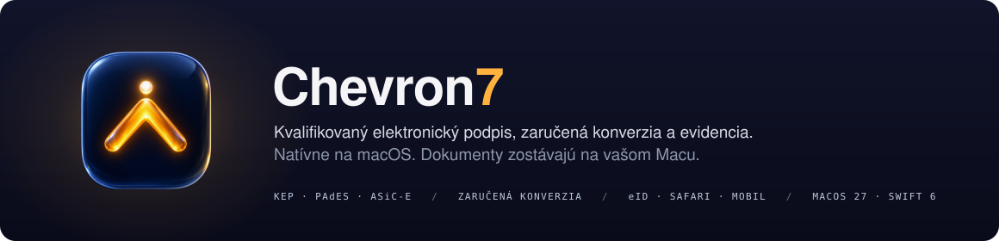
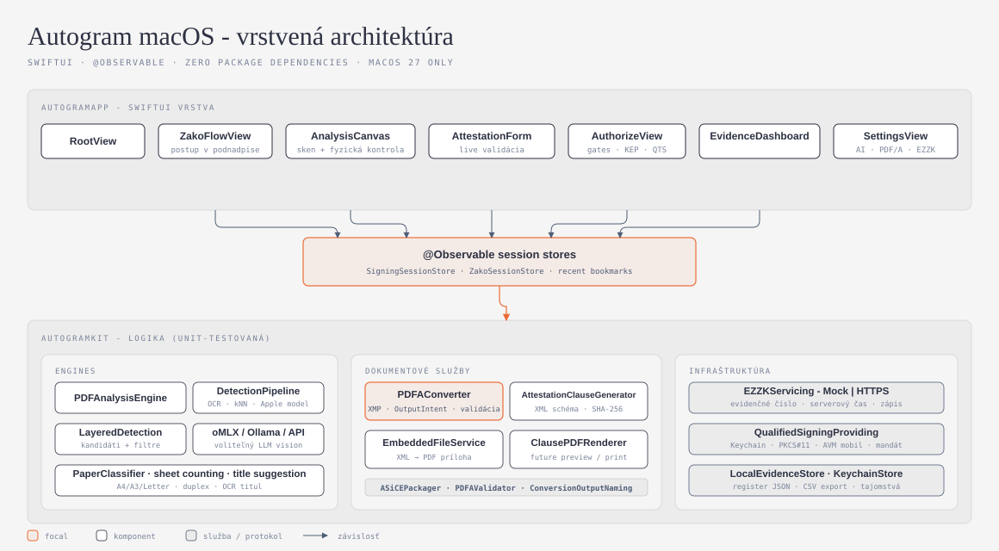
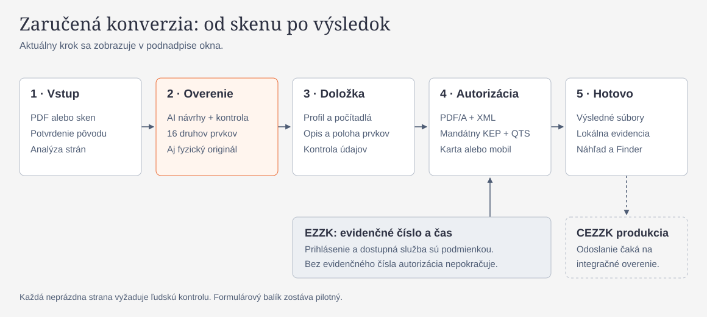
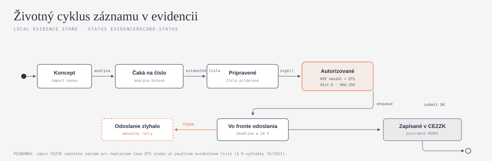
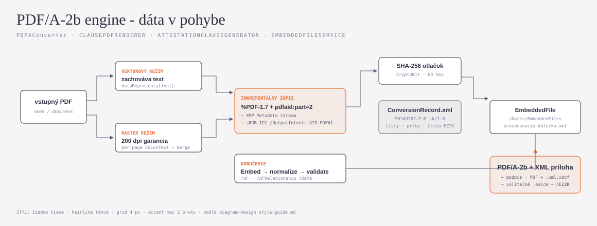
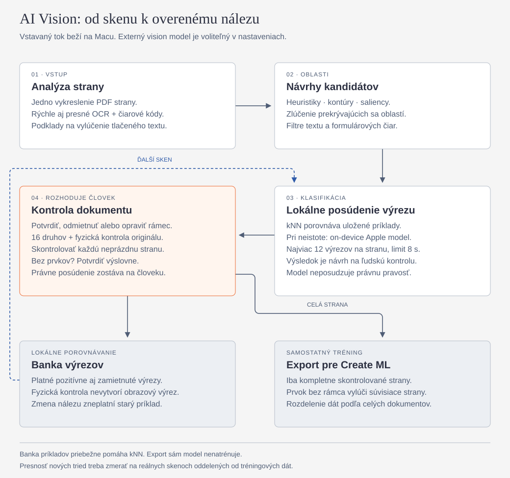

<p align="center">
  
</p>

# Autogram macOS

**Natívna SwiftUI aplikácia na elektronické podpisovanie dokumentov** — so štandardným režimom podpisovania (KEP + kvalifikovaná časová pečiatka) a **advanced režimom Zaručená konverzia** podľa § 35–39 zákona č. 305/2013 Z. z. o e-Governmente a vyhlášky MIRRI č. 70/2021 Z. z.

`macOS 26+` (Liquid Glass) · `SwiftUI + @Observable` · `0 Swift package závislostí` · `Swift 6 strict concurrency` · `86 testov (83 prešlo, 3 live skipped) ✅`

> 📋 Implementačná dokumentácia fáz 1–4 vrátane validácií a limitov: [`docs/PHASES.md`](docs/PHASES.md)

---

## Prehľad — jeden nástroj, dva režimy

### ✍️ Štandardný režim · Podpisovanie
Klasická autorizácia dokumentov v štýle pôvodného Autogramu: vlož PDF, pozri náhľad, voliteľne umiestni vizuálny podpis rámček priamo do stránky, podpíš KEP s kvalifikovanou časovou pečiatkou. Bez zbytočných krokov.

### 🏛️ Advanced režim · Zaručená konverzia
Zaručená konverzia je slovenský ekvivalent osvedčovania listín u notára: papierový dokument sa prevedie do elektronickej podoby tak, že nový dokument má **právne účinky osvedčenej kópie**. Advokát na to potrebuje mandátny certifikát a kvalifikované časové pečiatky — appka sa postará o všetko ostatné. V tomto režime sa nepoužívajú grafické podpisy; autorizáciou je KEP s mandátnym atribútom nad celým balíkom.

Kým existujúce nástroje (Podpisuj.sk, D.Convert) sú Java monštrá s desiatkami manuálne vypĺňaných polí, Autogram robí z konverzie **2–3 kliky**: automaticky rozpozná strany, listy aj bezpečnostné prvky, stiahne evidenčné číslo z EZZK, vygeneruje XML doložku a celé to zapečatí.

---

## Architektúra



Tri vrstvy: natívna SwiftUI prezentácia (`AutogramApp`) s dvoma reaktívnymi session store (`@Observable SigningSessionStore` pre štandardný podpis a `ZakoSessionStore` pre advanced režim) a čisto testovateľná knižnica `AutogramKit` — enginy, dokumentové služby a infraštruktúra. Bez Swift package závislostí; PDF/A zápis, XML generátor aj ZIP/ASiC-E packager sú vlastná implementácia. Reálne tokenové podpisovanie môže použiť natívny CryptoTokenKit alebo EngineBridge s Java/DSS engine pre PKCS#11 tokeny.

---

## Proces P→E krok za krokom



| # | Krok | Kto |
|---|---|---|
| 01 | Sken papierového originálu (drag & drop) | advokát |
| 02 | Analýza strán, listov, formátu listiny | Autogram |
| 03 | AI Vision detekcia pečiatok a podpisov | Autogram |
| 04 | Potvrdenie údajov (1 klik namiesto 30 polí) | advokát |
| 05 | Jednorazové evidenčné číslo + serverový čas | IS EZZK |
| 06 | PDF/A-2b konverzia + XML EmbeddedFile | Autogram |
| 07 | Autorizácia KEP mandátnym certifikátom + QTS | advokát |
| 08 | Zápis záznamu do centrálnej evidencie ≤ 24 h | CEZZK |

---

## Životný cyklus záznamu



Každá konverzia prechádza stavmi od konceptu po potvrdenie v centrálnej evidencii. Appka stráži zákonné lehoty — neodoslané záznamy po 20 hodinách červenajú v dashboarde.

---

## PDF/A-2b engine



Vlastný konvertor v čistom Swifte: inkrementálna PDF chirurgia doplní XMP metadáta (`pdfaid:part=2`, `conformance=B`), sRGB ICC OutputIntent `/GTS_PDFA1` a hlavičku `%PDF-1.7`. Vektorový režim zachováva textovú vrstvu, raster režim (300 dpi) garantuje vyrovnanie problematických skenov. Doložka sa vloží ako **XML EmbeddedFile** (§ 3 ods. 3 vyhlášky 70/2021) a navyše ako tlačiteľná príložená strana.

---

## AI Vision pipeline



On-device počítačové videnie (farebné/tmavé masky → connected components → radial coverage sampling) rozpozná úradné pečiatky a vlastnoručné podpisy vrátane umiestnenia. Vygeneruje **slovný opis priamo do doložky** — *„Úradná pečiatka na strane 2, v pravej dolnej časti…"*. Voliteľne LLM boost cez Ollama alebo OpenAI-compatible API (kľúč v Keychain).

---

## Ako začať (advokát)

1. **Podpísať bežný dokument?** → sidebar *Podpisovanie*: pretiahni PDF, potiahni rámček vizuálneho podpisu na správne miesto, klikni **Podpísať KEP**.
2. **Previesť papierový originál do elektronickej podoby?** → sidebar *Pokročilé › Zaručená konverzia*: pretiahni sken originálu, schvál AI-detekované prvky a počty listov, získaj evidenčné číslo z EZZK, klikni **Autorizovať konverziu**.
3. **Vyúčtovať klientovi úkony?** → *Evidencia* → export CSV.

> Bez nastaveného EZZK beží evidencia v DEMO režime; bez pripojeného kvalifikovaného podpisového modulu podpisuje DEMO podpisovač (jasne označený).

---

## Funkcie

### ✍️ Modul Podpisovanie (štandard)
- Drag & drop **PDF aj obrázkové skeny** (JPEG/PNG/TIFF/HEIC → auto-konverzia do PDF)
- Voliteľný **vizuálny podpis** — rámček potiahni priamo v náhľade, vyber stranu
- KEP podpis + QTS, identity z Keychainu / eID karty (CryptoTokenKit) alebo PKCS#11 tokenu cez EngineBridge, s detekciou mandátneho certifikátu
- Výstup: podpísané PDF (+ ASiC-E kontajner), uložené do Output priečinka

### 🏛️ Modul Zaručená konverzia (advanced)
- 5-krokový workflow stepper s vizuálne oddeleným „advokátskym“ režimom
- Automatické počítadlá: strany / neprázdné strany / listy / veľkosť listiny (A4·A3·Letter × výška·šírka)
- Detekcia prázdnych strán (grayscale ink coverage + absolútne pixely)
- **Manuálna klasifikácia prvotriedna**: klik/ťahanie priamo v náhľade strany vytvára box,
  drag presúva, rukoväť mení veľkosť; duplikovanie, page stepper per prvok, undo zmazania
- Warning chips „strany X bez potvrdených prvkov" — jeden klik preskočí na danú stranu
- AI nálezy sa mergujú s manuálnymi (manuálne prežívajú re-analýzu)
- Live-validovaná doložka s predvyplnením ~95 % polí z certifikátu, profilu a analýzy
- Šablóny doložiek, profily advokáta/kancelárie (SAK reg. č., IČO)

### 🤖 Modul AI Vision (voliteľný boost)
- **On-device detekcia beží vždy** (farebné/tmavé masky → connected components → radial coverage)
- **Lokálny LLM:** Ollama (`llava`, `llama3.2-vision`, `qwen2-vl`) — 100% offline
- **API:** ľubovoľný OpenAI-compatible endpoint, kľúč v Keychain
- **Editovateľný klasifikačný prompt** — default pokrýva § 37 typy (pečiatka so znakom, slepotlač,
  parafa, notárska pripojka); JSON schéma odpovede vynútená automaticky
- IoU deduplikácia: LLM môže len pridať nálezy, nikdy neodobrať built-in výsledky
- Case-insensitive parser s heuristikami — netypické kindy padajú do „Iný prvok"

### 🔐 Bezpečnosť a autorizácia
- **Reálny KEP podpis**: XAdES-B/T v ASiC-E alebo PAdES-B/T priamo v PDF — cez SecKey (Keychain / CryptoTokenKit) alebo EngineBridge s Java/DSS engine pre PKCS#11 tokeny
- **Slovenská eID karta** (Cosmo 9.2 / eID_klient 5.4): certifikát + privátny kľúč sa čítajú z tokenu cez CryptoTokenKit; PIN zadáš v systémovom dialógu eID klienta. Ak sa identita neobjaví, reštartuj **eID_klient** alebo kartu vyber a vlož znova (CTK session vie uviaznuť).
- **I.CA SecureStore / Starcos**: kvalifikovaný certifikát a podpis cez PKCS#11 EngineBridge; overené s kartou Starcos 3.7. PIN sa používa iba na načítanie identity a aktuálne podpisovanie, do aplikácie sa neukladá.
- **Java/DSS engine**: automaticky sa hľadá v `/Applications/Autogram macOS 2.app/Contents` alebo `/Applications/Autogram macOS.app/Contents`; umiestnenie možno prepísať premennou `AUTOGRAM_JAVA_ENGINE_ROOT`.
- **PKCS#11 fallback** (oficiálny `libPkcs11.dylib`, OpenSC, AWP) — použije sa len keď token neposkytne SecKey
- **RFC 3161 klient** s vlastnou DER implementáciou; TSA zoznam podľa originálneho Autogramu (Sectigo, Belgian TSA) + CA Disig SK, vlastné servery, test spojenia
- **Live detekcia karty** cez TKTokenWatcher — vloženie eID / SAK karty okamžite refreshuje certifikáty
- **Mandátna brána**: ZaKo vyžaduje mandátny certifikát; pokračovanie bez neho len výslovným override
- Gate „QTS čas ≥ čas konverzie“ — CEZZK by inak zápis zamietla
- Serverový čas EZZK (nie lokálne hodiny), zhoda identity certifikát ↔ doložka

### ✅ Validačné vrstvy (hard gates)
- `PDFAValidator` — PDF/A-2b štruktúra (XMP pdfaid, OutputIntent GTS_PDFA1 + ICC, žiadne šifrovanie/JS)
- `AttestationXMLValidator` — kompletnosť doložky (fingerprint == base64 SHA-256, evidenčné číslo ako URI, prvky/strany/listy, ISO8601 čas)
- `ASiCEContainerVerifier` — manifest úplnosť + **prepočet SHA-256 každého objektu proti digestom v XAdES signatúre**
- Všetky bežia automaticky pred dokončením konverzie; zlyhanie blokuje výstup so zoznamom problémov

### 🗂️ Evidencia
- Lokálny register konverzií (JSON, Application Support) so stavmi a CSV exportom
- Dashboard: summary karty, filtre podľa stavu, status timeline (číslo → KEP → CEZZK),
  pulsujúci indikátor prehorených záznamov (>24 h), detail s XML náhľadom a URI záznamu
- Hromadné odosielanie čakajúcich záznamov do IS EZZK priamo z dashboardu
- Fakturovateľný prehľad úkonov pre vyúčtovanie klientovi (sadzobník)

---

## Build & spustenie

```bash
cd Autogram

# knižnica + appka (debug)
swift build

# testy — 86 (83 prejde, 3 live testy sú voliteľné a bez hardvéru sa preskočia)
DEVELOPER_DIR=/Applications/Xcode-26.5.app/Contents/Developer swift test

# .app bundle (release)
./build_app.sh --release
open .build/arm64-apple-macosx/release/Autogram.app
```

> SwiftUI makrá potrebujú plný Xcode toolchain. Pri použití iba Command Line Tools nastavte:
> `export DEVELOPER_DIR=/Applications/Xcode-26.5.app/Contents/Developer`

Interaktívna galéria diagramov: [`docs/gallery.html`](docs/gallery.html) *(otvoriť v prehliadači)*

---

## Testovacia matica

| Sada | Pokrytie |
|---|---|
| `PDFAnalysisEngineTests` | počítadlá strán/listov, blank detekcia, klasifikácia A4/A3/Letter, návrh titulu |
| `SecurityElementsDetectorTests` | pečiatka + podpis na syntetickom skene, prázdna strana = 0 prvkov, IoU merger |
| `AttestationXMLTests` | elementy schémy, escaping, LegalSubject varianta, SHA-256 golden vector, validátory |
| `PDFAConverterTests` | hlavička 1.7, pdfaid markery, zachovanie textu, raster mód, EmbeddedFile round-trip |
| `EvidenceAndPackagingTests` | perzistencia registra, CSV escaping, ZIP/ASiC-E štruktúra, ZaKo kontajner layout + manifest, Mock EZZK ({registry}-{YYMMDD}-{seq}), demo podpis |
| `TimestampClientTests` | RFC 3161 DER golden vektory (request bajt-po-bajte, odpoveď s genTime), zamietnuté stavy, TSA migrácia nastavení, pečiatka v ASiC-E |
| `SigningInfrastructureTests` | X.509 parser (veľké sériové čísla, RFC2253 issuer), výber reálneho providera |
| `EngineBridgeTests` | protokol v2, výber certifikátu, PIN/error mapping, PKCS#11 signing flow, vizuálny podpis a geometria |
| `TokenIdentityScannerTests` | scanAll nesmie visieť na token certifikátoch; Apple tokeny sú odfiltrované |
| `ValidationAndPAdESTests` | PDF/A validátor na konvertovanom aj čistom PDF, XML validátor (korupcia fingerprint/evidence/UsedDevice), ASiC-E verifier (digest mismatch detekcia), PAdES ByteRange == CMS messageDigest |
| `VisibleSignatureStamperTests` | FreeText anotácia vizuálneho podpisu, obsah s menom/dátumom, variant bez časovej pečiatky |
| `ElementGeometryTests` | klik-to-place clamping, drag move, resize obojsmerne, hit-test najmenšieho boxu, aspect-fit mapovanie |
| `LLMVisionParserTests` | JSON extrakcia z noisy odpovede, case-insensitive kind mapping, custom prompt fallback, § 37 pokrytie |
| `ImageToPDFConverterTests` | JPEG→PDF, multi-page TIFF→PDF, odmietnutie ne-obrázkových dát |
| `ConversionPipelineIntegrationTests` | **celý tok**: sken → analýza → detekcia → PDF/A → doložka → embed → sign → EZZK |

---

## Legislatívna kotva

- **§ 35–39** zákona č. 305/2013 Z. z. — oprávnenie advokáta, postup, účinky osvedčenej kópie
- **Vyhláška MIRRI č. 70/2021 Z. z.** — obsah doložky (prílohy 1/3), forma XML-in-PDF, mandátny certifikát + QTS, evidencia, jednorazové evidenčné čísla, 24 h lehota
- **eIDAS 910/2014 + IR 2015/1506** — PAdES/CAdES/XAdES v ASiC kontajneroch; XAdES_ZEP zakázaný

Detailná právna rešerš a reverse engineering Podpisuj.sk: [`AUTOGRAM_ZAKO_MODULE_SPEC.md`](AUTOGRAM_ZAKO_MODULE_SPEC.md)
Dizajnové špecifikácie: [`AUTOGRAM_MASTER_UI_UX_SPEC.md`](AUTOGRAM_MASTER_UI_UX_SPEC.md) · [`AUTOGRAM_UI_UX_CONCEPTS.md`](AUTOGRAM_UI_UX_CONCEPTS.md) · [`AUTOGRAM_SWIFTUI_DEVELOPER_BLUEPRINT.md`](AUTOGRAM_SWIFTUI_DEVELOPER_BLUEPRINT.md)

---

## Roadmapa

| Oblast | Stav | Ďalší krok |
|---|---|---|
| KEP podpis | ✅ reálny XAdES-B/T + PAdES-B/T cez SecKey/CryptoTokenKit aj EngineBridge/PKCS#11; eID a I.CA Starcos overené | cert chain do KeyInfo, PAdES B-LT archivácia |
| Časové pečiatky | ✅ RFC 3161 klient + TSA zoznam/custom + test spojenia | autodetekcia kvalifikovanosti TSA z EU Trusted List |
| Validácie | ✅ PDFAValidator + AttestationXMLValidator + ASiCEVerifier ako hard gates | voliteľná plná veraPDF schémová validácia via bundled CLI |
| Mandátny atribút | heuristika CN/issuer | presný OID mandátu z reálneho SAK certifikátu |
| EZZK API | Mock + HTTP kostra, hromadné odoslanie z UI | oficiálna OpenAPI špecifikácia od MIRRI/IOMO |
| Smery E→P, E→E | architektúra pripravená | formuláre príloh č. 1 a 5 |
| Formuláre v1.2 (2027) | verziovaný placeholder (`ZakoCodelists`) | auto-update artefaktov z formulare.slovensko.sk |

> ⚠️ **Právna poznámka:** aplikácia je vo vývoji. Keď je dostupná identita s privátnym kľúčom (eID karta alebo advokátsky preukaz SAK cez CryptoTokenKit, prípadne PKCS#11 token cez EngineBridge), appka vytvára reálny KEP (XAdES/PAdES) s RFC 3161 QTS. Ak identita nie je dostupná, beží DEMO podpisovač — jeho výstupy nemajú právne účinky kvalifikovaného elektronického podpisu. Integráciu s IS EZZK overte pred produkčným nasadením.

---

*Diagramy v štýle [diagram-design](https://github.com/cathrynlavery/diagram-design) — editorial tokens: white-smoke paper, jet-black ink, atomic-tangerine accent, blue-slate muted. Bez tieňov, bez Mermaid slopu.*
