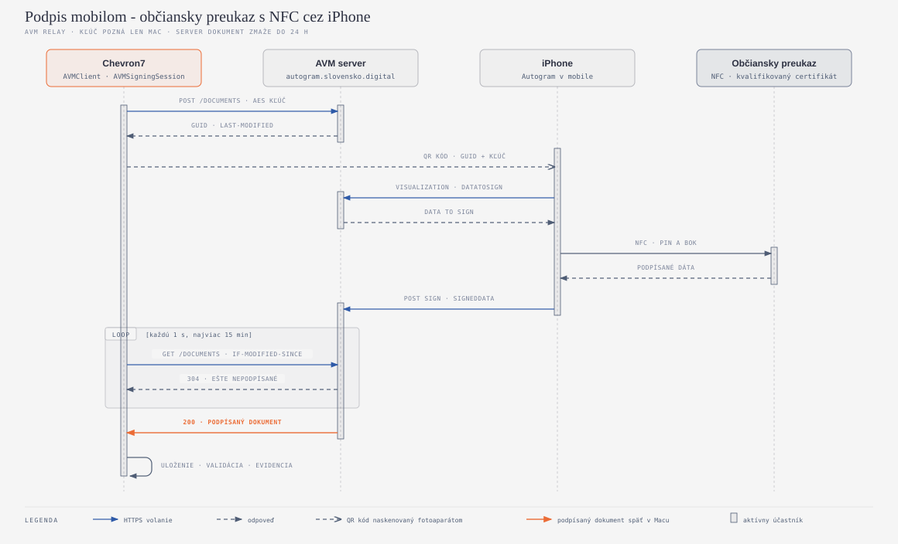

<p align="center">
  
</p>

<h1 align="center">Autogram macOS</h1>

<p align="center">
  <a href="https://github.com/originalmagneto/autogram-macOS/releases/latest"></a>
  
  
  
  
</p>

<p align="center">
  <strong>Natívny pracovný stôl pre dôveryhodné právne dokumenty.</strong><br>
  Podpis. Konverzia. Evidencia. V jednom lokálnom workflow.
</p>

<p align="center">
  <a href="#prehľad">Prehľad</a> ·
  <a href="#ai-vision-vrstvená-detekcia-bezpečnostných-prvkov">AI Vision</a> ·
  <a href="#zaručená-konverzia">Zaručená konverzia</a> ·
  <a href="#podpisovanie">Podpisovanie</a> ·
  <a href="#rýchly-štart">Rýchly štart</a> ·
  <a href="#architektúra">Architektúra</a>
</p>

Natívna macOS aplikácia v SwiftUI pre kvalifikované elektronické podpisovanie, zaručenú konverziu podľa zákona č. 305/2013 Z. z. a lokálnu evidenciu právnych dokumentov. Žiadny obsah dokumentu neopúšťa Mac, pokiaľ to výslovne nezvolíte.

## Prehľad

<table>
<tr>
<th align="left" width="22%">Modul</th>
<th align="left">Čo rieši</th>
<th align="left" width="26%">Výstup</th>
</tr>
<tr>
<td><strong>Podpisovanie</strong></td>
<td>KEP, PAdES, ASiC-E, kvalifikovaná časová pečiatka, vizuálny podpis a dávkové spracovanie s jednou plnou DSS validáciou.</td>
<td><code>PDF</code> · <code>ASiC-E</code></td>
</tr>
<tr>
<td><strong>Zaručená konverzia</strong></td>
<td>Import, analýza strán, vrstvená AI Vision detekcia bezpečnostných prvkov, osvedčovacia doložka a autorizácia mandátnym certifikátom.</td>
<td><code>PDF/A-2b</code> · <code>XML doložka</code> · evidencia</td>
</tr>
<tr>
<td><strong>Štátne weby</strong></td>
<td>Rozšírenie do Safari, ktoré podpisovanie na portáloch obslúži cez túto aplikáciu: natívna správa namiesto otvoreného portu, potvrdenie v plávajúcom okne, kartou alebo mobilom.</td>
<td><code>PDF</code> · <code>ASiC-E</code> · <code>XDCF</code></td>
</tr>
<tr>
<td><strong>Register</strong></td>
<td>Lokálne záznamy o konverziách, stavy, vyhľadávanie a CSV export.</td>
<td><code>register.json</code> · <code>CSV</code></td>
</tr>
<tr>
<td><strong>Integrácie</strong></td>
<td>eID, advokátske preukazy, PKCS#11, Keychain, Finder Quick Action, podpis mobilom cez Autogram v mobile (NFC eID na iPhone), EZZK (OAuth2/PKCE, fail-closed).</td>
<td>natívny pracovný tok</td>
</tr>
</table>

<details>
<summary><strong>Čo získate v každom module</strong></summary>

<table>
<tr>
<td width="50%" valign="top">
<h3>Podpisovanie</h3>
<ul>
<li>Výber eID, I.CA SecureStore, PKCS#11 a Keychain tokenov, vrátane čítačiek s viacerými slotmi.</li>
<li>PAdES a ASiC-E výstupy s kvalifikovanou časovou pečiatkou.</li>
<li>Vizuálny podpis, dávkové spracovanie a bezpečné zrušenie operácie.</li>
<li>Podpis bez čítačky: QR kód, iPhone s aplikáciou Autogram v mobile a občiansky preukaz s NFC.</li>
<li>Neplatný vstupný podpis blokuje konkrétny dokument; nedostupná trust služba zostáva iba informatívna.</li>
</ul>
</td>
<td width="50%" valign="top">
<h3>Zaručená konverzia</h3>
<ul>
<li>Kontrolovaný import a potvrdenie pôvodu dokumentu.</li>
<li>AI Vision detekcia s povinnou manuálnou kontrolou podpisov, pečiatok, slepotlače a paraf.</li>
<li>PDF/A-2b, osvedčovacia doložka, XML a lokálna evidencia.</li>
<li>Mandátny certifikát a fail-closed produkčné odoslanie do CEZZK.</li>
</ul>
</td>
</tr>
</table>
</details>

## AI Vision: vrstvená detekcia bezpečnostných prvkov

Detekcia beží výhradne na zariadení a skladá sa z troch vrstiev. Každá vrstva sa dá vypnúť alebo môže zlyhať bez toho, aby výsledok bol horší ako doteraz.

<p align="center">
  
</p>

<table>
<tr>
<th align="left" width="18%">Vrstva</th>
<th align="left">Ako funguje</th>
<th align="left" width="30%">Technológia</th>
</tr>
<tr>
<td><strong>1 · Kandidáti</strong></td>
<td>Strana sa vykreslí raz a prejde presným OCR. Tri nezávislé zdroje navrhnú oblasti, ktoré sa zlúčia podľa prekrytia; tlačený text, linkované bunky formulárov a čiarové kódy odpadnú ešte pred klasifikáciou.</td>
<td>vstavané HSV heuristiky · <code>RecognizeTextRequest</code> (accurate) · <code>DetectContoursRequest</code> · objectness saliency</td>
</tr>
<tr>
<td><strong>2 · Klasifikácia</strong></td>
<td>Každý výrez porovná <em>feature print</em> s lokálne uloženými potvrdenými a zamietnutými príkladmi. Ak je výsledok neistý, rozhodne on-device Apple model: dostane iba výrez a podiel OCR textu, nie tip heuristiky, a jeho "nie" platí aj pri nulovej istote. Najviac 12 výrezov na stranu, 8 s limit na výrez, každý výrez v čerstvej relácii modelu.</td>
<td><code>GenerateImageFeaturePrintRequest</code> · Foundation Models (macOS 27, obrazový vstup)</td>
</tr>
<tr>
<td><strong>3 · Kontrola</strong></td>
<td>Plátno drží iba dokument; vpravo sú tri karty: Kontrola strany, Nálezy a Pridať prvok. Advokát nález potvrdí alebo odmietne, upraví rámec ťahaním, alebo zvolí typ a klikne na prvok, aby sa rámec prichytil k obrysu. Po označení strany aplikácia preskočí na ďalšiu neskontrolovanú; bez kontroly každej neprázdnej strany nepokračuje.</td>
<td><code>GenerateIterativeSegmentationRequest</code> · SwiftUI canvas</td>
</tr>
</table>

<details open>
<summary><strong>Ako sa detekcia učí z vašej práce</strong></summary>

<table>
<tr>
<th align="left" width="28%">Udalosť</th>
<th align="left">Čo sa stane</th>
</tr>
<tr>
<td>Potvrdíte nález</td>
<td>Výrez s konečným rámcom a druhom sa uloží ako pozitívny príklad spolu s jeho feature printom.</td>
</tr>
<tr>
<td>Odmietnete nález</td>
<td>Výrez sa uloží ako negatívny príklad; detektor sa učí aj vaše falošné poplachy.</td>
</tr>
<tr>
<td>Vrátite na kontrolu</td>
<td>Príklad sa z datasetu odstráni.</td>
</tr>
<tr>
<td>Ďalšia konverzia</td>
<td>kNN porovnáva s väčším datasetom, takže model rozhoduje čoraz menej prípadov.</td>
</tr>
<tr>
<td>Export pre Create ML</td>
<td>Nastavenia vytvoria priečinok s <code>annotations.json</code> a náhľadmi strán pre tréning vlastného objektového detektora (fáza C).</td>
</tr>
</table>

<p>Dataset žije v <code>~/Library/Application Support/Autogram/VisionBank</code>, obsahuje náhľady strán dokumentov, ktorých prvky ste posúdili, a nikdy sa neodosiela. V Nastaveniach sa dá učenie vypnúť a dataset vymazať.</p>
</details>

<details>
<summary><strong>Nastavenia AI a voliteľné externé modely</strong></summary>

<table>
<tr>
<th align="left" width="40%">Voľba</th>
<th align="left">Správanie</th>
</tr>
<tr>
<td>Klasifikovať neisté nálezy on-device modelom</td>
<td>Predvolene zapnuté, ak je dostupná Apple Intelligence. Bez modelu rozhoduje iba porovnanie s príkladmi a odhad heuristík.</td>
</tr>
<tr>
<td>Učiť sa z potvrdených a odmietnutých prvkov</td>
<td>Predvolene zapnuté. Vypnutím sa dataset prestane dopĺňať.</td>
</tr>
<tr>
<td>oMLX · Ollama · OpenAI-compatible API</td>
<td>Voliteľná druhá vrstva nálezov z externého vision LLM. Iba pri výslovnom zapnutí; vstavaná detekcia beží vždy.</td>
</tr>
</table>
</details>

<details>
<summary><strong>Meranie presnosti</strong></summary>

<p>Každá zmena detektora sa dokladá číslami na vašich vlastných skenoch, nie na syntetických fixtúrach. Exportovaný dataset (mimo repozitára) sa vyhodnotí príkazom:</p>

```bash
cd Autogram
DEVELOPER_DIR=/Applications/Xcode-beta.app/Contents/Developer \
swift run vision-eval ~/AutogramEval [--builtin-only] [--no-fm] [--bank <dir>] [--iou 0.4] [--json]
```

<p>Výstup obsahuje presnosť, úplnosť a F1 pre každý druh prvku, priemerný čas na stranu a počet volaní on-device modelu. Bez <code>--bank</code> sa použije prázdny dočasný dataset, nie ten používateľský, aby boli čísla porovnateľné medzi commitmi.</p>
</details>

## Zaručená konverzia

<table>
<tr>
<td align="center" width="20%"><strong>1 · Import</strong><br><sub>PDF alebo obrazový sken, potvrdenie pôvodu</sub></td>
<td align="center" width="20%"><strong>2 · Analýza</strong><br><sub>formát strán, neprázdne strany, listy, názov</sub></td>
<td align="center" width="20%"><strong>3 · Overenie</strong><br><sub>AI nálezy, klik-na-prvok, kontrola strany za stranou</sub></td>
<td align="center" width="20%"><strong>4 · Doložka</strong><br><sub>osoba, počítadlá, poloha prvkov, XML, právny preflight</sub></td>
<td align="center" width="20%"><strong>5 · Autorizácia</strong><br><sub>evidenčné číslo, PDF/A, podpis, evidencia</sub></td>
</tr>
</table>

<details open>
<summary><strong>Stav EZZK a produkčného odoslania</strong></summary>

<p><strong>Produkčné EZZK zapojenie čaká na potvrdenie a integračné podklady od MIRRI SR.</strong> OAuth2/PKCE, OIDC discovery, natívny callback <code>autogram://ezzk/callback</code> a bezpečné uloženie session v Keychain sú hotové. Aplikácia zatiaľ pripraví konverzný artefakt, osvedčovaciu doložku a lokálnu evidenciu v pilotnom režime; produkčné pridelenie evidenčného čísla a odoslanie do CEZZK zostávajú oddelené a fail-closed, kým nie je vytvorený a validovaný samostatný podpísaný record ASiC a potvrdený receipt kontrakt.</p>

<p>Pilotný postup: importovať dokument, skontrolovať každú neprázdnu stranu, potvrdiť bezpečnostné prvky, prihlásiť sa do EZZK sandboxu a vyžiadať evidenčné číslo. Bez čísla z EZZK aplikácia zámerne nepovolí autorizáciu.</p>
</details>

<p align="center">
  
</p>

## Podpisovanie

1. Otvorte PDF cez `⌘O`, drag and drop alebo Finder Quick Action.
2. Pri viacerých dokumentoch vyberte **Pripraviť dávku podpisov**.
3. Prejdite preflight kontrolou vstupov a nastavení.
4. Vyberte formát, certifikát a voliteľný vizuálny podpis alebo QTS.
5. Spustite podpisovanie cez **Podpísať KEP** (karta v čítačke) alebo **Podpísať mobilom** (občiansky preukaz s NFC cez iPhone).
6. Skontrolujte výsledný PDF, XML alebo ASiC-E artefakt.

### Podpis mobilom

Bez čítačky kariet podpíšete dokument občianskym preukazom s NFC a iPhonom s aplikáciou [Autogram v mobile](https://sluzby.slovensko.digital/autogram-v-mobile/). Mac dokument zašifruje náhodným kľúčom, ktorý pozná len on, nahrá ho na server Slovensko.Digital, zobrazí QR kód a čaká. Po naskenovaní kódu telefón dokument podpíše a Mac si podpísaný súbor stiahne, overí a uloží rovnako ako pri karte.

<p align="center">
  
</p>

<table>
<tr>
<th align="left" width="30%">Čo platí</th>
<th align="left">Detail</th>
</tr>
<tr><td>Formát a pečiatka</td><td>Rovnaké voľby ako pri karte: PAdES v PDF alebo ASiC-E (XAdES), kvalifikovanú časovú pečiatku pridá server pri úrovni <code>_T</code>.</td></tr>
<tr><td>Vizuálny podpis</td><td>Vypáli sa do PDF lokálne ešte pred odoslaním; karta uvádza "Občiansky preukaz (eID) cez Autogram v mobile", lebo certifikát je známy až po podpise.</td></tr>
<tr><td>Zaručená konverzia</td><td>Vyžaduje mandátny certifikát. Podpis z mobilu bez neho aplikácia odmietne, nič neuloží a evidenciu nezmení. Kontajner podpisuje finálne PDF/A s vloženou doložkou; XDCF sa ukladá vedľa.</td></tr>
<tr><td>Súkromie</td><td>Server dokument dešifruje len v pamäti pri podpise a zmaže ho do 24 hodín. Kľúč sa neposiela nikam inam než v hlavičke k danému dokumentu.</td></tr>
<tr><td>Hranice</td><td>Aplikácia Autogram v mobile číta len občiansky preukaz a otvára len odkazy z <code>autogram.slovensko.digital</code>; SAK karta a vlastný server cez mobil nejdú. Finder Quick Action ostáva len pre kartu.</td></tr>
</table>

<details>
<summary><strong>Stavy podpisu a dôveryhodnosti</strong></summary>

<table>
<tr>
<th align="left" width="22%">Krok</th>
<th align="left">Význam</th>
</tr>
<tr><td><code>INSPECT</code></td><td>Rýchle čítanie existujúcich podpisov vrátane podpisov v ASiC-E, bez blokovania na nedostupnom trust liste.</td></tr>
<tr><td><code>VALIDATE</code></td><td>Úplná dôveryhodnostná kontrola s trust listami; jedna validácia pre celú dávku.</td></tr>
<tr><td><code>INVALID</code></td><td>Konkrétny dokument je zablokovaný, ostatné v dávke pokračujú.</td></tr>
<tr><td><code>indeterminate</code></td><td>Trust služba nie je dostupná; nie je to platný ani neplatný podpis a dávku neblokuje.</td></tr>
<tr><td><code>DEMO</code></td><td>Jasne označený podpisovač bez reálneho tokenu. DEMO podpis nie je právne záväzný.</td></tr>
</table>
</details>

## Podpisovanie na štátnych weboch

Rozšírenie do Safari podpisuje priamo na slovensko.sk, financnasprava.sk, sluzby.orsr.sk, socpoist a obcan.justice.sk. Portál volá svoje obvyklé rozhranie D.Signer a Autogram macOS ho obslúži namiesto pôvodného podpisovača. Dokumenty necestujú cez žiadny otvorený port: rozšírenie hovorí s aplikáciou natívnou správou.

<table>
<tr>
<th align="left" width="30%">Čo platí</th>
<th align="left">Detail</th>
</tr>
<tr><td>Transport</td><td>Natívny messaging, žiadny HTTP server a žiaden počúvajúci port. Meno Mach služby vlastní malý launchd agent, ktorý slúži len ako miesto stretnutia; aplikácia uňho zaregistruje anonymný endpoint a rozšírenie sa naň pripojí priamo. Cez agenta neprejde ani jeden dokument.</td></tr>
<tr><td>Spustenie</td><td>Aplikácia sa spustí sama, keď príde požiadavka, a otvorí sa bez aktivácie, takže neberie prehliadaču zameranie.</td></tr>
<tr><td>Potvrdenie</td><td>Stránka nepodpíše nič ticho. Každá požiadavka otvorí plávajúce okno nad prehliadačom s tým, čo sa podpisuje, a čaká na certifikát a PIN alebo na mobil. Naraz sa spracúva jedna požiadavka.</td></tr>
<tr><td>Mobil</td><td>Podpísať sa dá aj občianskym preukazom cez NFC. Relay prijíma tie isté eForm atribúty ako lokálny engine, takže mobilom sa dá podpísať aj elektronický formulár, nielen PDF.</td></tr>
<tr><td>Formát</td><td>Určuje ho portál, nie nastavenia: PDF objekt sa podpíše ako PAdES, elektronický formulár ako XAdES v ASiC-E s XML Data Containerom.</td></tr>
<tr><td>Časová pečiatka</td><td>Portály pýtajú úroveň Baseline B, teda bez pečiatky, a aplikácia im predvolene pošle presne to. Prepínač v okne úroveň povýši na Baseline T; portál však môže podpis, ktorý si nevyžiadal, odmietnuť.</td></tr>
<tr><td>Ukladanie</td><td>Podpis z prehliadača sa vracia stránke. Kópiu si aplikácia predvolene odkladá do vlastného priečinka, ktorý sa dá zmeniť alebo ukladanie vypnúť.</td></tr>
<tr><td>Návrat k pôvodnému</td><td>Prepínač v rozšírení vráti konkrétnu stránku jej pôvodnému podpisovaču, napríklad D.Bridge 2, bez vypínania celého rozšírenia a bez obnovenia stránky.</td></tr>
<tr><td>Hranice</td><td>Rozšírenie nie je podpísané Developer ID, takže Safari ho načíta len pri zapnutom <strong>Develop &gt; Allow Unsigned Extensions</strong>, a to po každom štarte. Podporované sú zatiaľ formuláre XAdES s XML Data Containerom a PDF; ostatné typy objektov hlásia nepodporovaný typ.</td></tr>
</table>

<details>
<summary><strong>Inštalácia rozšírenia</strong></summary>

```bash
DEVELOPER_DIR="/Applications/Xcode-beta.app/Contents/Developer" ./build_app.sh --release install
./scripts/install-webbridge-agent.sh
./scripts/safari-spike.sh
```

`safari-spike.sh` overí všetko, čo sa overiť dá bez Safari: prítomnosť appexu, jeho entitlement, registráciu agenta a spojenie s aplikáciou. Potom vypíše tri kroky, ktoré treba spraviť v Safari ručne.

Podpis bez Safari sa dá vyskúšať priamo:

```bash
"$(swift build --show-bin-path)/webbridge-probe" --sign dokument.pdf
```

</details>

## Vizuálny guide

<table>
<tr>
<td width="50%" valign="top">
<ul>
<li><a href="docs/diagrams/autogram-visual-guide.html">Architektúra a batch preflight</a> (interaktívne HTML)</li>
<li><a href="docs/gallery.html">Diagramová galéria</a></li>
<li><a href="docs/diagrams/architecture.svg">Architektúra aplikácie</a></li>
<li><a href="docs/diagrams/process-zako.svg">Proces zaručenej konverzie</a></li>
<li><a href="docs/diagrams/mobile-signing.svg">Podpis mobilom (AVM)</a></li>
</ul>
</td>
<td width="50%" valign="top">
<ul>
<li><a href="docs/diagrams/ai-vision.svg">AI Vision pipeline</a></li>
<li><a href="docs/diagrams/pdfa-pipeline.svg">PDF/A pipeline</a></li>
<li><a href="docs/diagrams/finder-quick-action.svg">Finder Quick Action</a></li>
<li><a href="docs/diagrams/state-machine.svg">Stavový automat evidencie</a></li>
</ul>
</td>
</tr>
</table>

<details>
<summary><strong>Ďalšie diagramy</strong></summary>

<h3>Architektúra aplikácie</h3>
<p>Natívny SwiftUI shell sa opiera o session stores a <code>AutogramKit</code>. Dokumentové služby zostávajú lokálne; externé hranice sú oddelené cez Java DSS helper, PKCS#11, PDFKit a EZZK.</p>
<p align="center"></p>

<h3>PDF/A pipeline</h3>
<p>Vloženie metadát a príloh, XMP profil, výpočet fingerprintu a kontrola, že exportovaný artefakt spĺňa požadovaný formát.</p>
<p align="center"></p>

<h3>Finder Quick Action</h3>
<p>Samostatný runner zobrazí výber ovládača, certifikátu a PIN/BOK, podpíše PDF na pozadí a uloží výsledok bez otvorenia hlavného okna.</p>
<p align="center"></p>

<h3>Podpis mobilom</h3>
<p>Mac nahrá zašifrovaný dokument na AVM server, iPhone ho po naskenovaní QR kódu podpíše občianskym preukazom cez NFC a Mac si podpísaný súbor stiahne pollingom. Rovnaký diagram je v sekcii Podpisovanie.</p>

<h3>Stavový automat evidencie</h3>
<p>Kedy je dokument iba pripravený, kedy prešiel kontrolou a kedy už vznikol podpísaný alebo konvertovaný artefakt.</p>
<p align="center"></p>
</details>

## Rýchly štart

<table>
<tr>
<th align="left" width="30%">Požiadavka</th>
<th align="left">Poznámka</th>
</tr>
<tr><td>macOS 27 alebo novší</td><td>Foundation Models a Vision segmentácia vyžadujú macOS 27; AI funkcie sa bez nich len zúžia.</td></tr>
<tr><td>Xcode 27.0 a Swift 6</td><td>Iba pre build zo zdrojov. Samotné Command Line Tools nestačia (chýba SwiftUI macro plugin).</td></tr>
<tr><td>Apple Intelligence</td><td>Voliteľné. Zapína on-device klasifikáciu neistých nálezov.</td></tr>
<tr><td>eID, advokátsky preukaz, PKCS#11, CryptoTokenKit alebo Keychain token</td><td>Pre reálny kvalifikovaný podpis.</td></tr>
<tr><td>EZZK účet, callback <code>autogram://ezzk/callback</code>, sandbox</td><td>Pre produkčný režim zaručenej konverzie.</td></tr>
</table>

### Stiahnutie

Aktuálny macOS build je v [GitHub Releases](https://github.com/originalmagneto/autogram-macOS/releases/latest) ako DMG.

<details open>
<summary><strong>Prvé spustenie (aplikácia nie je notarizovaná)</strong></summary>

<p>Build je podpísaný lokálne, nie Apple Developer ID, takže Gatekeeper ho pri prvom spustení zastaví. Toto je štandardný postup, žiadne nastavenia sa nemenia natrvalo:</p>

<ol>
<li>Otvorte DMG a presuňte <code>Autogram macOS.app</code> do priečinka <strong>Applications</strong>.</li>
<li>Spustite aplikáciu. macOS ohlási, že ju nemôže overiť, a ponúkne len "Presunúť do koša" alebo "Hotovo". Zvoľte <strong>Hotovo</strong>.</li>
<li>Otvorte <strong>Systémové nastavenia ▸ Súkromie a bezpečnosť</strong>, zrolujte nadol k hláseniu o Autograme a kliknite na <strong>Aj tak otvoriť</strong>. Potvrďte heslom alebo Touch ID.</li>
<li>Od tejto chvíle sa aplikácia spúšťa normálne.</li>
</ol>

<p>Alternatíva z Terminálu, ktorá zruší karanténny príznak stiahnutého súboru:</p>

```bash
xattr -d com.apple.quarantine "/Applications/Autogram macOS.app"
```

<p>Overenie stiahnutého DMG: v poznámkach k vydaniu je SHA-256 odtlačok; porovnajte ho s výstupom <code>shasum -a 256 Autogram-macOS-v0.3.1.dmg</code>.</p>
</details>

<details>
<summary><strong>v0.2.3 · predchádzajúce vydanie</strong></summary>
<ul>
<li>I.CA SecureStore správne vyberá slot s kartou aj pri prázdnej čítačke na prvej pozícii.</li>
<li>Existujúce XAdES podpisy v ASiC-E sa načítajú cez ľahkú inšpekciu bez blokovania na nedostupnom trust liste.</li>
<li>Batch preflight, PDF/A výstupy, ZaKo workflow a lokálna evidencia zostávajú súčasťou jedného natívneho buildu.</li>
</ul>
</details>

<details open>
<summary><strong>v0.3.1 · aktuálne vydanie: podpisový engine a Finder Quick Action v DMG</strong></summary>
<ul>
<li>DMG obsahuje Java podpisový engine (DSS, PKCS#11, machine protokol v1/v2) s vlastným jlink runtime; kvalifikovaný podpis eID a advokátskym preukazom funguje bez inštalácie Javy a sidebar už nepadá do režimu DEMO.</li>
<li>Finder Quick Action podpisuje cez zabalené helpery <code>AutogramCLI-arm64</code> a <code>AutogramQuickActionRunner-arm64</code>.</li>
<li>Zdroje enginu sú v repozitári (<code>engine/</code>, EUPL 1.2) a zostavujú sa skriptom <code>Autogram/scripts/build-engine.sh</code>.</li>
</ul>
</details>

<details>
<summary><strong>v0.3.0 · vrstvená AI Vision a nová kontrola originálu</strong></summary>
<ul>
<li>Kandidáti z troch zdrojov (heuristiky, Vision kontúry, saliency) plus presné OCR, ktoré odfiltruje tlačený text a linkované bunky formulárov; na reálnom skene plnomocenstva klesol počet volaní modelu z 24 na 3 a strana bez podpisu ostala čistá.</li>
<li>Klasifikácia porovnaním s vašimi potvrdenými príkladmi a on-device Apple modelom, bez externých služieb.</li>
<li>Obrazovka Overenie originálu: dokument na plátne, tri karty vpravo (Kontrola strany, Nálezy, Pridať prvok), jednoriadkové nálezy, "Potvrdiť všetky" a automatický prechod na ďalšiu neskontrolovanú stranu.</li>
<li>Klik-na-prvok cez Vision segmentáciu a spresnenie rámca jedným tlačidlom.</li>
<li>Lokálny dataset s exportom pre Create ML a <code>vision-eval</code> na meranie presnosti.</li>
<li>Nastavenia v zväčšovateľnom okne, poskytovateľ detekcie v spodnej lište pri "Znova analyzovať AI", File ▸ Otvoriť nedávne.</li>
</ul>
</details>

### Build a inštalácia

Podpisový engine (Java fork Autogramu s DSS, machine protokol v1/v2, Finder Quick Action) je v priečinku `engine/` a zostavuje sa raz, pred buildom aplikácie. Potrebuje arm64 JDK 25 s JavaFX jmods ([Azul Zulu FX 25](https://www.azul.com/downloads/?version=java-25-lts&os=macos&architecture=arm-64-bit&package=jdk-fx)) rozbalený pod `~/Library/Java`, prípadne cestu v `AUTOGRAM_JAVA_HOME`.

```bash
cd Autogram
scripts/build-engine.sh
DEVELOPER_DIR=/Applications/Xcode-beta.app/Contents/Developer ./build_app.sh --release install
```

`build-engine.sh` zostaví `autogram.jar` a závislosti cez Maven, vytvorí jlink runtime, skompiluje launcher `AutogramCLI-arm64` a runner `AutogramQuickActionRunner-arm64` a overí engine cez `CAPABILITIES`. `build_app.sh` potom všetko zabalí do `Contents/{Helpers,app,runtime}`; bez enginu aplikácia beží, ale podpis padá na Keychain alebo DEMO a Finder Quick Action nepodpisuje.

Aplikácia sa nainštaluje do `/Applications/Autogram macOS.app`.

### Testy

```bash
cd Autogram
DEVELOPER_DIR=/Applications/Xcode-beta.app/Contents/Developer swift test
```

<details>
<summary><strong>Voliteľné live testy</strong></summary>

<p>Java DSS engine (vyžaduje nainštalovaný engine):</p>

```bash
AUTOGRAM_ENGINE_LIVE_TEST=1 \
DEVELOPER_DIR=/Applications/Xcode-beta.app/Contents/Developer \
swift test --filter JavaEngineLiveProcessTests
```

<p>On-device Foundation Model (beží automaticky, ak je model dostupný, inak sa preskočí):</p>

```bash
DEVELOPER_DIR=/Applications/Xcode-beta.app/Contents/Developer \
swift test --filter FoundationModelClassifierTests
```
</details>

## Výstupy a hranice

<table>
<tr>
<th align="left" width="30%">Čo</th>
<th align="left">Kde a ako</th>
</tr>
<tr><td>Podpísané a konvertované súbory</td><td>Prednostne vedľa zdrojového dokumentu, inak <code>~/Library/Application Support/Autogram/Output</code>. Existujúce súbory sa neprepíšu (<code>dokument (2).pdf</code>).</td></tr>
<tr><td>Register konverzií</td><td><code>~/Library/Application Support/Autogram/Evidence/register.json</code>, bez obsahu dokumentov.</td></tr>
<tr><td>Dataset AI Vision</td><td><code>~/Library/Application Support/Autogram/VisionBank</code>: náhľady strán, výrezy a feature printy posúdených prvkov. Lokálne, vymazateľné.</td></tr>
<tr><td>Tajomstvá</td><td>Keychain (API kľúče, EZZK session). Security-scoped bookmarks pre prístup k súborom.</td></tr>
<tr><td>Podpis mobilom</td><td>Dokument dočasne na <code>autogram.slovensko.digital</code>, zašifrovaný kľúčom z tohto Macu, zmazaný po podpise alebo do 24 hodín. Bez registrácie a bez API kľúča.</td></tr>
</table>

Aktuálny ZaKo profil je implementačný P2E pilot s PDF/A-2b. Lokálny `PDFAValidator` nie je náhradou za veraPDF alebo Acrobat Preflight. Produkčné EZZK endpointy, aktívne formuláre a externé požiadavky treba overiť samostatne.

## Architektúra

<table>
<tr>
<th align="left" width="24%">Vrstva</th>
<th align="left">Zodpovednosť</th>
</tr>
<tr><td><strong>AutogramApp</strong></td><td>SwiftUI views, menu commands, Settings, drag and drop, Finder routing a lifecycle.</td></tr>
<tr><td><strong>Session stores</strong></td><td><code>SigningSessionStore</code>, <code>ZakoSessionStore</code>, <code>RecentDocumentStore</code> a <code>SignedDocumentStore</code> riadia workflow, stav a históriu podpisov.</td></tr>
<tr><td><strong>AutogramKit</strong></td><td>PDF analýza, <code>LayeredDetectionProvider</code> (kandidáti, klasifikácia, učenie, segmentácia), XML doložka, PDF/A, podpisovanie, ASiC-E a evidencia.</td></tr>
<tr><td><strong>EngineBridge</strong></td><td>Persistentný machine session helper pre Java/DSS, PDFBox a PKCS#11 integrácie.</td></tr>
<tr><td><strong>Signing/AVM</strong></td><td><code>AVMClient</code>, <code>AVMSigningSession</code> a <code>MobileSigningCoordinator</code>: podpis mobilom cez relay Autogram v mobile (upload, QR kód, polling, mapovanie výsledku, kontrola mandátu). <code>avm-probe</code> overuje protokol proti reálnemu serveru.</td></tr>
<tr><td><strong>WebBridge</strong></td><td><code>AutogramWebBridge</code> nesie kontrakt medzi rozšírením a aplikáciou, <code>autogram-webbridge-agent</code> je launchd rendezvous vlastniaci meno Mach služby, <code>AutogramWebExtensionHandler</code> je appex v <code>Contents/PlugIns</code> a <code>WebExtension/</code> samotné rozšírenie. <code>webbridge-probe</code> otestuje celú appkovú polovicu bez Safari.</td></tr>
<tr><td><strong>vision-eval</strong></td><td>Samostatný CLI target na meranie presnosti detekcie; nie je súčasťou aplikácie.</td></tr>
</table>

Kompletná implementačná dokumentácia je v [`docs/PHASES.md`](docs/PHASES.md); návrh podpisu mobilom v [`docs/superpowers/specs/2026-09-11-avm-mobile-signing-design.md`](docs/superpowers/specs/2026-09-11-avm-mobile-signing-design.md); návrh podpisovania na štátnych weboch v [`Autogram/docs/superpowers/specs/2026-09-11-safari-extension-design.md`](Autogram/docs/superpowers/specs/2026-09-11-safari-extension-design.md); návrh vrstvenej detekcie v [`Autogram/docs/superpowers/specs/2026-09-05-layered-security-element-detection-design.md`](Autogram/docs/superpowers/specs/2026-09-05-layered-security-element-detection-design.md).

## Právne a bezpečnostné upozornenie

Autogram je technický nástroj. Nenahrádza právne posúdenie konkrétneho dokumentu ani povinnosť advokáta skontrolovať originál, bezpečnostné prvky, certifikát a výsledný artefakt. AI nálezy sú návrhy; bez potvrdenia advokátom sa do osvedčovacej doložky nedostanú.
