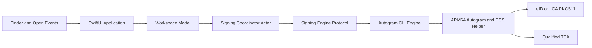

# Native macOS PDF Signing Workspace Design

Status: Approved in design review on 2026-08-06, revised for ARM64-only runtime on 2026-08-06, extended for signature inspection, ASiC-E, token defaults, and timestamp-source settings on 2026-08-07

## Summary

Autogram will gain a native macOS application for signing one or more PDF files without opening JavaFX or Terminal. The application will use SwiftUI, AppKit, and PDFKit for the user experience while retaining the existing Autogram Java CLI as the cryptographic signing engine.

The initial workspace implementation is PDF-focused. The approved product extension in `2026-08-07-signature-inspection-token-defaults-and-timestamp-sources.md` adds existing-signature inspection and further signing for supported ASiC-E containers. General XML, eForms, and unrestricted XAdES or CAdES workflows outside supported ASiC-E remain deferred.

## Product Decisions

- Minimum operating system: macOS 27.
- Supported hardware: Apple silicon only.
- Toolchain: Xcode 27 and Swift 6 with strict concurrency checking.
- User interface: native SwiftUI with focused AppKit bridges.
- PDF rendering: PDFKit.
- Signing engine: existing Autogram Java core exposed through a non-interactive CLI protocol.
- Signing runtime: native macOS ARM Autogram 2.7.5 or newer with DSS 6.4.
- I.CA middleware: I.CA SecureStore 8.3.1 or newer.
- Signature profile: PAdES Baseline T.
- Timestamping: a qualified electronic timestamp is mandatory.
- Distribution: Developer ID signed and notarized outside the Mac App Store.
- Repository: the native application lives in `native-macos/` inside this repository.
- Initial delivery: GitHub Releases, with Sparkle deferred until the release pipeline is stable.

## Goals

1. Sign one or more PDF files through a fast, native macOS workflow.
2. Keep JavaFX and Terminal out of the user interaction path.
3. Reuse the existing eIDAS and DSS signing implementation instead of rewriting cryptography in Swift.
4. Support eID and I.CA SecureStore on Apple silicon running macOS 27.
5. Require PAdES Baseline T with a qualified timestamp for every successful signature.
6. Preserve original files and produce deterministic, collision-safe output names.
7. Accept files from drag and drop, the Open panel, Open With, and a Finder Quick Action.
8. Provide structured, actionable errors without Java stack traces.
9. Keep PIN values, client file paths, and certificate details out of logs and diagnostics.
10. Make the Swift application testable without a physical card, real PIN, or live timestamp service.

## Non-Goals for the First Release

- XML and Slovak eForms signing.
- General XAdES and CAdES workflows outside supported ASiC-E containers.
- Signature placement or visible signature artwork.
- PDF editing or annotation.
- macOS 26 or Intel Mac compatibility.
- Mac App Store distribution.
- Reimplementation of DSS, PKCS#11, PAdES, or trusted-list validation in Swift.
- Automatic storage of a PIN in Keychain or any other persistent store.
- Full replacement of the cross-platform JavaFX application.

## Existing Foundation

The current fork already provides important building blocks:

- CLI mode through `--cli`.
- Non-interactive driver selection through `--driver`.
- Certificate listing through `--list-keys`.
- Certificate selection through `--key`.
- PIN input through `--pin-stdin`.
- PAdES level selection through `--pdf-level`.
- Timestamp server selection through `--tsa-server`.
- A Finder Quick Action wrapper and macOS dialogs.
- Native macOS ARM packaging in Autogram 2.7.5.
- Universal ARM64 support in I.CA SecureStore 8.3.1 PKCS#11.
- Universal ARM64 support in the supported Slovak eID PKCS#11 library.
- Correct routing of `PAdES_BASELINE_T` to PDF signing.
- Regression coverage for the PAdES Baseline T routing issue.

The native application must build on these capabilities rather than duplicate them. The main missing boundary is a stable machine-readable protocol and a native application shell.

## Platform Constraints

### macOS 27

The application targets macOS 27 and Xcode 27 to use the current SwiftUI appearance, updated toolbar behavior, reorderable containers, improved document APIs, and current Observation behavior without compatibility branches for older systems.

Development builds created against beta SDKs must be labeled as previews. A stable release cannot be declared until it is built and tested against the final macOS 27 SDK and final Xcode 27.

### Apple Silicon Runtime and Driver Validation

The Swift application, bundled Java runtime, Autogram helper, and selected PKCS#11 driver all run natively on ARM64. The target architecture contains no Intel helper, Rosetta fallback, translated process, or x86_64-only compatibility path.

The application must not load a third-party PKCS#11 library into the Swift process. Driver loading stays inside the isolated Java helper process.

The driver resolver must:

1. Discover supported PKCS#11 driver locations without assuming that a file exists.
2. Inspect every selected driver with a native Mach-O architecture check before starting Autogram.
3. Require an arm64 slice and reject x86_64-only drivers.
4. Require I.CA SecureStore 8.3.1 or newer for the I.CA driver.
5. Report a clear repair instruction that names the required middleware version when validation fails.
6. Launch the single ARM64 Autogram helper only after all startup checks pass.

The local I.CA SecureStore 8.3.1 library was verified with both file and lipo -info at /usr/local/lib/pkcs11/libICASecureStorePkcs11.dylib; it contains an arm64 slice. This local path is evidence for development only and must not be embedded in distributable configuration or documentation.

## High-Level Architecture



The Swift layer owns presentation, workflow state, file intake, output naming, process supervision, and user-facing error recovery. The Java layer owns token access, certificate access, signing, timestamping, and cryptographic validation.

## Repository Layout

```text
autogram-macOS/
├── native-macos/
│   ├── Autogram.xcodeproj
│   ├── Autogram/
│   │   ├── App/
│   │   ├── Features/
│   │   │   ├── Workspace/
│   │   │   ├── Signing/
│   │   │   ├── Certificates/
│   │   │   └── Settings/
│   │   ├── Core/
│   │   ├── Infrastructure/
│   │   │   ├── CLI/
│   │   │   ├── Drivers/
│   │   │   ├── PDF/
│   │   │   └── FileSystem/
│   │   └── Resources/
│   ├── AutogramTests/
│   ├── AutogramIntegrationTests/
│   └── AutogramUITests/
├── src/
│   ├── main/java/
│   └── test/java/
├── scripts/
└── docs/
```

The Swift project must not copy Java signing logic. Java protocol changes remain in the existing source tree so they can be tested with the current Maven suite.

## Native Application Components

### Application Layer

- `AutogramApp`: SwiftUI application entry point.
- `AppCommands`: native File, Edit, View, Window, and Help commands with keyboard shortcuts.
- `Settings` scene: native application preferences.
- `OpenEventHandler`: accepts files from Finder, Open With, and the Quick Action.

### Workspace Feature

- `WorkspaceModel`: `@MainActor` and `@Observable` source of presentation state.
- `PDFItem`: immutable identity plus mutable per-file processing state.
- `WorkspaceView`: root `NavigationSplitView`.
- `PDFListView`: batch list and selection.
- `PDFDetailView`: PDFKit preview.
- `SigningInspector`: signature information and selected signing configuration.

### Signing Feature

- `SigningCoordinator`: actor implementing the signing state machine.
- `SigningEngine`: protocol used by production and test engines.
- `AutogramCLIEngine`: production adapter for the Java CLI.
- `FakeSigningEngine`: deterministic test implementation.
- `SigningConfiguration`: driver, certificate, profile, timestamp policy, and output policy.
- `SigningResult`: per-file result independent of process exit details.

### Infrastructure

- `CLIProcessRunner`: launches and supervises helper processes.
- `MachineProtocolCodec`: encodes requests and decodes events.
- `DriverResolver`: locates drivers and chooses the compatible helper architecture.
- `PDFPreviewService`: performs basic PDF parsing and provides the PDFKit preview bridge.
- `SignatureInspectionService`: asks the Java and DSS engine to enumerate and validate existing signatures.
- `OutputService`: computes collision-safe output URLs and validates output artifacts.
- `DiagnosticReporter`: creates redacted, user-shareable diagnostics.

All models crossing actor boundaries must conform to `Sendable`. Views must not own process, token, network, or file-system logic.

## User Interface

### Main Window

The main window is a focused workspace rather than a wizard or dashboard.

- Sidebar: selected PDF files and their individual states.
- Detail: large PDFKit preview of the selected file.
- Inspector: existing signatures, certificate choice, PAdES profile, timestamp status, and output behavior.
- Toolbar: add files, remove files, sidebar visibility, inspector visibility, and the primary Sign action.

The Sign action remains visible at narrow window widths using the macOS 27 toolbar priority APIs. Lower-priority actions may move into the overflow menu.

The sidebar may hide automatically for a single file. It remains visible for a batch and supports native reordering.

### Empty State

The empty state contains only:

- a PDF drop target,
- a Select PDF button,
- a short statement that signatures include a qualified timestamp,
- actionable setup diagnostics when no supported driver is available.

It must not contain marketing cards or duplicate navigation.

### Certificate and PIN

The application remembers only privacy-preserving token identity and public certificate matching metadata. Defaults are stored separately for each known token. It never persists the PIN. Exact selection and renewal rules are defined in `2026-08-07-signature-inspection-token-defaults-and-timestamp-sources.md`.

The normal flow is:

1. Inspect selected files.
2. Detect drivers.
3. List certificates.
4. Select a certificate.
5. Present a native secure PIN sheet.
6. Start the batch.

Some token implementations may require authentication before certificate enumeration. The engine may therefore request a PIN earlier, but the UI must explain why and must not retain it after the operation.

### Batch Results

Each row displays one of these states:

- ready,
- inspecting,
- signing,
- signed,
- skipped,
- failed,
- cancelled.

A failure for one file does not cancel later files. The final summary groups successful, skipped, and failed files and provides Reveal in Finder actions.

### Settings

The native Settings scene contains:

- detected and remembered tokens,
- a friendly default certificate for each token,
- output naming policy,
- destination policy,
- behavior after successful signing,
- qualified timestamp source and custom provider management,
- detected driver architectures,
- helper runtime status,
- redacted diagnostics.

PAdES Baseline T and qualified timestamping are mandatory in the first release and are not user-disableable preferences.

### Accessibility and System Behavior

- Use semantic system controls and SF Symbols.
- Support full keyboard navigation and VoiceOver labels.
- Respect Reduce Motion, Reduce Transparency, Increase Contrast, and system accent color.
- Use Liquid Glass primarily where the system provides it, especially toolbars and interactive controls.
- Keep PDF content, settings forms, and legal status text visually quiet and highly legible.
- Support light mode and dark mode without custom theme duplication.

## File Intake and Finder Integration

The application accepts PDF URLs through:

- drag and drop,
- `NSOpenPanel`,
- File > Open,
- Finder Open With,
- application open-document events,
- a Finder Quick Action handling one or more selected files.

The Finder Quick Action is a thin launcher. It passes selected files through native open-document events and performs no signing itself. Its preferred implementation uses Finder and application actions without a shell script. It must not contain personal absolute paths, place selected paths in custom command-line arguments, invoke developer tools, open Terminal, or present a second signing user interface.

If the application is already running, new files are added to the current workspace. Duplicate URLs are ignored and the existing row is selected.

Cloud-backed files must be materialized before inspection. File coordination and access errors must be reported per file.

## Signing State Model

The batch state machine is:

```text
idle
  -> inspectingFiles
  -> resolvingDriver
  -> loadingCertificates
  -> selectingCertificate
  -> awaitingPIN
  -> signing
  -> completed | partiallyCompleted | failed | cancelled
```

The state machine is owned by `SigningCoordinator`, not by SwiftUI views. Invalid transitions are programming errors covered by unit tests.

Cancellation must:

1. stop accepting new work,
2. terminate the active helper process with a bounded grace period,
3. preserve already completed output files,
4. remove incomplete temporary files,
5. mark untouched files as cancelled,
6. clear the in-memory PIN binding.

## Machine-Readable CLI Protocol

### Protocol Goals

- No parsing of human-oriented CLI text.
- Stable version negotiation.
- Structured progress and errors.
- No interactive terminal prompts.
- No PIN in command-line arguments or environment variables.
- Support arbitrary batches and explicit output URLs.
- Compatibility tests in Java and Swift.

### Invocation

The existing CLI gains a machine mode similar to:

```text
AutogramApp --cli --machine-readable --protocol-version 1 --operation sign
```

Operation arguments select the protocol behavior. Sensitive request data is delivered through standard input as a single JSON object. Standard output contains JSON Lines events. Standard error is reserved for redacted diagnostics and must never contain request payloads.

### Requests

Initial operations are:

- `capabilities`: protocol version, supported operations, profiles, and helper architecture.
- `drivers`: available drivers and driver status.
- `certificates`: certificates for a selected driver.
- `inspect`: existing PDF signatures and their validation status.
- `sign`: selected certificate, ephemeral PIN, signing policy, and source-target pairs.

Cancellation is implemented by supervised process termination in version 1 rather than an in-band operation.

The signing request contains:

- protocol version,
- driver identifier,
- stable certificate selector,
- PIN,
- `PAdES_BASELINE_T`,
- qualified timestamp policy,
- explicit source and target URLs,
- batch identifier.

The request must never be logged. The Swift model clears its PIN binding immediately after handing the request to the process runner. The implementation must minimize copies of the PIN, while acknowledging that Swift and Java managed runtimes cannot guarantee complete memory zeroization.

### Events

Version 1 events include:

- `session.started`,
- `driver.detected`,
- `certificates.available`,
- `inspection.completed`,
- `pin.required`,
- `file.signingStarted`,
- `file.progress`,
- `file.completed`,
- `file.failed`,
- `session.completed`,
- `session.failed`.

Every event contains:

- protocol version,
- event type,
- session identifier,
- timestamp,
- optional file identifier,
- typed payload.

Errors contain a stable code, localized-message key, safe fallback message, retryability, and suggested recovery action. They do not expose Java class names or stack traces.

The decoder must reject unknown protocol versions, malformed payloads, oversized event lines, invalid state transitions, and events with an unexpected session or file identifier.

### Exit and Artifact Semantics

A zero process exit does not by itself prove signing success. A successful file requires:

1. a `file.completed` event,
2. an output file at the expected URL,
3. a valid PDF header,
4. a valid PDF end marker,
5. a PAdES signature at the requested level,
6. a present and validated qualified timestamp.

Machine mode must make shutdown deterministic. Any non-zero helper exit remains a failure even when an output file exists. Artifact validation is mandatory but never converts an abnormal process exit into success.

## Qualified Timestamp Policy

Setting a TSA URL is not sufficient proof that a timestamp is qualified. The signing engine must:

1. use a configured service intended to issue qualified timestamps,
2. fail closed when the TSA is unavailable,
3. require a timestamp token in the produced PAdES signature,
4. validate the timestamp token and its certificate chain,
5. evaluate qualification using the applicable EU trusted-list data,
6. report the result as structured metadata,
7. reject an output that contains only an unqualified or unverifiable timestamp.

Timestamp qualification is distinct from signer-certificate qualification. The UI and diagnostics must not describe one as proof of the other.

The application ships with the three timestamp configurations used by the existing Autogram application: ordered Sectigo then Belgium fallback, Sectigo only, and Belgium only. Settings also supports custom ordered TSA URLs with optional credentials stored only in macOS Keychain. The Java engine manages trusted-list retrieval, caching, freshness checks, and validation. It must fail closed when the trusted-list state is too stale to support the qualification result or when a custom service does not produce a validated `QTSA` timestamp. Detailed source, authentication, and failure rules are defined in `2026-08-07-signature-inspection-token-defaults-and-timestamp-sources.md`.

## Output Policy

- Never overwrite the source PDF.
- Default output: `<name>_signed.pdf` beside the source.
- On collision: `<name>_signed (2).pdf`, then increment safely.
- Write to a temporary file in the destination directory.
- Validate the completed PDF before atomically moving it to the final URL.
- Canonicalize source and destination URLs, reject unsafe symlink targets, and create outputs exclusively to prevent replacement races.
- Remove incomplete temporary files after failure or cancellation.
- Preserve successful files from an otherwise partially failed batch.

## Error Model

Error domains include:

- input file,
- output file,
- cloud materialization,
- driver discovery,
- ARM64 runtime validation,
- unsupported middleware version,
- token connection,
- certificate enumeration,
- PIN authentication,
- signing,
- timestamp service,
- timestamp qualification,
- protocol compatibility,
- process lifecycle,
- output validation.

Examples of recovery actions:

- Retry Driver Detection,
- Reconnect Card,
- Enter PIN Again,
- Choose Another Certificate,
- Retry Timestamp Service,
- Choose Destination,
- Reveal Successful Files,
- Copy Redacted Diagnostics.

The UI must never show raw Java exceptions to a normal user.

## Security and Privacy

- Do not store PIN values.
- Do not place PIN values in arguments, environment variables, preferences, crash metadata, analytics, or logs.
- Use `SecureField` and clear its binding after request handoff, cancellation, and completion.
- Redact file paths, certificate subjects, serial numbers, and user names in shareable diagnostics.
- Do not log machine-protocol requests.
- Treat machine-protocol output as potentially sensitive and log only redacted event summaries.
- Use restrictive permissions for temporary files.
- Validate all source and target URLs before invoking Java.
- Never load third-party PKCS#11 code into the Swift process.
- Sign every executable and nested helper with the expected Developer ID identity.
- Enable Hardened Runtime and notarize the final bundle.
- Apply the library-validation exception only to the Java helper executables that must load externally installed PKCS#11 libraries. Do not grant it to the Swift application process.
- Do not enable App Sandbox because the signing helpers and externally installed PKCS#11 drivers require access not compatible with the initial sandbox model.
- Do not add telemetry in the first release.

## Testing Strategy

### Existing Baseline

Before this design document was added, the project passed:

```text
Tests run: 347, Failures: 0, Errors: 0, Skipped: 0
BUILD SUCCESS
```

The baseline used Liberica JDK 25.0.4 with JavaFX and `./mvnw test -Psystem-jdk`.

### Java Tests

- Protocol request decoding.
- Protocol version rejection.
- Driver and certificate event encoding.
- Per-file progress and completion events.
- Typed error mapping.
- Redaction guarantees.
- Mandatory PAdES Baseline T.
- Mandatory qualified timestamp verification.
- Batch continuation after one file failure.
- Deterministic machine-mode shutdown.

### Swift Unit Tests

- Valid and invalid state transitions.
- Batch continuation and cancellation.
- Output naming and collision handling.
- Process timeout and termination.
- JSON Lines decoding across arbitrary read boundaries.
- Error mapping and recovery actions.
- Redaction of paths and certificate details.
- Driver architecture selection.
- PIN binding clearing.

### Integration Tests

- Swift process runner against a fake JSON Lines helper.
- Swift process runner against Autogram machine mode using test credentials.
- Protocol compatibility fixtures shared between Java and Swift.
- Output validation for valid PDF, truncated PDF, and ASiC data with a `.pdf` suffix.
- Finder file intake with one file, multiple files, duplicates, and cloud-backed URLs.

### UI Tests

- Empty state and file selection.
- Drag and drop.
- Single-file and batch layouts.
- Certificate selection.
- Secure PIN sheet.
- Partial batch failure.
- Cancellation.
- Result summary and Reveal in Finder.
- Settings and diagnostics.
- Keyboard-only operation.

### Manual Hardware Matrix

- eID with the supported eID client.
- I.CA SecureStore 8.3.1 or newer with an ARM64-capable PKCS#11 library.
- Correct PIN and rejected PIN.
- Card removal during signing.
- One PDF and multiple PDFs.
- Existing signatures in PDF and supported ASiC-E containers.
- Per-token certificate defaults and safe certificate renewal matching.
- Predefined TSA selection, ordered fallback, and an authenticated custom TSA.
- Unavailable TSA and invalid timestamp response.
- Local files and supported cloud-storage files.
- Finder Quick Action invocation.
- Fresh macOS 27 installation with no prior Autogram preferences.

No automated test may contain a real PIN, private certificate, client document, personal absolute path, or live legal filing.

## Build and Distribution

The release pipeline must:

1. build and test the Java component with JDK 25,
2. build and test the Swift component with Xcode 27,
3. assemble the ARM64 app and the single ARM64 Java helper,
4. reject Intel helper artifacts and any bundled executable without an ARM64 slice,
5. sign all nested code from the inside out,
6. verify signatures with strict validation,
7. notarize and staple the application or DMG,
8. run a clean-machine smoke test,
9. scan the release tree for secrets and personal paths,
10. publish checksums and requirements with the GitHub Release.

The first distributable builds are preview releases. Sparkle is added only after signing, notarization, and update-feed security have dedicated tests.

## Implementation Ownership

SOL owns architecture, protocol boundaries, specifications, implementation planning, integration decisions, and final acceptance.

Terra agents perform implementation in non-overlapping write scopes:

1. Terra CLI: Java machine protocol and Java contract tests.
2. Terra Foundation: Xcode project, domain models, actors, protocol codec, and fake engine.
3. Terra UI: workspace, PDFKit bridge, inspector, sheets, Settings, and accessibility.
4. Terra Integration: Finder Quick Action, packaging, signing, notarization, and release workflow.

The CLI and Foundation packages may start in parallel after their shared protocol contract is fixed. UI begins after the Swift domain interfaces are stable. Integration begins after the real CLI engine works with the native workspace.

Luna agents are read-only reviewers. They verify repository scope, tests, privacy, protocol conformance, release contents, and documentation after each implementation stage. Luna does not write production code.

No implementation agent starts before this design and the subsequent implementation plan are reviewed and approved.

## Delivery Phases

### Phase 0: Protocol Contract

- Define version 1 request, event, and error schemas.
- Add golden protocol fixtures.
- Add Java and Swift decoder tests.

### Phase 1: CLI Machine Mode and Native Foundation

- Implement the Java machine protocol.
- Create the Xcode project and Swift domain layer.
- Implement the fake engine and process runner.
- Prove ARM64 helper and PKCS#11 driver validation.

### Phase 2: PDF Workspace

- Implement file intake, PDFKit preview, sidebar, inspector, certificate flow, secure PIN sheet, batch progress, and results.
- Connect the native workspace to the real CLI engine.

### Phase 3: Finder and Distribution

- Add the Finder Quick Action launcher.
- Implement app signing, nested-helper signing, notarization, DMG packaging, and release documentation.

### Phase 4: Stabilization

- Run the hardware matrix.
- Resolve macOS 27 beta SDK changes.
- Complete accessibility, privacy, and release audits.
- Publish a preview release, then a stable release after final macOS 27 validation.

## Deferred Roadmap

- XML and eForms workspace.
- XAdES and CAdES.
- Signature validation and detailed trust reports.
- Visible PDF signature placement.
- App Intents and richer Shortcuts integration.
- Sparkle automatic updates.
- Additional qualified middleware providers with native ARM64 drivers.

## Acceptance Checklist

- [ ] Native ARM64 SwiftUI application runs on macOS 27.
- [ ] JavaFX and Terminal never appear in the signing workflow.
- [ ] One or more PDFs can be added from the app or Finder.
- [ ] PDFKit renders the selected PDF.
- [ ] eID and I.CA drivers are detected and contain an ARM64 slice.
- [ ] I.CA SecureStore older than 8.3.1 is rejected with a clear repair instruction.
- [ ] Every bundled executable runs natively on ARM64.
- [ ] Certificates are listed and selectable.
- [ ] PIN is entered securely and never persisted or logged.
- [ ] Every successful output is PAdES Baseline T.
- [ ] Every successful output contains a validated qualified timestamp.
- [ ] Original files are never overwritten.
- [ ] Partial batch failures preserve successful outputs.
- [ ] Errors are structured, localized, and actionable.
- [ ] Automated tests use no real credentials or client data.
- [ ] Finder Quick Action works for multiple selected files.
- [ ] Release bundle contains no personal paths or secrets.
- [ ] Application and nested helpers pass strict code-signing verification.
- [ ] Notarization and clean-machine smoke tests pass.

## References

- Apple SwiftUI updates: <https://developer.apple.com/documentation/updates/swiftui>
- Apple WWDC26 SwiftUI guide: <https://developer.apple.com/wwdc26/guides/swiftui/>
- Apple What is new in SwiftUI: <https://developer.apple.com/videos/play/wwdc2026/269/>
- Apple SwiftUI with AppKit: <https://developer.apple.com/videos/play/wwdc2026/272/>
- Apple PDFView: <https://developer.apple.com/documentation/pdfkit/pdfview>
- Autogram v2.7.5 release: <https://github.com/slovensko-digital/autogram/releases/tag/v2.7.5>
- Autogram native macOS ARM packaging: <https://github.com/slovensko-digital/autogram/pull/686>
- I.CA SecureStore: <https://www.ica.cz/en/secure-store>
- European Commission DSS: <https://ec.europa.eu/digital-building-blocks/sites/display/DIGITAL/Digital%2BSignature%2BService%2B-%2B%2BDSS>
- Existing macOS CLI automation notes: `docs/macos-cli-automation.md`
